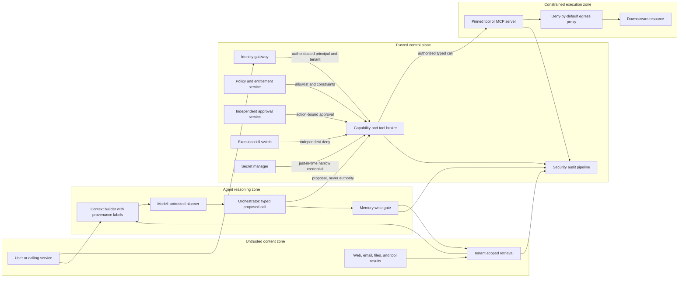

# Threat-Driven Security Architecture for AI Agents

The way I think about it: an AI agent is just an untrusted planner sitting inside a normal security system. The model can propose a tool, a target, some parameters, a whole workflow — but a deterministic control plane, not the model, decides whether that proposal is actually allowed. So every effect an agent can have on the outside world should go through a broker that pulls identity and tenant context from outside the model, applies its own resource limits, asks for approval when the stakes are high, and logs the decision before it ever calls a narrowly scoped tool.

System prompts and content filters are not authorization boundaries, and I don't treat them as one.

They're still worth having as defense in depth — they steer behavior and cut down on unsafe output — but neither one tells you who the user is, which tenant they belong to, what they're entitled to, or whether they actually agreed to a transaction. An injected instruction, a poisoned retrieval result, a model that regresses, or an unexpected tool response should never be able to grant a capability on its own.

## What's actually built here versus what's a design

I want to be upfront about what backs this write-up, because it's easy to blur "I designed this" with "I ran this":

- **The design:** the end-to-end architecture, the operational procedures, the deployment patterns, and most of the evaluation cases below are engineering guidance I've worked through carefully — but I haven't validated any of it against a production agent, a real identity provider, a real model, a sandbox, a vector database, or an actual MCP implementation.
- **What I actually ran:** the dependency-free [`labs/ai-agent-security`](../labs/ai-agent-security/README.md) lab, where I execute a local, fake tool through an external broker. I wrote tests that cover both cases that should succeed and cases that should fail — tenant checks, tool checks, amount limits, approval flow, replay, and the kill switch. It makes no network request and does nothing real.
- **What I checked against sources:** I checked the standards and protocol statements against the primary sources listed under `References`, on 2026-07-23. Given how broad the design is and how small the lab intentionally is, I'm tagging this `implementationStatus: partially-tested` and `reviewStatus: partially-verified` — that's just the honest read of where it stands.

## The core decision

Adopt a control-plane/data-plane split:

1. Authenticate the human or workload before model invocation.
2. Derive principal, tenant, purpose, and entitlements from trusted server-side state.
3. Treat user input, retrieved content, model output, memory, tool descriptions, and tool results as untrusted data.
4. Permit the model to emit only a proposed, typed action.
5. Route every action through an external capability broker.
6. Authorize the exact principal, tenant, tool, resource, constraints, and current policy version.
7. Require separate, short-lived, single-use approval for high-impact effects.
8. Give the selected tool a narrow downstream credential only after approval.
9. Constrain execution with a sandbox, deny-by-default egress, resource limits, and an independently operated kill switch.
10. Record the decision and outcome without placing credentials or unnecessary sensitive content in logs.

The point of designing it this way: the model's output is just one more input the broker has to check, never the thing that gets to decide.

## Scope, non-goals, and assumptions

### In scope

- LLM-backed assistants and agents that retrieve data, retain memory, call local or remote tools, use MCP, or coordinate subordinate agents;
- direct and indirect prompt injection, retrieval and memory poisoning, cross-tenant access, confused-deputy behavior, unsafe output consumption, excessive agency, and model/software supply-chain compromise;
- identity, authorization, approval, secret delivery, execution isolation, observability, staged rollout, evaluation, and incident response.

### Not established by this design

- that a model is truthful, deterministic, aligned, unbiased, or free of exploitable behavior;
- that a content classifier detects every harmful instruction;
- that a container alone safely executes arbitrary hostile native code;
- that a generic control list satisfies a particular legal, regulatory, safety, privacy, or sector-specific obligation;
- that using MCP makes a tool or server trustworthy;
- that human approval is effective when the reviewer lacks context, time, or a trustworthy interface.

### Assumptions to validate per deployment

- The identity tier can authenticate users and workloads, resolve current tenant membership, and revoke access within a documented interval.
- Each protected resource has an authoritative tenant owner and action-specific policy.
- Downstream systems can enforce authorization again, support idempotency where effects may be retried, and return stable identifiers for audit.
- The broker, policy store, approval service, secret manager, audit pipeline, and kill-switch path are outside the model's writable boundary.
- Operators can isolate workloads, revoke credentials, stop queued work, and restore retrieval and memory from known-good versions.
- Any exception to deny-by-default egress, tenant isolation, or bound approval is explicitly risk-accepted rather than silently delegated to the model.

## Assets, actors, and security invariants

Primary assets include tenant data, model and retrieval inputs, durable memory, tool credentials, financial or destructive authority, approval records, model artifacts, policy, prompts, audit evidence, and system availability.

Threat actors and fault sources include a malicious user, a tenant that can publish indexed content, a compromised document or website, a malicious tool server, a poisoned model or adapter, an overprivileged integration, a confused deputy, a compromised operator account, and an ordinary model or application failure.

The system should preserve these invariants:

1. Missing or ambiguous principal, tenant, audience, purpose, tool, or policy context denies execution.
2. Content cannot create authority. Instructions found in prompts, documents, memory, tool metadata, or tool results never add permissions.
3. The model runtime never receives an omnibus credential or a credential for an action that has not been authorized.
4. Every external effect is mediated by the same broker or by a downstream boundary with equivalent controls.
5. Tenant isolation is enforced on ingestion, retrieval, memory read/write, tool execution, task state, audit access, and deletion.
6. Approval is bound to the exact action displayed to the approver; a changed target, amount, tenant, tool, or payload requires new approval.
7. Disabling execution, revoking capability, or isolating a tenant does not depend on cooperation from the model.

## Architecture and trust boundaries



The critical boundary is between the orchestrator's proposed call and the broker's authorization decision. Keep authenticated context on a protected server-side channel; do not ask the model to copy identity, scopes, or tenant claims into tool arguments. Tool parameters are still untrusted even when they match a schema.

## Threat model and required negative evidence

The [OWASP Top 10 for LLM Applications 2025](https://genai.owasp.org/llm-top-10/) and [OWASP Top 10 for Agentic Applications 2026](https://genai.owasp.org/resource/owasp-top-10-for-agentic-applications-for-2026/) are living community risk catalogs, not authorization specifications. Use them as threat inputs and verify controls against the actual architecture.

| Threat or abuse case | Boundary and preventive controls | Required negative evidence |
|----|----|----|
| Direct prompt injection asks the agent to ignore policy or reveal data | Treat the model as an untrusted planner; external authorization; typed outputs; least privilege | Injection corpus cannot cause an unauthorized tool execution, tenant read, secret disclosure, or policy change |
| Indirect injection in a document, website, email, image-derived text, or tool result | Provenance labels; isolate retrieved data from trusted control data; tool broker; restricted rendering and egress | Malicious retrieved instructions may alter text output but cannot create capability or escape allowed egress |
| Retrieval poisoning promotes attacker content | Controlled ingestion, source and version provenance, quarantine, deletion, re-indexing, quality review, and anomaly telemetry | A poisoned fixture is traceable, removable, and cannot grant tool or memory authority |
| Cross-tenant RAG or cache leakage | Server-derived tenant filter at ingestion and query; storage authorization; deny missing tenant; tenant-bound cache keys | Query tenant A with tenant B document IDs, embeddings, cache keys, filters, and deletion jobs; return no B content |
| Tool misuse or excessive agency | Tool allowlist; resource and amount constraints; rate, time, and step budgets; reversible-by-default actions | Unauthorized tool, resource, amount, sequence, retry, and budget cases deny before executor invocation |
| Confused deputy uses valid authority for the wrong client or target | Validate issuer, audience/resource, subject, tenant, client, consent, and purpose; no token passthrough | Tokens for another tool server, tenant, resource, client, or purpose are rejected |
| Malicious or replaced MCP/tool server | Registry allowlist, owner review, pinned version/digest, transport authentication, schema limits, isolation, and egress policy | Unknown server, changed digest, tool-name collision, schema drift, and unsolicited capability all fail closed |
| Improper output handling | Treat model/tool output as tainted; structured validation; contextual encoding; parameterized APIs; URL/command allowlists | XSS, template, SQL, shell, path, SSRF, header, and log-injection payloads do not reach an interpreter |
| Durable memory poisoning | Authenticate writer; bind tenant and subject; provenance, TTL, moderation/quarantine; approval for privileged memory | Cross-user writes, injected policy claims, replayed memories, and malicious summaries cannot become trusted instructions |
| Secret theft or exfiltration | Secretless model context; broker-side just-in-time credential use; field redaction; deny egress; response minimization | Fake canary values in documents, errors, environment, and tool output never leave approved destinations |
| Model, adapter, tokenizer, dataset, or runtime compromise | Approved registry; provenance; immutable digest; signatures where supported; isolated loading/conversion; evaluation and rollback | Digest/signature mismatch, unsafe serialization, unapproved adapter, and unexpected dependency fail admission |
| Unbounded consumption or agent loop | Per-request token, cost, tool-call, wall-time, recursion, concurrency, and output limits | Cycles, fan-out, oversized output, retry storms, and slow tools terminate within the configured budget |
| Approval spoofing or fatigue | Separate authenticated UI; exact diff and impact; action binding; expiry; one-time use; revalidation | Missing, altered, expired, cross-tenant, or replayed approval denies; executor sees no call |

Passing a model-level injection evaluation is useful evidence about behavior, but it is not evidence that authorization is correct. The deterministic boundary must reject forbidden actions even when the model proposes them every time.

## Control design

### Keep instructions and authority separate

Classify every context item with origin, tenant, owner, version, retrieval time, and trust purpose. A "trusted source" may support an answer, but its prose still does not become executable policy. Place policy in code or a dedicated policy service with reviewed changes, explicit defaults, and versioned decisions.

For direct and indirect injection:

- mark user, retrieval, memory, and tool-result segments as data;
- minimize the content provided to the model and remove active markup when it is not needed;
- do not expose unnecessary tools to the session;
- require structured proposals and validate every field;
- keep authorization, approval, credential use, and egress enforcement after the model;
- measure content filters, prompt hardening, and injection classifiers as fallible detection or steering controls, never fail-open gates.

The prompt-injection and data-poisoning terminology used here aligns with the final [NIST AI 100-2 E2025 adversarial machine-learning taxonomy](https://csrc.nist.gov/pubs/ai/100/2/e2025/final). NIST also publishes a potential-updates notice for that final document; record the exact edition and errata state used by an evaluation.

### Isolate retrieval and prevent cross-tenant RAG

Derive the tenant from authenticated membership, not from a model-produced filter, request body, filename, or document metadata alone. Enforce that tenant at every data operation:

- ingestion verifies the writer may add content to that tenant and records source URI/object ID, content digest, parser and embedding versions, owner, and time;
- chunk and embedding records carry a non-null authoritative tenant key;
- queries deny when tenant context is absent and apply the filter in the storage authorization layer, not only in the prompt or application post-processing;
- post-retrieval checks verify every returned record belongs to the expected tenant before context assembly;
- caches include tenant, principal or policy cohort, model, prompt template, and source versions in the key;
- updates and deletion remove or tombstone derived chunks, embeddings, summaries, and caches;
- shared indexes receive adversarial cross-tenant tests after schema, embedding, ranking, or library changes.

Embedding similarity and metadata supplied by an indexed document are not access control. Separate physical indexes may reduce some blast radius, but they do not remove the need for authenticated ingestion, query authorization, and deletion correctness. OWASP describes retrieval-specific risks under its living [vector and embedding weaknesses material](https://genai.owasp.org/llmrisk/llm082025-vector-and-embedding-weaknesses/).

Treat retrieved content as potentially poisoned even after authorization. Quarantine newly ingested high-risk sources, maintain an emergency source denylist, and support re-indexing from a known-good corpus. Retrieval provenance should be visible to reviewers and carried into audit without logging entire sensitive documents.

### Authorize capabilities outside the model

The broker evaluates a capability tuple such as:

```text
(principal, tenant, tool, action, resource, constraints, purpose, expiry, policy-version)
```

This tuple is an **illustrative design**, not a wire-format standard. Production policy should also account for environment, device or workload identity, separation of duties, risk tier, and downstream entitlements where relevant.

The broker should:

- accept identity only from a validated gateway or workload channel;
- allow only registered tool and action identifiers;
- parse a closed, versioned schema and reject unknown or ambiguous fields;
- constrain resource IDs, destinations, amount, data classification, time, frequency, and cumulative budget;
- re-check current entitlement immediately before execution;
- ask a separate approval service for high-impact calls;
- mint, exchange, or retrieve a short-lived credential for only the selected downstream resource;
- pass authoritative tenant and principal context independently of model arguments;
- make downstream services authorize again;
- apply idempotency keys and reconcile uncertain outcomes before retrying.

Do not hand the model a broad user access token. Do not let a tool server forward the client's bearer token to another API. The current [MCP 2025-11-25 authorization specification](https://modelcontextprotocol.io/specification/2025-11-25/basic/authorization) requires resource indicators and prohibits token passthrough; its design builds on OAuth protected-resource metadata and related standards. Independently of MCP, follow [OAuth 2.0 Security Best Current Practice, RFC 9700](https://www.rfc-editor.org/rfc/rfc9700) and bind requested tokens to the intended resource using [RFC 8707](https://www.rfc-editor.org/rfc/rfc8707).

### Treat MCP and tool servers as security principals

MCP defines interoperability; it does not certify a server, tool, prompt, resource, or returned content. The [MCP server specification](https://modelcontextprotocol.io/specification/2025-11-25/server) describes tools as model-controlled, which makes the client/broker boundary especially important.

For each MCP or proprietary tool server:

- register owner, business purpose, transport, endpoint, issuer, expected audience, permitted tenants, tool names, schema versions, artifact digest, network destinations, data classes, and incident contact;
- authenticate both ends, negotiate only supported protocol versions, and reject unexpected capability or schema changes;
- isolate local `stdio` servers because they inherit local process access; do not place a general cloud credential or an entire user environment in their process;
- validate tool names and descriptions as untrusted metadata and prevent lookalike or collision-based selection;
- cap input/output size, task duration, progress events, redirects, and resource fetches;
- bind asynchronous task state and results to the authenticated principal and tenant, rather than relying on an opaque task ID alone;
- prohibit inbound-token passthrough, validate the server audience, and obtain a separate downstream token;
- run high-risk servers in separate identities and isolation domains so one server cannot read another server's secrets or network.

As of 2026-07-23, MCP's [versioning page](https://modelcontextprotocol.io/docs/learn/versioning) identifies `2025-11-25` as the current protocol. The project has announced `2026-07-28` as a [release candidate](https://blog.modelcontextprotocol.io/tags/protocol/), so it is a preview, not the baseline claimed by this article. Re-check the status before implementation because the specification is living material.

### Validate model and tool output at every sink

Model output, structured output, and tool output remain untrusted after parsing. A valid JSON object may still contain an unauthorized resource or an injection payload.

- Use a closed schema with type, length, range, character, and enumeration constraints.
- Encode text for its final HTML, Markdown, CSV, log, header, or template context.
- Use parameterized database and API operations.
- Never build shell commands, SQL, paths, URLs, templates, or policy expressions by concatenating model output.
- Resolve object IDs through an authorized lookup; do not accept arbitrary filesystem paths or URLs.
- Route outbound HTTP through an egress proxy that validates scheme, hostname, port, resolved destination, redirect target, and response size. Account for private addresses and DNS rebinding.
- Strip credentials and unnecessary sensitive fields from errors and tool responses before they re-enter model context.

OWASP's [improper output handling entry](https://genai.owasp.org/llmrisk/llm052025-improper-output-handling/) provides a threat catalog; the actual encoder and validator must be selected for each sink.

### Govern durable memory as a data store

Memory is a second retrieval system with a write path. A model-generated summary can preserve an attack after the original prompt disappears.

Separate conversation state, user preferences, factual records, and security policy. The model may propose a memory, but a memory gate should:

- authenticate the writer and bind user, tenant, session, and purpose;
- reject attempts to store credentials, hidden policy, or another tenant's data;
- retain origin, source references, model and prompt version, confidence or review state, and expiry;
- prevent a retrieved memory from overriding policy or becoming identity evidence;
- require approval for durable memories that change workflow, destinations, permissions, or other high-impact behavior;
- support inspection, correction, deletion, quarantine, version rollback, and tenant-scoped export;
- detect unusual write volume, repeated injected phrases, cross-user reuse, and abrupt changes in influential memory.

Do not silently train on conversation or memory data. Training and retention decisions require their own documented authority, purpose, tenant handling, and deletion semantics.

### Sandbox execution, egress, and secrets

Use an ephemeral execution identity and filesystem per task or trust cohort. Depending on the runtime and threat model, controls may include a non-root user, read-only base image, minimal writable volume, syscall and capability reduction, no host or container-engine socket, no cloud instance-metadata access, CPU/memory/ process/file/output/time quotas, and a stronger virtual-machine boundary for hostile native code.

Network access should be denied by default. Send permitted traffic through an authenticated proxy with a destination and method allowlist, response limits, redirect validation, DNS and private-range protections, and attributable logs. Do not allow a generic "browse the internet" path from the same identity that can reach internal administration APIs.

Keep secrets out of prompts, retrieval, memory, environment dumps, command lines, and model-visible error messages. The broker should obtain a narrowly scoped, short-lived credential after authorization and expose it only to the selected tool process or make the downstream call itself. Secret scanning and output filters are backstops; the primary control is that the model never receives the secret.

### Require bound approval for high-impact actions

Classify high-impact operations before rollout. Typical candidates include:

- transferring value or changing a financial commitment;
- deleting or overwriting durable data;
- granting permissions, creating credentials, or changing security policy;
- deploying to production or modifying infrastructure;
- exporting sensitive or cross-tenant data;
- sending external communications or making a legally significant submission;
- disabling a security control or expanding egress.

The approval interface should show the authenticated requester, tenant, exact tool and action, target, before/after change, amount and unit, data leaving the boundary, expected side effects, and expiry. Approval must be recorded through a separate authenticated channel, cryptographically or server-side bound to a canonical action digest, short-lived, single-use, and revalidated immediately before execution.

Any material change after approval creates a new action. Do not approve a plan that later allows the model to choose the target or amount. Rate-limit approval requests and measure reviewer overrides, abandonment, repeated prompts, and approval latency for signs of fatigue. A human click is not proof that the action was understood.

### Build an independent kill switch

Provide global, tenant, principal, model, tool-server, tool, destination, and action-level disablement. Enforce it in the broker and, for defense in depth, in credential issuance, queue consumption, egress, and downstream policy. The control must not require a prompt change, model response, normal deployment, or access to the affected agent.

Define and rehearse:

- how pending and in-flight work is stopped or quarantined;
- whether reads may continue while writes are disabled;
- token revocation and secret rotation;
- queue draining versus evidence preservation;
- break-glass authentication and separation of duties;
- how long it takes each check in the chain to actually pick up the change;
- safe restoration and re-authorization after containment.

Failing to reach the kill-switch policy service should deny new high-impact actions. Any low-risk degraded mode must be explicit, bounded, observable, and tested.

## Failure modes and explicit semantics

| Failure | Required behavior |
|----|----|
| Identity, tenant, or entitlement cannot be resolved | Deny; never use model-, document-, or client-asserted fallback authority |
| Policy service unavailable or policy version unknown | Deny writes and high-impact actions; allow a read-only degraded mode only if separately designed and cached policy remains valid |
| Approval service unavailable, evidence expired, or action changed | Deny the high-impact action and require a new approval |
| Audit pipeline unavailable | Fail closed for high-impact actions; for explicitly low-risk actions, use a bounded durable local queue and alert before it fills |
| Tool schema, owner, endpoint, certificate, version, or digest changes | Quarantine the tool until registry review and compatibility/security tests pass |
| Retrieval tenant filter missing or index returns mismatched tenant | Drop the result, fail the request, alert, and investigate as a potential isolation incident |
| Model provider or selected model unavailable | Stop or use a separately evaluated equal-or-lower-capability fallback; never gain tools or permissions during fallback |
| Egress proxy or destination validation unavailable | Deny outbound traffic; do not bypass directly |
| Downstream timeout leaves outcome uncertain | Reconcile with an idempotency key or authoritative status endpoint before any retry |
| Loop, recursive delegation, or budget exhaustion | Stop scheduling, revoke task capability, persist minimal evidence, and return a bounded failure |
| Kill-switch state cannot be read | Deny new effects according to the last safe state and alert the control-plane owner |

Availability pressure is not permission to weaken tenant or authorization boundaries. If an emergency bypass is genuinely required, handle it as a time-bound, approved, logged break-glass event and a security exception.

## Evaluation and release evidence

The [NIST AI RMF 1.0](https://www.nist.gov/itl/ai-risk-management-framework) organizes risk work around Govern, Map, Measure, and Manage. Its [Generative AI Profile, NIST AI 600-1](https://www.nist.gov/publications/artificial-intelligence-risk-management-framework-generative-artificial-intelligence) calls for documented testing, red-teaming, monitoring, and risk tracking across the lifecycle. Use those outcomes to govern an engineering test program, not as a claim of certification.

### Deterministic boundary tests

For the broker, storage authorization, egress proxy, memory gate, and downstream service, make these release-blocking:

- unknown principal, tenant, tool, action, schema version, resource, and policy deny;
- cross-tenant read, write, cache, task, memory, audit, and deletion cases deny;
- over-limit amount, rate, data class, destination, time, and cumulative budget deny;
- missing, expired, altered, wrong-principal, wrong-tenant, wrong-tool, wrong-target, and replayed approvals deny;
- changed tool-server digest, audience, issuer, redirect, schema, and capability deny;
- private-network, metadata-service, redirect, DNS-rebinding, and oversized response egress cases deny;
- executor invocation count remains zero for every rejected proposal;
- kill switches prevent new invocation at each configured scope.

These tests require zero false allows for the cases encoded. A passing finite suite does not prove the policy complete.

### Model and system evaluations

Use versioned, access-controlled suites that include:

- direct and indirect injections in user text, documents, email, web content, images converted to text, code comments, tool descriptions, errors, and tool results;
- obfuscation, encoding, multilingual, multi-turn, delayed-trigger, and instruction-conflict variants;
- poisoned retrieval ranking, forged provenance, cross-tenant document IDs, cache collisions, stale deletion, and malicious memory;
- tool-name collisions, schema ambiguity, argument smuggling, approval spoofing, confused-deputy flows, asynchronous tasks, retries, and time-of-check/time-of-use changes;
- output payloads for every interpreter or renderer and exfiltration attempts using unmistakably fake canary values;
- long-horizon loops, multi-agent delegation, resource exhaustion, partial tool failure, and uncertain downstream outcomes;
- model, prompt, adapter, embedding, parser, runtime, policy, and tool upgrades.

Run repeated trials because model behavior can vary. Record the entire tested configuration and distinguish:

- **proposal attack success:** the model produced a forbidden proposal;
- **boundary false allow:** a forbidden proposal reached the executor;
- **sensitive-output rate:** fake canary or protected fixture appeared outside its allowed sink;
- **false deny and task success:** legitimate work was blocked or failed;
- **budget containment:** calls, time, tokens, output, and cost remained bounded;
- **detection and response:** telemetry fired and containment completed within the rehearsed objective.

Do not average away a tenant-isolation or unauthorized-execution failure. Set explicit per-boundary release gates and document unmeasured risks. Keep held-out adversarial cases separate from prompt tuning and version both the corpus and expected policy decisions.

### Tested companion lab

Run:

```powershell
node --test labs/ai-agent-security/tests/broker.test.js
```

The lab proves only that its small JavaScript broker:

- allows an authorized tenant/tool/amount and calls a fake executor;
- rejects an unauthorized tenant, tool, and over-policy amount;
- requires approval above the configured impact threshold;
- rejects approval bound to different action details or reused approval;
- denies execution while its injected kill switch is active.

It does not implement token validation, cryptographic approval, a policy engine, MCP, network egress, a sandbox, durable audit, or a real external action.

## Staged rollout and rollback gates

| Stage | Capability | Entry and exit evidence | Rollback |
|----|----|----|----|
| 0\. Inventory and offline evaluation | No production tools; synthetic or approved test data | Threat model, data flow, tenant model, owners, tool registry, policy, failure semantics, and baseline eval recorded | Stop evaluation and correct design or data handling |
| 1\. Read-only shadow | Model proposes; broker evaluates; no external execution, or approved read-only duplicate path | Negative boundary suite passes; proposal/denial telemetry and cost measured; no sensitive logs | Disable model path; preserve conventional application |
| 2\. Read-only canary | Narrow tenants/users, allowlisted sources and tools, strict budgets | Cross-tenant and injection campaigns pass; on-call and kill switch rehearsed; user reporting available | Disable tenant/model/tool scope and revoke credentials |
| 3\. Reversible writes with approval | Small set of idempotent or reversible actions; every write approved | Bound approval, reconciliation, rollback, audit, and downstream reauthorization tested | Stop writes, reconcile in-flight work, undo through normal audited API |
| 4\. Bounded automation | Selected low-impact actions may execute without per-action approval | Sustained evidence for explicit false-allow, false-deny, task-success, cost, and incident objectives; risk acceptance recorded | Return action to approval or read-only mode without model change |

Expand one dimension at a time: tenant population, data class, tool, autonomy, model, or egress. Do not change all of them in one release. Rollback must preserve security policy and tenant isolation; "temporarily bypass the broker" is not a rollback.

## Observability and operations

Emit structured events at retrieval, memory, proposal, authorization, approval, credential issuance, tool invocation, egress, downstream result, and kill-switch transitions. Correlate them with a trace ID while minimizing content.

Useful fields include:

- authenticated principal and workload, authoritative tenant, session, purpose, environment, and policy version;
- model provider, model and adapter digest/version, prompt-template version, and orchestrator release;
- retrieved source IDs, tenants, versions, digests, ranking metadata, and post-filter result counts;
- proposed tool, registered server identity and digest, schema version, target class, amount/unit, risk tier, and budget;
- allow/deny decision, stable reason code, evaluated constraints, approval ID and expiry, and kill-switch state;
- credential audience and lifetime without the credential value;
- executor start/finish, idempotency key, downstream status, bytes, duration, egress destination, and reconciliation result;
- memory writer, subject, source, review state, version, expiry, and deletion.

Do not log bearer tokens, approval secrets, raw credentials, unnecessary prompt content, sensitive document bodies, or unrestricted model/tool output. Protect audit access with the same tenant and administrative separation applied to the source systems.

Alert on:

- any deterministic boundary false allow;
- cross-tenant retrieval/memory mismatch or missing tenant context;
- unknown or changed tool server, schema, digest, issuer, or audience;
- sharp changes in proposal denials, approval requests, reviewer overrides, memory writes, external destinations, loop termination, cost, or latency;
- fake secret canary detection, blocked metadata/private-network access, or attempted credential disclosure;
- kill-switch activation, failure to propagate, audit backlog, or repeated uncertain downstream outcomes.

Pre-deployment evaluation cannot represent all production conditions. NIST's final [AI 800-4 report on deployed-system monitoring](https://www.nist.gov/publications/challenges-monitoring-deployed-ai-systems-center-ai-standards-and-innovation) describes post-deployment monitoring practices as still nascent; keep claims about coverage and effectiveness bounded to measured evidence.

## Incident response

Add agent-specific actions to the normal incident plan:

1. **Detect and classify:** identify affected tenants, principals, model/prompt/ adapter versions, retrieval sources, memory records, tools, credentials, egress destinations, approvals, and downstream effects.
2. **Contain:** activate the narrowest reliable kill switch, stop queue consumption, deny credential issuance and egress, quarantine tool servers, freeze implicated ingestion and memory writes, and revoke affected tokens.
3. **Preserve evidence:** retain policy versions, decision records, action digests, source and model artifact digests, tool results, task state, approval evidence, and downstream reconciliation IDs under the incident evidence policy. Avoid collecting unrelated tenant content.
4. **Eradicate:** remove poisoned sources/memory, rebuild indexes and caches, rotate exposed secrets, patch or replace tools, restore approved artifacts, and close the authorization or sandbox gap.
5. **Reconcile and recover:** determine which external effects actually occurred, reverse them through normal audited interfaces where possible, restore in read-only/canary mode, and re-run deterministic plus adversarial tests.
6. **Communicate and learn:** follow applicable contractual, legal, regulatory, and tenant-notification processes; publish a bounded internal account; add regression tests and update the threat model, policy, playbooks, and risk register.

Do not delete suspicious memory or retrieval content before preserving the minimum evidence needed to understand derived chunks, caches, summaries, and effects. Do not re-enable automation solely because model output appears normal.

## Model and agent supply chain

Apply the final [NIST SP 800-218A](https://csrc.nist.gov/pubs/sp/800/218/a/final) as an AI-specific community profile alongside SSDF 1.1. Maintain an inventory and provenance graph for:

- base models, weights, adapters, tokenizers, embedding and reranking models;
- training, tuning, retrieval, evaluation, and safety datasets;
- system/developer prompt templates, policies, tool schemas, MCP servers, agent packages, plugins, and approval workflows;
- parsers, converters, inference runtimes, native libraries, containers, build systems, and deployment manifests.

Acquire from approved sources; record licenses and use restrictions; pin immutable digests; verify signatures/attestations where the ecosystem supports them; scan ordinary dependencies; and isolate model loading and conversion. Treat executable or unsafe serialization formats as code and do not deserialize an untrusted artifact in a privileged environment. Preserve the exact artifact set used for evaluation and support rollback to a known-good set.

A provider name or model label is not a stable version. Contract and operational controls should address unannounced model changes, retention/training use, subprocessors, regional processing, incident notice, vulnerability handling, deprecation, export, and deletion. Re-run security and task evaluations before a new model, adapter, embedding, prompt, policy, runtime, or tool becomes eligible.

The [SLSA provenance specification](https://slsa.dev/spec/) and [CycloneDX machine-learning BOM](https://cyclonedx.org/capabilities/mlbom/) are primary project materials that can represent parts of this evidence. Neither, by itself, proves an artifact safe or a deployed agent authorized.

## Standards and version baseline

| Material | Status used here | How it is used |
|----|----|----|
| NIST AI RMF 1.0, NIST AI 100-1 (January 2023) | Final published framework; NIST states a revision is in progress | Govern, Map, Measure, and Manage structure; not a certification |
| NIST AI 600-1 (July 2024) | Final Generative AI Profile | Generative-AI lifecycle risk, evaluation, red-team, provenance, and monitoring outcomes |
| NIST SP 800-218A (July 2024) | Final SSDF Community Profile | Secure development and acquisition practices for AI model/system producers and acquirers |
| NIST AI 100-2 E2025 (March 2025) | Final taxonomy with a published potential-updates notice | Adversarial ML, poisoning, prompt injection, privacy, misuse, and mitigation terminology |
| OWASP Top 10 for LLM Applications 2025 | Living community project material | Threat discovery for prompt injection, supply chain, poisoning, output handling, agency, embeddings, and consumption |
| OWASP Top 10 for Agentic Applications 2026 | Published community project material, December 2025 | Agent-specific threat discovery and mitigation prompts |
| MCP 2025-11-25 | Current protocol revision on the review date | Protocol, server primitive, authorization, version negotiation, and task-boundary requirements |
| MCP 2026-07-28 | Release candidate on the review date | Preview only; not the implementation baseline |

Re-check every living or in-revision source at the next review. A newer date does not automatically make a draft, release candidate, or catalog a normative replacement for a final publication.

## What's still not solved

Even with all of this in place, here's what can still go wrong:

- novel model behavior and injection techniques that evade detection;
- a compromised broker, policy administrator, identity tier, approval service, tool server, downstream service, or build pipeline;
- legitimate but malicious insiders with authorized access;
- authorization policy that is enforced correctly but models the wrong business rule;
- side channels across shared inference, retrieval, caches, telemetry, or infrastructure;
- sandbox escapes, kernel or runtime vulnerabilities, DNS and supply-chain compromise;
- poisoned sources that are authorized and plausible enough to pass review;
- approval fatigue, collusion, inaccessible context, and delayed revocation;
- model-provider changes and incomplete visibility into hosted models or data handling;
- finite evaluations that do not cover open-ended, long-horizon, multi-agent interactions.

The strongest mitigation is to reduce capability and blast radius: fewer tools, smaller data scopes, shorter credentials, reversible effects, lower budgets, tighter egress, narrower tenants, and less unattended autonomy. Some use cases should remain read-only, require approval permanently, or not use an agent.

## Engineering and operational checklist

Principal and tenant are authenticated outside the model and deny when missing.

User, retrieval, memory, tool metadata, model output, and tool output are all treated as untrusted.

Every effect crosses an external capability broker and downstream authorization.

Tool, resource, destination, amount, data class, rate, step, time, and cost constraints are explicit allowlists.

High-impact approval is separate, exact, short-lived, single-use, and revalidated before execution.

RAG ingestion, query, cache, derived data, and deletion each have a cross-tenant test that's supposed to fail.

MCP/tool servers have owners, pinned identities/versions/digests, schema limits, isolation, audience validation, and no token passthrough.

Model and tool output is validated and encoded for each final sink.

Memory writes have tenant binding, provenance, review state, TTL, and deletion/rollback.

Model context is secretless; credentials are just-in-time, narrow, and not visible to the model.

Execution is ephemeral and resource-limited; network egress is denied by default.

Kill switches exist at multiple scopes and are rehearsed independently of the model.

Deterministic authorization tests and stochastic model/system evaluations are both release evidence.

Observability distinguishes proposals, policy decisions, approvals, execution, egress, and downstream outcomes without logging secrets.

Incident response covers retrieval, memory, model artifacts, tasks, tools, credentials, approvals, and external-effect reconciliation.

Models, adapters, data, prompts, policies, runtimes, tools, and evaluations have provenance, immutable versions, admission checks, and rollback.

What's still not solved, what hasn't been measured, and the maximum autonomy permitted are all explicitly signed off by whoever owns that decision.

## References

- [NIST Artificial Intelligence Risk Management Framework 1.0](https://www.nist.gov/itl/ai-risk-management-framework)
- [NIST AI 600-1, Artificial Intelligence Risk Management Framework: Generative Artificial Intelligence Profile](https://www.nist.gov/publications/artificial-intelligence-risk-management-framework-generative-artificial-intelligence)
- [NIST SP 800-218A, Secure Software Development Practices for Generative AI and Dual-Use Foundation Models](https://csrc.nist.gov/pubs/sp/800/218/a/final)
- [NIST AI 100-2 E2025, Adversarial Machine Learning: A Taxonomy and Terminology of Attacks and Mitigations](https://csrc.nist.gov/pubs/ai/100/2/e2025/final)
- [NIST AI 800-4, Challenges to the Monitoring of Deployed AI Systems](https://www.nist.gov/publications/challenges-monitoring-deployed-ai-systems-center-ai-standards-and-innovation)
- [OWASP Top 10 for LLM Applications 2025](https://genai.owasp.org/llm-top-10/)
- [OWASP Top 10 for Agentic Applications 2026](https://genai.owasp.org/resource/owasp-top-10-for-agentic-applications-for-2026/)
- [OWASP Securing Agentic Applications Guide 1.0](https://genai.owasp.org/resource/securing-agentic-applications-guide-1-0/)
- [Model Context Protocol versioning](https://modelcontextprotocol.io/docs/learn/versioning)
- [Model Context Protocol 2025-11-25 authorization](https://modelcontextprotocol.io/specification/2025-11-25/basic/authorization)
- [Model Context Protocol security best practices](https://modelcontextprotocol.io/docs/tutorials/security/security_best_practices)
- [Model Context Protocol 2025-11-25 server specification](https://modelcontextprotocol.io/specification/2025-11-25/server)
- [RFC 8707, Resource Indicators for OAuth 2.0](https://www.rfc-editor.org/rfc/rfc8707)
- [RFC 9700, Best Current Practice for OAuth 2.0 Security](https://www.rfc-editor.org/rfc/rfc9700)
- [RFC 9728, OAuth 2.0 Protected Resource Metadata](https://www.rfc-editor.org/rfc/rfc9728)
- [SLSA specification](https://slsa.dev/spec/)
- [CycloneDX machine-learning bill of materials](https://cyclonedx.org/capabilities/mlbom/)
