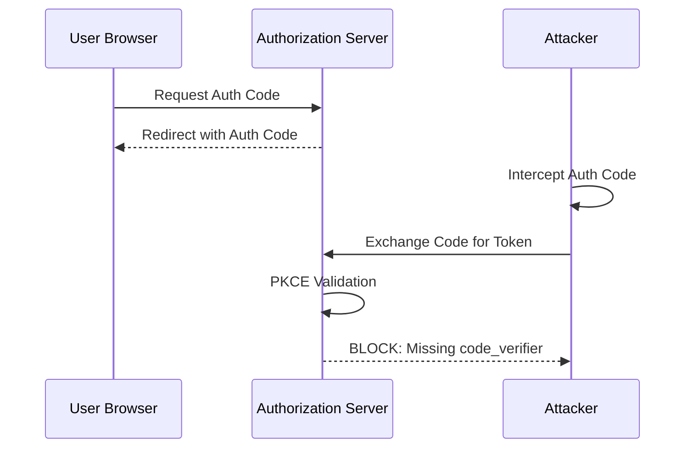
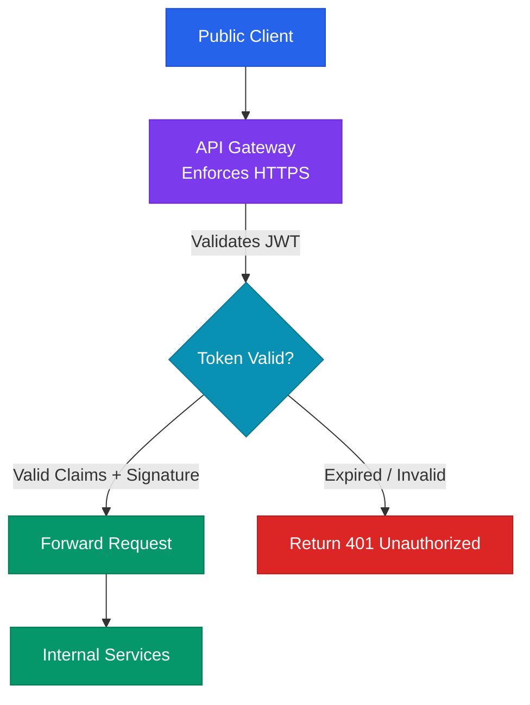

# OAuth 2.0 and OIDC Security Deep Dive: PKCE, Token Validation, and Federation Hardening

## Executive Summary

OAuth 2.0 and OpenID Connect (OIDC) are the industry standards for web-based authorization and identity federation. However, implementing these protocols securely is notoriously difficult. Many engineering teams rely on outdated flows or fail to validate token signatures and claims properly. Common mistakes like utilizing the insecure Implicit Flow or neglecting to enforce Proof Key for Code Exchange (PKCE) leave applications vulnerable to token hijacking and authorization code interception.

At scale, the failure to secure redirect URIs, validate cryptographic tokens, and prevent issuer confusion leads directly to account takeover vulnerabilities. Attackers exploit these flaws to intercept authorization codes, replay tokens, and masquerade as trusted users. This whitepaper explains the cryptographic principles of PKCE, details secure JWT validation processes, analyzes common federation vulnerabilities, and provides defensive implementation guidelines.

---

## Threat Model and Attack Surface

The OAuth and OIDC attack surface includes the client application, the user's browser, the Authorization Server, and the token transfer paths.



### Threat Vectors and Kill-Chains

1. **Authorization Code Interception (Authorization Code Flow without PKCE)**:
   - *Adversary Goal*: Intercept the authorization code and exchange it for a user's access token.
   - *Attack Vector*: In native or single-page applications (SPAs), the authorization response is delivered via a browser redirect. An attacker registers a malicious app on the user's device that intercepts custom URI schemes (e.g. `myapp://oauth-callback`). When the authorization server redirects the user, the attacker's app captures the authorization code from the URL and exchanges it for access tokens, compromising the user's account.
2. **State Parameter Bypass (Cross-Site Request Forgery - CSRF)**:
   - *Adversary Goal*: Force a victim to associate their account with an attacker's identity.
   - *Attack Vector*: The client application does not generate or validate a cryptographically secure `state` parameter in the authorization request. An attacker initiates an OAuth flow, intercepts the authorization code response, and tricks a victim into clicking a link containing that code. The victim's browser sends the code to the client application. Because the client does not check `state`, it associates the victim's session with the attacker's resource account.
3. **Open Redirector Exploitation via Lax Redirect URIs**:
   - *Adversary Goal*: Redirect authorization codes directly to an attacker-controlled server.
   - *Attack Vector*: The authorization server allows wildcard redirect URIs (e.g. `https://example.com/*` or `*.example.com`). An attacker crafts an authorization URL with a redirect parameter pointing to a known open redirect vulnerability on the victim's domain: `https://example.com/oauth/callback?redirect=http://attacker.com`. The authorization server validates the pattern against the wildcard rule and sends the code to the target domain, which redirects the sensitive parameter straight to the attacker's server.

---

## Deep Technical Body

### Cryptographic Underpinnings of PKCE (RFC 7636)

Proof Key for Code Exchange (PKCE) mitigates the risk of authorization code interception. Instead of relying on a static `client_secret` (which cannot be securely stored in public clients like SPAs or mobile apps), PKCE dynamically binds each transaction to the specific client that initiated it.

```
       [ Client ]                                     [ Auth Server ]
           │                                                │
           ├─── Step 1: Compute Challenge (S256) ──────────>│ (Stores Challenge)
           │                                                │
           │<── Step 2: Return Authorization Code ──────────┤
           │                                                │
           ├─── Step 3: Send Code + Original Verifier ─────>│ (Verifies Verifier)
           │                                                │
           │<── Step 4: Issue Access & ID Tokens ───────────┤
```

#### PKCE Mathematical Flow
1. **Generate Verifier**: The client generates a high-entropy, cryptographically secure random string `code_verifier` containing characters `[A-Z]`, `[a-z]`, `[0-9]`, `-`, `.`, `_`, `~`.
2. **Compute Challenge**: The client computes the `code_challenge` by taking the SHA-256 hash of the verifier and base64url-encoding it:
   $$\text{Challenge} = \text{Base64URLEncode}(\text{SHA256}(\text{Verifier}))$$
3. **Send Challenge**: The client sends the challenge and method (`code_challenge_method=S256`) to the authorization endpoint. The server stores these values.
4. **Token Request**: During the token exchange step, the client sends the authorization code along with the plaintext `code_verifier`.
5. **Validation**: The server computes the challenge using the incoming verifier and compares it to the stored challenge. If they match, it verifies the transaction is authentic and issues the tokens.

### JWT Cryptographic Validation Flow

When an application receives an ID token or access token (JWT), it must validate the token before trusting its contents.

```
                 [ Receive JWT Token ]
                           │
                           ▼
              [ Decode Header & Payload ]
                           │
                           ▼
          [ Fetch Public Signing Keys (JWKS) ]
                           │
                           ▼
          [ Cryptographically Verify Signature ]
                           │
            ┌──────────────┴──────────────┐
            ▼ (Valid)                     ▼ (Invalid)
   [ Validate Claims ]             [ REJECT TOKEN ]
  (iss, aud, exp, nbf)
```

1. **Header Parsing**: Decode the base64url-encoded header to identify the signing algorithm (`alg`) and the key ID (`kid`).
2. **Key Retrieval**: Fetch the organization's JSON Web Key Set (JWKS) from the trusted `.well-known/jwks.json` endpoint. Locate the public key matching the token's `kid`.
3. **Signature Verification**: Verify the cryptographic signature using the public key and the token's signing input (header + payload).
4. **Claim Validation**:
   - **Expiration (`exp`)**: Ensure the current time is before the expiration timestamp.
   - **Not Before (`nbf`)**: Ensure the current time is after the activation timestamp.
   - **Issuer (`iss`)**: Match the issuer string exactly against the expected authentication domain.
   - **Audience (`aud`)**: Match the audience claim exactly against the client application's registered client ID.

---

## Defensive Architecture

A secure authentication architecture requires enforcing PKCE globally and validating all OIDC tokens at the gateway boundary.

### Architecture Topology: Gateway-Level Token Validation and Session Management



### Hardened Authorization Request Configuration
When initiating the authorization flow, always use the Authorization Code Flow with PKCE, enforce the `state` parameter, and request access tokens using secure scopes.

```
https://auth.company.com/oauth/authorize?
  response_type=code
  &client_id=spa-client-1192
  &redirect_uri=https://example.com/callback
  &scope=openid%20profile%20email
  &state=c2VjdXJlX3JhbmRvbV9zdGF0ZV92YWx1ZQ
  &code_challenge=E9Melhoa2OwvFrGMTJguCH5yOFzCg3AVydeuDB9nTHs
  &code_challenge_method=S256
```

---

## Tooling and Implementation

Implement automated tools to manage token lifecycle and validate configurations:

1. **OAuth2 Proxy**: Deploy OAuth2 Proxy in front of internal applications to manage authentication sessions, handle redirects, and validate JWT tokens automatically.
2. **Hydra / Keycloak**: Use open-source, standards-compliant identity providers like Ory Hydra or Keycloak to enforce secure authentication flows, PKCE validation, and token signing.
3. **OWASP ZAP / JWT Tool**: Use vulnerability scanners and testing utilities (like `jwt_tool`) during development to check if your API endpoints are vulnerable to signature bypass attacks (e.g. changing the signing algorithm to `none`).

---

## OAuth and OIDC Security Audit Checklist

| Item | Focus Area | Verification Step / Command | Target State |
| :--- | :--- | :--- | :--- |
| 1 | Flow Enforcement | Inspect application configurations to check if Implicit Flow is disabled. | All clients use Authorization Code Flow with PKCE. |
| 2 | PKCE Validation | Verify that the authorization server rejects token requests lacking a `code_verifier`. | Server requires PKCE for all public client applications. |
| 3 | State Parameter | Confirm if the client application validates the `state` parameter. | The client generates a unique, cryptographically random `state` value per session and verifies it. |
| 4 | Redirect URI Policy | Check redirect URI registration lists. | Redirect URIs are configured with exact matches; no wildcard domains or paths are permitted. |
| 5 | Token Claims | Verify that signature, issuer, and audience validation is enforced. | Custom verification libraries throw errors on invalid signatures, incorrect issuers, or mismatched client IDs. |
| 6 | Transport Security | Ensure all OAuth communication routes over HTTPS. | Non-secure HTTP communication is blocked at the gateway level. |

---

## References

* *Proof Key for Code Exchange (PKCE) Specification*: [IETF RFC 7636](https://tools.ietf.org/html/rfc7636)
* *OAuth 2.0 Security Best Current Practice*: [IETF Draft](https://datatracker.ietf.org/doc/html/draft-ietf-oauth-security-topics)
* *JSON Web Token (JWT) Specification*: [IETF RFC 7519](https://tools.ietf.org/html/rfc7519)
