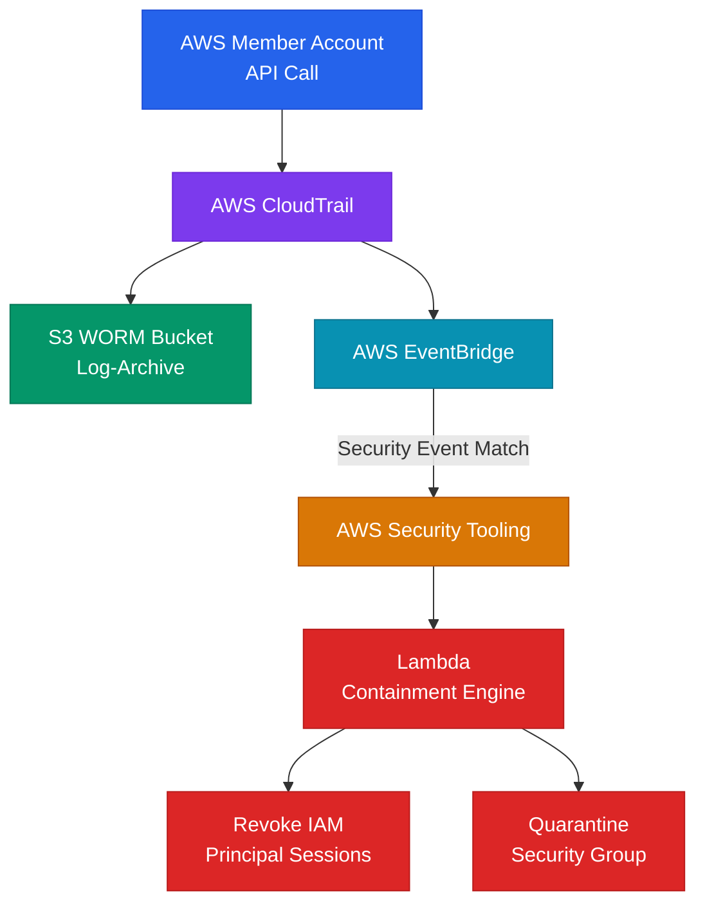

# Cloud Detection and Response: Designing Resilient SIEM Pipelines, CloudTrail Auditing, and Automated Response

## Executive Summary

Cloud workloads generate massive amounts of log and event data. However, the sheer volume of this data makes it easy for security signals to get lost. Many organizations believe that enabling services like AWS CloudTrail, GuardDuty, or Microsoft Sentinel is enough to keep their environments secure. In reality, without deliberate detection engineering, teams face alert fatigue and are slow to respond to critical threats.

At scale, the failure to secure log pipelines and establish high-fidelity detections creates blind spots that attackers exploit. A common tactic for adversaries is to disable logging services or delete audit trails immediately after gaining access to cover their tracks. Organizations must design a resilient detection and response architecture. This requires centralized, tamper-proof log archives, automated threat hunting, and near-real-time incident response workflows. This whitepaper explains how to build secure SIEM pipelines, write high-signal detections, protect log integrity, and automate incident response.

---

## Threat Model and Attack Surface

The detection and response threat model assumes the adversary is actively working to evade logging systems, alter audit records, and execute API calls silently.

```
       [ Adversary Gains API Credentials ]
                       │
                       ▼
       [ Attempts to Disable CloudTrail ]
                       │
         ┌─────────────┴─────────────┐
         ▼                           ▼
[ Central Log Archiving Failed ]  [ Tamper-Proof Log Archive Active ]
         │                           │
         ▼                           ▼
[ Actions undetected, logs deleted ] [ Log stored; EventBridge fires ]
         │                           │
  ( System Blind )                   ▼
                        [ Security IR Automation Triggered ]
                                     │
                                     ▼
                        [ Session Revoked / Key Deleted ]
```

### Threat Vectors and Kill-Chains

1. **Log Tampering and Trail Deletion (Defense Evasion)**:
   - *Adversary Goal*: Erase all evidence of unauthorized API activity.
   - *Attack Vector*: An attacker gains administrative privileges in a member account. They immediately call `cloudtrail:StopLogging` or `cloudtrail:DeleteTrail` to stop auditing systems from recording their subsequent actions (e.g. data extraction or resource creation).
2. **KMS Key Disabling (Data Ransom/Destruction)**:
   - *Adversary Goal*: Render encrypted databases or files unreadable.
   - *Attack Vector*: An attacker calls `kms:DisableKey` or `kms:ScheduleKeyDeletion` on a critical customer managed key (CMK). If detection systems do not flag this immediately, the data becomes permanently inaccessible once the deletion grace period expires.
3. **EventBridge Rule Deletion**:
   - *Adversary Goal*: Bypass automated incident response triggers.
   - *Attack Vector*: An attacker identifies EventBridge rules configured to trigger security automation (e.g. isolating a compromised instance). The attacker calls `events:DeleteRule` or `events:DisableRule` to disable the automated response before executing their primary payload.

---

## Deep Technical Body

### Securing the Log Pipeline and Log Tampering Defenses

Auditing systems are only as secure as the logs they generate. If an attacker can modify or delete log files, the entire incident response process is compromised.

#### Multi-Account Log Aggregation
All CloudTrail, VPC Flow, and application logs must be delivered directly to a dedicated `Log-Archive` account. This account must be isolated from the rest of the Organization.


* **No Delete Permissions**: The IAM policies in the member accounts must only permit writing to the S3 bucket in the `Log-Archive` account. They must have no permissions to read, modify, or delete existing objects.
* **S3 Object Lock (WORM)**: Configure the central S3 log bucket with S3 Object Lock in Compliance Mode. This enforces a write-once-read-many (WORM) policy, preventing anyone (including the root user of the Payer account) from deleting or overwriting logs for a specified retention period.
* **KMS Key Separation**: Encrypt log files using a KMS key managed by the `Security-Tooling` account, not the `Log-Archive` account. This ensures that even if the `Log-Archive` account is compromised, the logs cannot be decrypted or tampered with without authorization from the security account.

---

## Defensive Architecture

A secure detection and response architecture relies on real-time event routing, centralized threat intelligence, and automated containment actions.

### Architecture Topology: Real-Time Log Pipeline and Automated Containment



### High-Signal KQL Detection Rule: Detecting CloudTrail Stop / Disable Requests
Deploy these detection rules in your SIEM (e.g. Microsoft Sentinel or AWS Athena) to identify defense evasion attempts.

#### Sentinel KQL Detection Query
```kusto
AWSCloudTrail
| where EventName in~ ("StopLogging", "DeleteTrail", "UpdateTrail")
| extend UserAgent = tostring(parse_json(RequestParameters).userAgent)
| project TimeGenerated, SourceIPAddress, EventName, UserIdentityArn, UserAgent, RecipientAccountId
| order by TimeGenerated desc
```

#### AWS Athena SQL Query
```sql
SELECT eventtime, eventname, sourceipaddress, useridentity.arn, requestparameters
FROM cloudtrail_logs
WHERE eventname IN ('StopLogging', 'DeleteTrail', 'UpdateTrail')
ORDER BY eventtime DESC;
```

---

## Tooling and Implementation

Implement a centralized security operations framework using integrated tools:

1. **AWS Security Hub**: Aggregate security findings from GuardDuty, IAM Access Analyzer, and AWS Config in a single dashboard. Configure Security Hub inside the delegated `Security-Tooling` account to manage security alerts across the organization.
2. **Amazon EventBridge and AWS Lambda**: Automate incident response by routing Security Hub findings to EventBridge rules. These rules trigger Lambda functions to isolate compromised EC2 instances or revoke active sessions on compromised IAM roles automatically.
3. **AWS GuardDuty**: Enable GuardDuty across all accounts to detect anomalous behavior, such as API calls from Tor exit nodes, brute-force SSH attacks, or unauthorized DNS queries.

---

## Detection and Response Audit Checklist

| Item | Focus Area | Verification Step / Command | Target State |
| :--- | :--- | :--- | :--- |
| 1 | Centralized Trail Configuration | Verify if CloudTrail is configured as an Organization Trail. | The trail is managed from the Payer account and logs all member accounts. |
| 2 | S3 Object Lock Status | Inspect the S3 bucket holding central logs. | Object Lock is enabled in Compliance Mode with an active retention period. |
| 3 | Delegated Admin | Check Security Hub and GuardDuty configurations. | Services are administered from the dedicated `Security-Tooling` account, not the Payer account. |
| 4 | MFA Delete Status | Check delete settings on the log bucket. | MFA Delete is enabled on the S3 bucket to prevent unauthorized deletion of audit logs. |
| 5 | Response Automation | Test EventBridge rule triggers. | Security alerts automatically trigger notification and isolation workflows. |
| 6 | Alert Delivery | Verify that critical findings generate real-time alerts. | Alarms are delivered to security teams within minutes of event detection. |

---

## References

* *AWS CloudTrail Security Best Practices*: [AWS Documentation](https://docs.aws.amazon.com/awscloudtrail/latest/userguide/best-practices-for-cloudtrail.html)
* *S3 Object Lock Compliance Mode*: [AWS Documentation](https://docs.aws.amazon.com/AmazonS3/latest/userguide/object-lock.html)
* *NIST Special Publication 800-61 (Computer Security Incident Handling Guide)*: [NIST SP 800-61](https://nvlpubs.nist.gov/nistpubs/SpecialPublications/NIST.SP.800-61r2.pdf)
