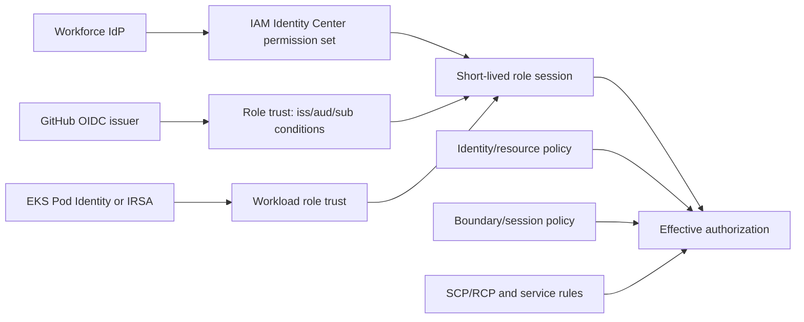

# AWS IAM at Scale: Federation, Delegation, and Guardrails

At scale, IAM is an authorization system and operating model. The design objective is
short-lived, attributable sessions with narrowly delegated permissions and controls
that remain understandable across accounts—not periodic rotation of thousands of
long-lived access keys.

## Executive decision

- Federate workforce access through an identity provider and IAM Identity Center.
- Use temporary workload credentials. For GitHub Actions, validate the AWS OIDC
  audience and a narrow `sub`; for EKS, prefer EKS Pod Identity where its documented
  constraints fit, otherwise use IRSA deliberately.
- Eliminate long-lived IAM-user access keys wherever possible. If a documented legacy
  exception remains, inventory, restrict, monitor, and rotate it while actively
  migrating it—not as a permanent 90-day ritual.
- Separate identity trust policy from permissions policy, resource policy, SCP/RCP,
  permission boundary, session policy, and service control behavior.
- Govern `iam:PassRole` as a privilege-escalation boundary and continuously analyze
  effective reachability.

## Trust model

An AWS role session requires both authentication/trust and authorization. A signed
OIDC token proves claims only if AWS trusts the issuer and the role trust policy
matches those claims. It does not give every repository access by default, and an
attacker cannot simply type a different signed `sub`. Risk appears when the trust
policy uses an overly broad pattern, accepts the wrong audience/issuer, or protects
the accepted repository/ref/environment poorly.



## GitHub Actions OIDC trust

AWS requires a GitHub trust policy to evaluate the GitHub subject claim; AWS also
documents using the audience `sts.amazonaws.com`. A narrow protected-environment
example is:

```json
{
  "Version": "2012-10-17",
  "Statement": [
    {
      "Effect": "Allow",
      "Principal": {
        "Federated": "arn:aws:iam::<account-id>:oidc-provider/token.actions.githubusercontent.com"
      },
      "Action": "sts:AssumeRoleWithWebIdentity",
      "Condition": {
        "StringEquals": {
          "token.actions.githubusercontent.com:aud": "sts.amazonaws.com",
          "token.actions.githubusercontent.com:sub": "repo:jasonachkar/cybersecurity-writeups:environment:production"
        }
      }
    }
  ]
}
```

This is illustrative. Verify the exact subject generated by the selected GitHub
event/environment and protect that environment with reviewers and branch/tag rules.
Use separate roles for build, staging, and production. A broad pattern such as
`repo:organization/*` intentionally delegates trust to many repositories and requires
organization-wide repository/workflow governance; it is not equivalent to an exact
repository and environment binding.

On each exchange, validate through configuration:

- canonical GitHub OIDC provider URL and thumbprint/provider handling per current AWS
  documentation;
- audience expected by the AWS action/partition;
- exact repository owner/name and branch, tag, pull request, or environment subject;
- repository visibility/ownership controls if relevant to the claim set;
- session duration, session name/tags where supported, and narrow role permissions.

The workflow still needs `id-token: write`; this permits requesting an OIDC token but
does not itself grant AWS access. The AWS trust and permissions remain decisive.

## Workload identity on EKS

AWS currently recommends EKS Pod Identity where possible. It centralizes the service
principal trust model and supports session tags, but has documented platform/version,
node-agent, same-account, and service limitations. IRSA uses a cluster OIDC provider
and service-account subject conditions and remains appropriate where Pod Identity is
unsupported or its model does not fit.

For either model:

- dedicate Kubernetes service accounts to workloads and disable default token mount
  where unnecessary;
- bind one narrow AWS role per meaningful workload trust boundary;
- restrict Kubernetes RBAC that can create/modify pods and service accounts because
  it may confer workload identity;
- enforce IMDS/node-role protections so a pod cannot fall back to broader node
  credentials;
- correlate Kubernetes audit, STS, and CloudTrail identity/session data.

Do not call containers a complete boundary: pods on a node share a kernel, and node/
cluster compromise can affect workload identity controls.

## `iam:PassRole` and delegated service roles

`iam:PassRole` lets a principal tell an AWS service to use a role. The role trust
policy must trust that service, and the role must be in the same account as the
principal passing it. Authorization should constrain:

- explicit role ARNs or tightly governed role paths/tags;
- destination service using `iam:PassedToService` where supported;
- associated resource using `iam:AssociatedResourceArn` where semantics are
  documented and tested;
- the service API actions that create/update the resource using the role.

The effective privilege is the intersection of who can pass which role, to which
service/resource, through which create/update APIs. Review all dimensions. The
`PassRole` permission is evaluated during the service API and does not produce a
standalone CloudTrail `PassRole` event; investigate the destination service event and
role ARN.

## Permission architecture

Use accounts as blast-radius and policy boundaries, organized under AWS Organizations.
SCPs restrict the maximum permissions available in member accounts; they do not grant
permissions. Permission boundaries restrict delegated role/user policies; they do not
grant permissions. Resource policies, KMS key policies, role trust policies, session
policies, service-specific authorization, and Organizations resource control policies
where applicable all contribute to effective access.

Build reusable job-function roles/permission sets, then narrow resource scope and
conditions. Avoid attaching administrator policies to CI, platform, and incident roles
for convenience. Use separate break-glass access with strong authentication,
just-in-time approval, dedicated monitoring, tested recovery, and post-use review.

## Long-lived access keys

AWS IAM best practices prioritize federation and temporary credentials. The target
state is no IAM-user key for humans, CI/CD, EC2, containers, or supported AWS
services. Use roles, instance/task profiles, EKS identities, service roles, and OIDC/
SAML federation.

For a legacy exception:

1. name an owner, workload, business reason, data/actions, network path, and migration
   deadline;
2. restrict policy/resource conditions and place the secret in a managed secret
   store, never source or general CI variables;
3. monitor use, source, and anomalous behavior;
4. rotate with overlap and rollback only as required by the integration;
5. disable, observe, then delete when migration completes.

Age alone is a weak signal: an unused new key is still unnecessary, and rotating a
persistently overprivileged key does not reduce its inherent exposure.

## Analysis and continuous validation

Use IAM Access Analyzer for external/internal access findings and policy generation/
validation, service last-accessed information with context, CloudTrail, AWS Config,
organization policy checks, and graph analysis. Community tools such as PMapper can
assist reachability review, but pin/test tool versions and treat their results as
analysis rather than authoritative proof.

Negative tests should attempt cross-account assume role, wrong GitHub repository/ref/
environment/audience, unapproved service-account identity, PassRole to an unauthorized
role/service, access outside resource tags/paths, and action from an SCP-denied account.

## Failure modes and rollback

- OIDC or IdP outage: use a controlled break-glass path, not cached permanent CI keys.
- Overbroad trust: restrict immediately, revoke active sessions where feasible,
  investigate CloudTrail, rotate any accessed downstream secrets, and review builds/
  deployments from affected sessions.
- Permission reduction breaks workloads: roll back a versioned policy through review;
  do not attach AdministratorAccess as an automated fallback.
- Lost organization controls: detect drift and require delegated policy changes through
  a protected pipeline with management-account safeguards.

## Operational checklist

- [ ] Humans and workloads use temporary, attributable sessions.
- [ ] GitHub trust validates audience and exact intended subject/environment.
- [ ] EKS workload identity choice and node/metadata protections are documented.
- [ ] `iam:PassRole`, destination APIs, role trust, and passed role permissions are
      reviewed together.
- [ ] SCPs/boundaries are described as guardrails, not grants.
- [ ] Long-lived keys have a migration deadline, not only a rotation date.
- [ ] Break-glass and identity-provider outage procedures are rehearsed.
- [ ] Trust/policy/role/access-key changes and unexpected sessions alert centrally.

## Limitations

Policy snippets require account/partition/service-specific review. AWS adds services,
condition keys, workload-identity capabilities, and Organizations controls over time;
revalidate before production changes.

## References

- [AWS IAM security best practices](https://docs.aws.amazon.com/IAM/latest/UserGuide/best-practices.html)
- [Create an OIDC role for GitHub Actions](https://docs.aws.amazon.com/IAM/latest/UserGuide/id_roles_create_for-idp_oidc.html)
- [Create an IAM OIDC identity provider](https://docs.aws.amazon.com/IAM/latest/UserGuide/id_roles_providers_create_oidc.html)
- [GitHub OIDC reference](https://docs.github.com/en/enterprise-cloud@latest/actions/reference/security/oidc)
- [GitHub OIDC in AWS](https://docs.github.com/en/actions/how-tos/secure-your-work/security-harden-deployments/oidc-in-aws)
- [Grant a principal permission to pass a role](https://docs.aws.amazon.com/IAM/latest/UserGuide/id_roles_use_passrole.html)
- [EKS IAM roles for service accounts and Pod Identity comparison](https://docs.aws.amazon.com/eks/latest/userguide/service-accounts.html)
- [PMapper source repository](https://github.com/nccgroup/PMapper)
