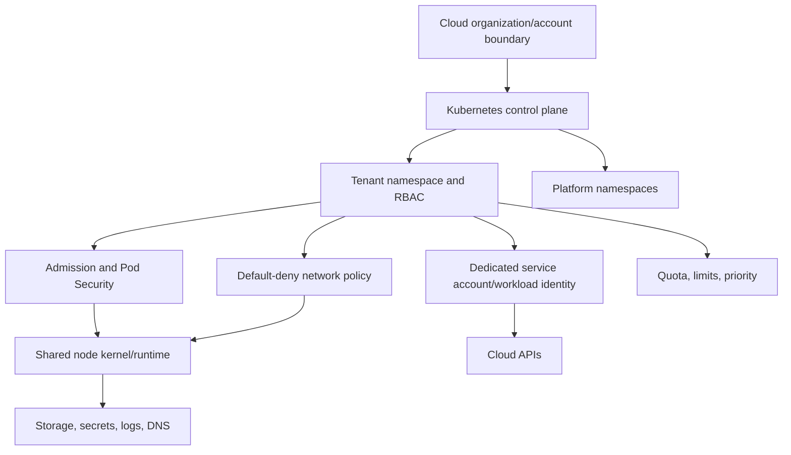

# Kubernetes Multi-tenancy: Boundaries, Isolation, and Operations

Kubernetes multi-tenancy is a spectrum. Namespaces are an administrative and policy
scope inside one control plane, not a hard security boundary by themselves. Containers
on a node share a kernel. Network connectivity is allowed by default unless policy and
the network implementation enforce restrictions. Cloud workload identities, node
credentials, admission, RBAC, secrets, storage, DNS, observability, and operator access
must be designed together.

## Isolation decision

Use shared clusters only when tenant trust, regulatory requirements, blast radius, and
operational controls support a soft-to-moderate boundary. Use dedicated clusters—and
often dedicated cloud accounts/subscriptions/projects—for hostile, regulated, high-
impact, or custom-control-plane tenants. A product may offer several tiers.



## Boundary layers and abuse cases

| Layer | Key controls | Important limitation/negative test |
| --- | --- | --- |
| Cloud/account | separate accounts/projects, narrow cluster/node/workload roles, network perimeter | workload cannot obtain node or another tenant's cloud identity |
| Control plane | private/restricted endpoint, strong admin auth, audit, encryption, upgrade/backup | compromised cluster-admin can cross namespace boundaries |
| Namespace/RBAC | dedicated namespaces/service accounts, least privilege, no wildcard escalation/bind/impersonate | tenant cannot create role bindings or resources in another namespace |
| Admission | Pod Security Admission and/or ValidatingAdmissionPolicy/policy engine | deny privileged/host access, unsafe volume, missing tenant label; test failure policy |
| Network | default deny ingress and egress, explicit DNS/API/dependency paths | CNI actually enforces egress/ingress; hostNetwork/node paths tested |
| Kernel/node | sandboxed runtime or dedicated node pools, hardened OS/runtime, patching | containers share a kernel; privileged/hostPath/hostPID escalation blocked |
| Workload identity | dedicated service account, short-lived projected token, IRSA/Pod Identity/workload federation | pod cannot use default SA, node metadata, or another workload's identity |
| Data/storage | tenant-bound PVC/storage class/key/backup/export policies | stale volume/snapshot/backup cannot attach or restore cross-tenant |
| Availability | ResourceQuota, LimitRange, priority/fairness, autoscaling bounds | one tenant cannot exhaust API, CPU/memory, storage, IPs, logs, or cost |
| Observability | tenant-aware log/metric/traces and platform audit access | telemetry queries and labels do not leak other tenants |

## RBAC and service accounts

The default service account receives no RBAC permissions beyond API discovery by
default, but pods may receive a token unless automount is disabled. Create a dedicated
service account per workload trust boundary, set `automountServiceAccountToken: false`
when Kubernetes API access is unnecessary, and use projected short-lived tokens for
supported external integrations.

Audit RBAC permissions that enable escalation: create/update roles or role bindings,
`bind`, `escalate`, `impersonate`, access to secrets, pod creation under a privileged
service account, exec/attach/port-forward, admission configuration, nodes/proxy,
certificate signing, and webhook/policy changes. Kubernetes authorization alone does
not express application tenant authorization inside a shared service.

## Node authorization precision

With the Node authorizer, a kubelet is authorized for its own Node object and for pods
bound to its node, plus related secrets, ConfigMaps, PVCs/PVs and selected objects
needed for those pods. It is not accurately described as unrestricted read of every
secret in the cluster. Enable the Node authorizer and NodeRestriction admission plugin
as documented; do not grant kubelets or node bootstrap identities broad legacy groups/
roles.

Nevertheless, node compromise is high impact: it exposes workloads and credentials
available on that node and may enable lateral movement through network, workload
identity, control-plane vulnerabilities, or privileged workloads. Use dedicated node
pools for stronger tenant separation, minimize node permissions, restrict metadata
access, patch, monitor runtime behavior, and evaluate sandboxed runtimes.

## Pod security and admission

PodSecurityPolicy was removed in Kubernetes 1.25. Use Pod Security Admission against
the current Pod Security Standards (Privileged, Baseline, Restricted), or a maintained
policy engine/native ValidatingAdmissionPolicy for additional rules.

ValidatingAdmissionPolicy is stable since Kubernetes 1.30 and evaluates CEL
expressions. A robust policy design defines:

- exact resources/operations and namespace/object selectors;
- parameter ownership, missing-parameter behavior, and authorization;
- audit/warn/deny rollout;
- `failurePolicy` behavior when evaluation errors occur;
- exclusions for platform/system components with explicit owners;
- unit fixtures and server-side integration tests across supported versions.

Kyverno has its own policy APIs. The local lab uses Kyverno 1.18
`policies.kyverno.io/v1` `ValidatingPolicy` and `ImageValidatingPolicy`, not the
deprecated legacy `kyverno.io/v1` `ClusterPolicy` type. Pin the CLI/controller version
and validate policy API availability before rollout.

Admission controls creation/update; it does not repair existing violating objects or
detect runtime compromise by itself.

## Network, DNS, and service discovery

Kubernetes networking permits pod-to-pod communication by default. Apply default-deny
ingress and egress in every tenant namespace, then allow DNS, API, identity, telemetry,
and application dependencies narrowly. Confirm the installed CNI enforces the policy
features used; NetworkPolicy semantics do not cover every node/host/control-plane path.

Cluster DNS commonly lets a pod resolve a service when it knows or guesses the fully
qualified name, including another namespace, subject to DNS/network controls. DNS does
not itself grant Kubernetes API enumeration of all services. Protect API discovery with
RBAC, restrict cross-namespace traffic, and consider tenant-specific DNS visibility/
egress controls where name disclosure matters.

## Workload-to-cloud identity

Avoid static cloud credentials and broad node instance roles. Bind a dedicated
Kubernetes service account to a narrow cloud workload identity. Protect every
Kubernetes permission that can create/mutate pods, service accounts, annotations, or
admission objects that influence identity. Block access to node metadata credentials
from pods and correlate Kubernetes audit with cloud STS/token/audit logs.

The cloud authorization policy still defines what a valid federated identity may do.
Test a pod in each tenant cannot exchange for another tenant/platform identity or call
resources outside its scope.

## Resource and noisy-neighbor controls

Apply namespace ResourceQuota and LimitRange for CPU, memory, ephemeral storage,
object counts, load balancers, PVCs/storage, and extended resources. Set requests/
limits based on performance testing, use priority classes carefully, constrain
autoscaling/cost, and protect API fairness. Quota is not a kernel/security boundary,
and limits can introduce availability problems; test eviction, throttling, and scaling.

## Failure modes and rollout

- Policy engine/webhook unavailable: define timeout and failure policy deliberately.
  Production isolation controls generally require fail-closed plus a controlled
  emergency process, not silent bypass.
- CNI/DNS failure: preserve default deny, investigate implementation health, and avoid
  replacing policy with broad allows during recovery.
- Bad admission policy: use audit/warn, canary namespaces, versioned policy, and a
  narrowly authorized rollback path.
- Node compromise: cordon/isolate, revoke node/workload sessions, rotate exposed
  secrets, rebuild the node, inventory pods/identities/data, and review control-plane
  audit.
- Tenant offboarding: revoke identities, stop workloads, handle storage/snapshots/
  backups/log retention, remove network/policy exceptions, and prove deletion.

Rollout starts with asset/tenant classification, RBAC and identity inventory, audit
mode, negative test tenants, default-deny networking, restricted pod baseline, resource
controls, dedicated node/account tiers, and incident exercises. Do not move hostile
tenants into a shared cluster merely because policies compile.

## Reproducible fixture evidence

The [Kubernetes admission, network, and image-policy lab](../labs/kubernetes-security/README.md)
is **partially tested** against Kubernetes `1.34` fixture API shapes and Kyverno CLI
`1.18.2`. From the repository root:

```powershell
node labs/kubernetes-security/tests/run-tests.js
kyverno test labs/kubernetes-security --remove-color
```

On 2026-07-23, the Node harness reported:

```text
PASS: Kubernetes admission, image identity (10 cases), and NetworkPolicy structural tests completed.
```

The pinned Kyverno CLI applied the hardened-pod `ValidatingPolicy` to seven Pod
fixtures and reported `7 tests passed and 0 tests failed`. One compliant Pod was
accepted; the six expected-denial fixtures covered:

- privileged containers/privilege escalation;
- host network and PID namespaces;
- `hostPath`;
- added `NET_ADMIN`;
- missing CPU/memory requests and limits; and
- service-account token automount.

The CLI reports each negative fixture as a passing *test* because the expected policy
result is denial.

The Node harness also parses the `ImageValidatingPolicy` and asserts its exact
registry, keyless issuer/workflow identity, SLSA predicate, failure policy, and digest
configuration. Its ten-case local decision model accepts one expected image and
rejects nine candidates: unsigned, wrong repository, wrong workflow, wrong branch,
wrong issuer, missing attestation, malformed provenance, mutable tag without a digest,
and digest substitution. These identity decisions are a pedagogical structural model;
the native Kyverno test above does not execute the image policy or perform Sigstore
cryptography.

Finally, the Node harness verifies that the NetworkPolicy fixture contains namespace-
wide default-deny ingress/egress and a TCP/UDP 53 DNS exception. It sends no packets
and does not establish CNI enforcement.

## Observability and validation

Collect API audit, admission decisions, RBAC denials, service-account token exchanges,
cloud identity sessions, network flows/denies, DNS, runtime detections, node changes,
exec/attach/port-forward, secret access, resource exhaustion, policy exemptions, and
telemetry-query authorization.

Beyond the local fixtures, test at minimum:

- cross-namespace list/get/create/exec and RBAC escalation;
- privileged, host namespace/path/network, unsafe capability and device requests;
- cross-tenant ingress/egress and node metadata/control-plane paths;
- service-account/cloud identity substitution;
- PVC/snapshot/backup reuse and secret/config access;
- admission dependency/error/missing-parameter behavior;
- CPU/memory/storage/API/log-volume exhaustion;
- node compromise and tenant offboarding runbooks.

## Residual risk and limitations

Shared clusters retain a common control plane and usually shared worker kernels/nodes.
Policy/controller/CNI/runtime defects, cluster-admin compromise, side channels,
observability leaks, cloud identity mistakes, and denial of service remain possible.
Dedicated clusters/accounts reduce some shared blast radius but add cost, fleet
management, patching, policy distribution, and incident complexity.

The local fixtures were not submitted to a Kubernetes API server and no cluster,
Kyverno controller/webhook, CNI, DNS service, container runtime, registry, Fulcio,
Rekor, or workload-identity provider was exercised. Kubernetes `1.34` identifies the
reviewed fixture schema target, not a deployed cluster version. Kyverno CLI success
does not prove admission failure behavior, controller availability, background scan
behavior, image signature/provenance verification, exception governance, or network
isolation in a cluster.

Before production enforcement, run server-side dry-run/schema checks and allowed/
denied admission tests on every supported Kubernetes/Kyverno version. Test signed and
unsigned organization-owned images against the actual registry and transparency
services, then run cross-namespace/CNI/DNS/host-network packet tests. Preserve a
reviewed rollback and fail-closed outage procedure.

## References

- [Kubernetes multi-tenancy](https://kubernetes.io/docs/concepts/security/multi-tenancy/)
- [Kubernetes Node authorization](https://kubernetes.io/docs/reference/access-authn-authz/node/)
- [Kubernetes service accounts](https://kubernetes.io/docs/concepts/security/service-accounts/)
- [Kubernetes Pod Security Standards](https://kubernetes.io/docs/concepts/security/pod-security-standards/)
- [Kubernetes ValidatingAdmissionPolicy](https://kubernetes.io/docs/reference/access-authn-authz/validating-admission-policy/)
- [Kubernetes NetworkPolicy](https://kubernetes.io/docs/concepts/services-networking/network-policies/)
- [Removed PodSecurityPolicy documentation](https://kubernetes.io/docs/concepts/security/pod-security-policy/)
- [Kyverno policy type lifecycle](https://kyverno.io/docs/policy-types/overview/)
- [Kyverno ValidatingPolicy](https://kyverno.io/docs/policy-types/validating-policy/)
- [Kyverno ImageValidatingPolicy](https://kyverno.io/docs/policy-types/image-validating-policy/)
