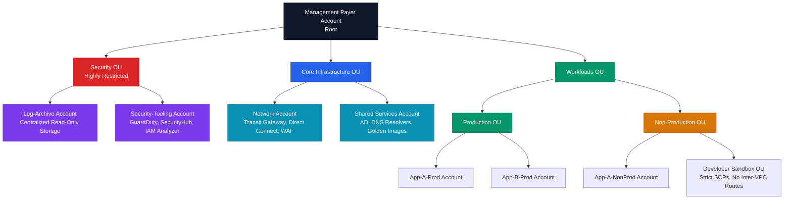

# Enterprise Multi-Account Landing Zone Architecture and Control Plane Isolation

## Executive Summary

Designing a resilient multi-account landing zone is one of the most critical security undertakings for modern cloud platforms. Yet, many organizations default to monolithic cloud architectures or poorly segmented account configurations. Often, teams treat AWS Organizations or Azure Management Groups as simple billing aggregates rather than strict control-plane and security boundaries. The misconception that a single "production" VPC can isolate multi-tier workloads or that IAM users can be securely managed within a single administrative account leads directly to catastrophic platform-wide compromises.

At scale, the failure to decouple identity, data, and compute planes results in lateral movement opportunities that bypass traditional network controls. When an attacker gains access to one developer workstation or a compromised service container, they shouldn't immediately inherit the keys to the entire enterprise kingdom. This whitepaper details how to engineer a security-first multi-account landing zone using AWS Organizations, AWS Control Tower, and delegated administration. It explains the subtle edge cases of nested Service Control Policies (SCPs) and lays out concrete blueprints for preventing control-plane sprawl and resource containment breaches.

---

## Threat Model and Attack Surface

An enterprise landing zone threat model assumes the adversary is seeking full administrative control of the cloud organization, horizontal movement across business units, or silent data exfiltration.

```
       [ Compromised Workload / IAM Session ]
                         │
                         ▼
        [ Attempts Cross-Account Lateral ]
                         │
        ┌────────────────┴────────────────┐
        ▼                                 ▼
[ Network Path (VPC Peering/TGW) ]   [ Identity Path (Cross-Account Role) ]
        │                                 │
        ▼                                 ▼
[ blocked by nacls/fws ]             [ checks role trust relationships ]
                                          │
                                          ▼
                               [ CONFUSED DEPUTY BYPASS ]
                                          │
                                          ▼
                             [ Full Account Compromise ]
```

### Threat Vectors and Kill-Chains

1. **Compromised WORKLOAD to Cross-Account Pivot**:
   - *Adversary Goal*: Extract data from a high-security account using credentials stolen from a low-security dev container.
   - *Attack Vector*: The adversary compromises a container in a developer sandbox, extracts dynamic IAM credentials, and queries the local metadata service. They scan for cross-account roles trusting the sandbox account. If the trust policy lacks structural constraints (like `ExternalId` or IP restrictions), the adversary calls `sts:AssumeRole` to hop directly into core production resources.
2. **Confused Deputy via Cross-Account Service Integrations**:
   - *Adversary Goal*: Leverage a third-party SaaS tool integrated into the landing zone to assume roles in sister accounts.
   - *Attack Vector*: An attacker registers for the same SaaS service and attempts to point the SaaS platform's integration toward the target organization's account ID. If the assumed IAM role's trust policy lacks a unique cryptographically secure `sts:ExternalId`, the SaaS platform's backend acts as a confused deputy, assuming the victim's role on behalf of the attacker.
3. **Malicious Organization Modification**:
   - *Adversary Goal*: Evade detection and logging by detaching security guardrails.
   - *Attack Vector*: An attacker gains administrative access in a child account and tries to invoke `organizations:LeaveOrganization`. If successful, the account leaves the guardrail boundaries of the Organization, disabling central audit trails, SCPs, and GuardDuty security monitoring.

---

## Deep Technical Body

### Service Control Policy (SCP) Evaluation Order and Edge Cases

Service Control Policies (SCPs) are the primary mechanism for setting guardrails in AWS Organizations. However, the logic governing SCPs is often misunderstood. SCPs operate as a filter on permissions; they do **not** grant any permissions. For an action to succeed, there must be a valid IAM policy allowing it, and it must pass through the SCP filter at every level of the Organization hierarchy (Root -> Parent OUs -> Account).

```
         [ API Request ]
                │
                ▼
        [ SCP: Explicit Deny? ] ── YES ──> [ ACCESS DENIED ]
                │ NO
                ▼
        [ SCP: Explicit Allow? ] ── NO ──> [ ACCESS DENIED ]
                │ YES
                ▼
      [ IAM Policy: Explicit Allow? ] ── NO ──> [ ACCESS DENIED ]
                │ YES
                ▼
        [ ACCESS GRANTED ]
```

#### The "Implicit Deny" Trap and FullAWSAccess
By default, every OU and account is attached to the AWS-managed `FullAWSAccess` SCP. This SCP allows `*` on `*`. If this policy is removed without replacing it with an equivalent allow rule, all actions in the child accounts are instantly blocked because of the **implicit deny** mechanism. To maintain operational control while applying fine-grained restrictions, engineers must preserve the default allow block at the root and apply **explicit Deny** rules downward.

#### Nested OU SCP Evaluation Mechanics
When evaluating nested OUs, an explicit deny at any level (Root, Parent OU, Child OU, or Account) takes precedence over any allow. Consider this configuration:
* **Root OU**: Attached to `FullAWSAccess`.
* **Infrastructure OU**: Attached to `DenyAllS3` SCP.
* **Database Account** (under Infrastructure OU): Attached to a custom SCP allowing all S3 actions.

Even though the database account specifically permits S3 actions via an SCP, the request `s3:CreateBucket` will fail with an authorization error. This is because the `DenyAllS3` policy at the parent OU level acts as a hard filter that cannot be overridden by lower levels.

#### Crucial Exceptions: What SCPs Cannot Block
Engineers must recognize that SCPs are not a magic bullet. AWS exempts certain critical actions from SCP evaluation to ensure the platform remains manageable. An SCP **cannot** block:
1. **Actions performed by the AWS Account Root User** (in some legacy scopes, though modern SCPs apply to the root user of *member* accounts, they NEVER apply to the root user of the *management/payer* account).
2. **Operations on Service-Linked Roles**: AWS services use these roles to run tasks on your behalf (e.g. Auto Scaling creating EC2 instances). SCPs cannot block these operations.
3. **Registering/Deregistering enterprise contact details** or viewing billing information in member accounts.
4. **AWS Support Operations**: Any actions taken via AWS Support API or Trusted Advisor support interfaces.

### Bypassing SCPs via Resource-Based Policies
A common architectural vulnerability occurs when an organization assumes SCPs cover all data access. S3 buckets, KMS keys, and SQS queues support **Resource-Based Policies**.
If an external account is granted access via an S3 Bucket Policy:
```json
{
  "Version": "2012-10-17",
  "Statement": [
    {
      "Effect": "Allow",
      "Principal": {
        "AWS": "arn:aws:iam::222222222222:role/external-role"
      },
      "Action": "s3:GetObject",
      "Resource": "arn:aws:s3:::internal-secure-bucket/*"
    }
  ]
}
```
If the external role calls `s3:GetObject` on the internal bucket, the SCPs of the **target account** (where the S3 bucket lives) are **not** evaluated against the caller. Only the SCPs of the **caller's account** (Account `222222222222`) are evaluated. If the caller's account lacks an SCP restricting S3 access, the data can be exfiltrated, bypassing all internal landing zone guardrails.

---

## Defensive Architecture

A secure landing zone requires a structured OU hierarchy that isolates administrative domains and enforces least privilege through automated guardrails.

### Reference OU Directory Tree



### Core Guardrail Policy: Harden Account Boundaries
Below is a production-ready SCP designed to prevent administrative escape, restrict region sprawl to compliant regions, and enforce IMDSv2 usage.

```json
{
  "Version": "2012-10-17",
  "Statement": [
    {
      "Sid": "DenyLeaveOrganization",
      "Effect": "Deny",
      "Action": [
        "organizations:LeaveOrganization"
      ],
      "Resource": "*"
    },
    {
      "Sid": "DenyDisablingSecurityServices",
      "Effect": "Deny",
      "Action": [
        "guardduty:DeleteDetector",
        "guardduty:DisassociateFromMasterAccount",
        "guardduty:UpdateDetector",
        "securityhub:DeleteDetector",
        "securityhub:DisassociateFromMasterAccount",
        "cloudtrail:StopLogging",
        "cloudtrail:DeleteTrail",
        "cloudtrail:UpdateTrail",
        "config:DeleteDeliveryChannel",
        "config:StopConfigurationRecorder"
      ],
      "Resource": "*"
    },
    {
      "Sid": "RestrictAWSRegions",
      "Effect": "Deny",
      "Action": "*",
      "Resource": "*",
      "Condition": {
        "StringNotEquals": {
          "aws:RequestedRegion": [
            "us-east-1",
            "us-west-2",
            "eu-west-1"
          ]
        },
        "Null": {
          "aws:RequestedRegion": "false"
        }
      }
    },
    {
      "Sid": "EnforceIMDSv2",
      "Effect": "Deny",
      "Action": "ec2:RunInstances",
      "Resource": "arn:aws:ec2:*:*:instance/*",
      "Condition": {
        "StringNotEquals": {
          "ec2:MetadataHttpTokens": "required"
        }
      }
    }
  ]
}
```

---

## Tooling and Implementation

Implementing a multi-account landing zone requires combining native CSP tools with Infrastructure-as-Code (IaC) governance engines.

1. **AWS Control Tower & Customizations (CfCT)**: Use Control Tower to orchestrate account provisioning. Use the Customizations for AWS Control Tower (CfCT) framework to apply SCPs and deploy baseline cloud resources (e.g., IAM roles, Config Rules) automatically using CloudFormation or Terraform templates.
2. **Delegated Administration**: Never use the Organization Payer/Management account for security operations. Configure Delegated Administration for services like **GuardDuty**, **Security Hub**, **AWS Config**, and **IAM Access Analyzer** to run inside the dedicated `Security-Tooling` account. This ensures that a compromise of a security tool's configuration does not expose organization-level administration APIs.
3. **AWS IAM Access Analyzer**: Deploy at the Organization level to continuously scan for resources that are accessible from outside the zone boundary, highlighting cross-account trust violations.

---

## Landing Zone Audit Checklist

| Item | Focus Area | Verification Step / Command | Target State |
| :--- | :--- | :--- | :--- |
| 1 | Payer Account Security | Verify no compute or database resources are running in the Management Payer account. | No EC2, RDS, or VPC resources exist. |
| 2 | Logging Integrity | Inspect S3 bucket policy for the centralized log bucket in the `Log-Archive` account. | Restrict delete permissions (`s3:DeleteObject*`) to prevent log tampering. |
| 3 | SCP Coverage | Check that the `DenyLeaveOrganization` and `DenyDisablingSecurityServices` SCPs are attached to the root of the Organization tree. | Protection is active globally across all member accounts. |
| 4 | Region Lockout | Validate if unauthorized regions (e.g. outside US/EU) can spin up resources. | Commands like `aws ec2 run-instances --region ap-southeast-1 ...` fail with authorization errors. |
| 5 | Workload Isolation | Audit transit gateway route tables in the `Network` account. | Non-Prod account VPCs must be physically blocked from routing traffic to Production VPCs. |
| 6 | Root User Protection | Ensure root accounts of all member accounts have MFA configured and no active access keys. | `aws credential-report` shows zero active API keys for root accounts. |

---

## References

* *AWS Organizations User Guide - Service Control Policies*: [AWS Documentation](https://docs.aws.amazon.com/organizations/latest/userguide/orgs_manage_policies_scps.html)
* *NIST Special Publication 800-162 (Attribute-Based Access Control)*: [NIST SP 800-162](https://nvlpubs.nist.gov/nistpubs/specialpublications/nist.sp.800-162.pdf)
* *Mitigating Confused Deputy Problems in Cross-Account Integrations*: [AWS Security Blog](https://aws.amazon.com/blogs/security/how-to-use-an-external-id-when-granting-access-to-your-aws-resources-to-a-third-party/)
