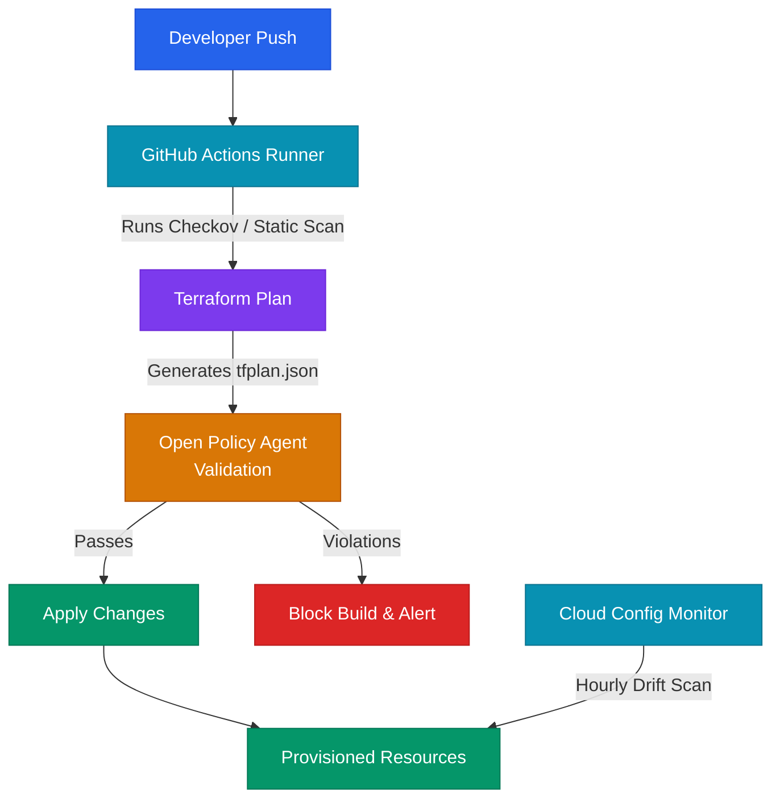

# IaC Security and Policy as Code: Hardening Terraform State, Rego Policy Engine, and Drift Controls

## Executive Summary

Infrastructure as Code (IaC) tools like Terraform, CloudFormation, and OpenTofu allow teams to manage cloud platforms with software development speed. However, this automation also speeds up the deployment of security risks. A single misconfiguration in an IaC template—such as a public S3 bucket or an overly permissive security group—can be deployed instantly across multiple environments, leading to large-scale data exposure. Traditional post-deployment compliance checks are too slow; security must be integrated directly into the IaC development lifecycle.

At scale, relying on manual code reviews to verify infrastructure configurations is insufficient and error-prone. Organizations must enforce automated guardrails using Policy as Code (PaC) engines like Open Policy Agent (OPA). Furthermore, teams frequently overlook the security of Terraform state files (`.tfstate`), which often contain plaintext secrets, passwords, and sensitive platform architecture metadata. This whitepaper explains how to protect Terraform state, build automated policy validation gates using Rego, detect configuration drift, and integrate security controls into pre-commit and pre-deploy stages.

---

## Threat Model and Attack Surface

The IaC security threat model covers code repositories, state storage backends, execution pipelines, and post-deployment configuration drift.

```
[ Developer Modifies TF Template ] -> [ Local Commit ] -> [ CI/CD Plan Phase ]
                                                                 │
                                                    ( Generates tfplan.json )
                                                                 │
                                                                 ▼
                                                  [ Open Policy Agent Validation ]
                                                                 │
                                 ┌───────────────────────────────┴───────────────────────────────┐
                                 ▼ (Violations Detected: e.g., Public S3)                        ▼ (Compliant Plan)
                      [ Block Deployment ]                                            [ Run Terraform Apply ]
                                                                                                 │
                                                                                                 ▼
                                                                                      [ Update Remote state ]
                                                                                                 │
                                                                                      ( Plaintext Secrets Exposure? )
```

### Threat Vectors and Kill-Chains

1. **State File Compromise (Information Disclosure)**:
   - *Adversary Goal*: Extract administrative passwords, database credentials, and cloud tokens.
   - *Attack Vector*: An application provisions a database using Terraform. The database password is dynamically generated and stored in the `terraform.tfstate` file. If the state file is stored in an unencrypted S3 bucket without access controls or committed to a git repository, an attacker downloads the file and reads the sensitive credentials in plaintext, compromising the database.
2. **Policy Bypass in CI/CD (Bypassing Security Gates)**:
   - *Adversary Goal*: Deploy non-compliant, insecure infrastructure.
   - *Attack Vector*: An organization uses static analysis checkers (like Checkov) to scan IaC code in pull requests. However, the checkers are configured to only scan static files and do not evaluate dynamic variables. An attacker variables-injects a public IP mapping during the runtime execution stage. Because the policy check is not applied to the generated execution plan (`tfplan`), the insecure resource is provisioned successfully.
3. **Configuration Drift (Security Evasion)**:
   - *Adversary Goal*: Create an unauthorized backdoor that bypasses IaC auditing.
   - *Attack Vector*: An attacker gains access to the AWS Console and modifies a Security Group directly, opening port 22 to the public internet (`0.0.0.0/0`). Because the IaC code remains unchanged, static scanners do not detect the modification. The backdoor remains open until a drift detection utility runs or a new Terraform apply reconciles the resource.

---

## Deep Technical Body

### Hardening Terraform State Files

Terraform state files contain a complete record of all resources managed by a workspace. This includes private IP addresses, system resource names, and sensitive values (like database passwords or API keys) generated during provision steps.

#### State Protection Strategies:
* **Encryption at Rest**: Store state files in an S3 bucket configured with default server-side encryption using a customer-managed KMS key. Restrict decryption permissions to the specific IAM role running the deployment pipeline.
* **State File Lockout Policies**: Prevent concurrent runs and unauthorized modifications by using DynamoDB tables for state locking.
* **Strict IAM Access Policies**: Never allow developers to read state files directly. Restrict access using S3 Bucket Policies to ensure only the CI/CD runner can read and write to the state location.

### Open Policy Agent (OPA) and Rego Validation

Open Policy Agent (OPA) is a cloud-native, general-purpose policy engine. You write policies in a declarative language called **Rego**. To scan Terraform plans dynamically, export the plan as a JSON file and run OPA validations against it:

#### Exporting the Plan:
```bash
terraform plan -out=tfplan
terraform show -json tfplan > tfplan.json
```

#### Rego Policy: Block Public S3 Buckets and Open Security Groups
This Rego policy scans the `tfplan.json` execution plan and blocks the deployment if an S3 bucket is configured with public access, or if a security group allows inbound traffic on port 22 from the public internet.

```rego
package terraform.security

default allow = false

# Allow deployment only if there are no violations
allow {
    count(violations) == 0
}

# Rule 1: Identify public S3 bucket configurations
violations[msg] {
    resource := input.resource_changes[_]
    resource.type == "aws_s3_bucket_public_access_block"
    
    # Check if any public access block parameter is set to false (unlocked)
    public_param := ["block_public_acls", "block_public_policy", "ignore_public_acls", "restrict_public_buckets"]
    param := public_param[_]
    resource.change.after[param] == false

    msg := sprintf("S3 Bucket public access block '%v' is disabled on resource '%v'", [param, resource.address])
}

# Rule 2: Identify Security Groups allowing open SSH (port 22 from 0.0.0.0/0)
violations[msg] {
    resource := input.resource_changes[_]
    resource.type == "aws_security_group"
    
    ingress := resource.change.after.ingress[_]
    ingress.from_port <= 22
    ingress.to_port >= 22
    
    cidr := ingress.cidr_blocks[_]
    cidr == "0.0.0.0/0"
    
    msg := sprintf("Security Group '%v' allows public SSH access (port 22) from '0.0.0.0/0'", [resource.address])
}
```

---

## Defensive Architecture

A secure IaC deployment pipeline must enforce pre-commit validation, plan-stage policy checks, and automated drift detection.

### Architecture Topology: IaC Validation Pipeline and Drift Detection Loop



### Automated Drift Detection Workflow
To detect unauthorized changes made directly via the cloud console, run a scheduled drift detection job hourly in your CI/CD system. Run `terraform plan -detailed-exitcode`; if the command returns exit code 2 (indicating configuration changes exist), trigger alert notifications or run `terraform apply` to overwrite the changes and restore compliance.

---

## Tooling and Implementation

Implement a robust IaC validation chain using specialized security tools:

1. **Checkov / tfsec**: Deploy these static analysis engines inside developers' local pre-commit hooks (using the `pre-commit` framework) to scan Terraform manifests for vulnerabilities before code is committed.
2. **Open Policy Agent (OPA)**: Integrate OPA into the central CI/CD pipeline to evaluate execution plans dynamically, blocking non-compliant changes before they are provisioned.
3. **Driftctl**: Use Driftctl or native Terraform workspace drift monitoring tools to scan cloud environments continuously, identifying resources that are not tracked by IaC state configurations.

---

## IaC Security Audit Checklist

| Item | Focus Area | Verification Step / Command | Target State |
| :--- | :--- | :--- | :--- |
| 1 | State Encryption | Check S3 bucket encryption settings for the remote state storage. | KMS encryption is active, and bucket access is restricted using custom IAM rules. |
| 2 | State Access Control | Verify if developers have direct read access to remote state files. | Read/Write access is restricted exclusively to the CI/CD pipeline role. |
| 3 | Static Scan Coverage | Check if Checkov or tfsec scans run automatically on every pull request. | Scans are enforced as required checks before merging code. |
| 4 | Plan-Stage Validation | Verify if policy checks analyze the runtime execution plan (`tfplan.json`). | Open Policy Agent rules validate the generated plan file. |
| 5 | Drift Monitoring | Audit drift detection schedules. | Scheduled jobs run at least daily to identify untracked changes. |
| 6 | Secret Detection | Verify if pre-commit hooks check for hardcoded secrets in IaC code. | Scanners block commits containing plaintext passwords, keys, or certificates. |

---

## References

* *Terraform Remote State Storage Best Practices*: [HashiCorp Documentation](https://developer.hashicorp.com/terraform/language/state/remote)
* *Open Policy Agent Rego Reference*: [OPA Documentation](https://www.openpolicyagent.org/docs/latest/policy-reference/)
* *NIST Special Publication 800-204D (Security for Infrastructure Automation)*: [NIST SP 800-204D](https://nvlpubs.nist.gov/nistpubs/SpecialPublications/NIST.SP.800-204D.pdf)
