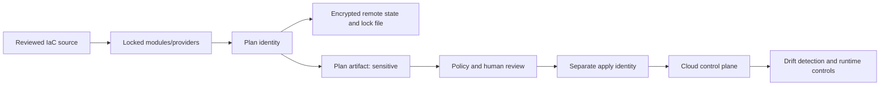

# Infrastructure as Code Security and Policy Engineering

Infrastructure as Code (IaC) is privileged software. Source, modules/providers,
state, plans, policy engines, runners, and cloud identities all cross trust boundaries.
A scanner is useful, but security comes from controlled dependency resolution,
protected state, least-privilege planning/apply identities, independent policy,
reviewable changes, drift triage, and runtime verification.

## Threat model and control plane


```mermaid
flowchart LR
  C["Reviewed IaC source"] --> D["Locked modules/providers"]
  D --> P["Plan identity"]
  P --> S["Encrypted remote state and lock file"]
  P --> O["Plan artifact: sensitive"]
  O --> G["Policy and human review"]
  G --> A["Separate apply identity"]
  A --> R["Cloud control plane"]
  R --> X["Drift detection and runtime controls"]
```

Threats include malicious modules/providers, credential theft, poisoned runners,
state disclosure/tamper, saved-plan substitution, policy bypass, excessive cloud
permissions, unreviewed drift, destructive apply, and a scanner failure interpreted
as success.

## Backend and state security

State can contain resource identifiers, topology, generated values, and secrets even
when outputs are marked sensitive. Treat it as restricted data.

For the Terraform S3 backend, current HashiCorp documentation supports native S3
locking with `use_lockfile = true` and recommends S3 bucket versioning for recovery.
DynamoDB-based locking is deprecated and is planned for removal. Existing backends
may temporarily configure both during migration, but new guidance should not make a
DynamoDB lock table the default.

```hcl
# Illustrative: values and policy must be organization-specific.
terraform {
  backend "s3" {
    bucket       = "<restricted-state-bucket>"
    key          = "landing-zones/prod/terraform.tfstate"
    region       = "ca-central-1"
    encrypt      = true
    use_lockfile = true
  }
}
```

Enforce TLS, encryption with an appropriately governed KMS key, bucket public-access
blocks, versioning, narrow state/lock object permissions, separate state per trust
boundary, access logging/audit, retention/recovery, and no developer-wide state
download. Backend partial configuration or environment federation avoids committing
credentials. `encrypt = true` is not a substitute for bucket/key policies.

OpenTofu and Terraform may diverge in backend, encryption, state, provider, and CLI
semantics. Pin the tool and provider/module versions and validate against the chosen
implementation; do not assume interchangeable behavior from a shared language.

## Dependency integrity

- Commit dependency lockfiles and use locked initialization in CI.
- Pin registry module/provider versions with reviewed constraints; prefer immutable
  source revisions for VCS modules.
- Use approved registries/mirrors and protect publishing namespaces.
- Verify provider/plugin checksums through supported lockfile/mirror mechanisms.
- Review transitive module behavior, required provider permissions, and generated
  resources. A version pin fixes bytes; it does not prove safety.

Do not let untrusted pull-request code run `terraform plan` with a credential that can
read production data sources/state or invoke dangerous provider APIs. Use static
validation without credentials for untrusted code, then plan a reviewed revision in a
protected context.

## Identity separation and plan handling

Planning can call read APIs and data sources, and some providers have surprising
side effects. Use a narrow plan identity and an even more carefully scoped apply
identity where practical. Prefer OIDC/workload federation to stored cloud keys.

Saved binary plan files can contain sensitive cleartext values and encode actions for
a particular state/configuration/provider set. Encrypt/restrict/expire them as
artifacts, bind them to source commit, state lineage/version, lockfile, tool version,
policy evidence, and approval, then apply that exact plan. Do not accept a plan from an
untrusted workflow.

Separate production environments/accounts/subscriptions, protected approvals, and
apply roles. Restrict bypass paths such as direct owner access, alternate pipelines,
local apply, state editing, policy exemption, or deployment through a different tool.

## Policy as code

Use complementary checks:

- syntax/format/validation;
- static misconfiguration and secret scanning;
- plan-aware policy evaluating the actual proposed graph;
- organization/cloud policy at the control plane;
- runtime configuration and threat detection after apply.

Policy results need tool/configuration version, input identity, completion state,
severity/rule, resource address, owner, waiver, and expiry. Missing/invalid plan or
scanner output blocks. Roll out new rules in observation mode, triage false positives,
then enforce with owned exceptions. Test both violating and compliant fixtures.

Guardrails should cover public exposure, identity/role scope, encryption and key
governance, logging, network paths, backup/recovery, metadata-service protections,
regions, tags/ownership, managed service configurations, and destructive lifecycle
behavior according to risk. Avoid counting policies as equivalent controls without
testing their actual provider semantics.

## Drift response

Drift is a signal, not authorization to run `terraform apply` automatically. An
automatic apply can delete an emergency control, overwrite incident containment,
recreate a compromised configuration, or make an unreviewed destructive change.

Classify drift:

1. determine actor, time, affected resource, incident/change context, and intended
   source of truth;
2. assess exposure, destructive actions, data-plane effects, and dependencies;
3. decide whether to import/update code, revert runtime, preserve emergency change,
   or investigate as an incident;
4. generate a fresh reviewed plan with the correct identity and state lock;
5. apply through the normal protected promotion path;
6. verify runtime and record resolution.

Emergency console changes need a reconciliation workflow, not concealment.

## Failure modes and recovery

- **Lock acquisition failure:** investigate active operation and stale lock. Do not
  force-unlock until ownership is known and no operation is active.
- **State corruption/deletion:** stop applies, preserve evidence, recover a reviewed
  version, validate lineage/serial/resources, and plan before changes.
- **Backend/KMS outage:** do not fall back to local unprotected state.
- **Partial apply:** capture logs/state, inspect actual resources, and create a new
  recovery plan; do not rerun blindly.
- **Policy/scanner outage:** block or use explicit time-bounded risk acceptance; no
  empty success.
- **Compromised provider/module/runner:** revoke sessions, quarantine outputs/plans,
  restore trusted dependencies/runner, inspect control-plane audit, and re-plan.
- **Unexpected destructive plan:** stop, validate variables/workspace/state/source,
  require specialized approval, and rehearse recovery for stateful resources.

## Deployment and rollback

Canary guardrails and modules in non-production. Use small plans, dependency-aware
ordering, maintenance windows where required, and pre-change backup/recovery evidence.
Terraform rollback is a new forward plan; not every cloud operation is reversible.
Deletion, key rotation, database migration, network cutover, and policy inheritance
need resource-specific recovery procedures.

## Validation checklist

- [ ] Tool, provider, module, and lockfile versions are controlled.
- [ ] Remote state uses encryption, TLS, versioning, least privilege, audit, and native
      locking supported by the selected tool.
- [ ] Untrusted PR validation has no production state/cloud credential.
- [ ] Plan and apply identities, artifacts, approvals, and environments are separated.
- [ ] Policy/scanner failures block; waivers are narrow, owned, and expiring.
- [ ] Destructive and high-blast-radius changes receive specialized review.
- [ ] Drift is investigated and approved, never blindly auto-applied.
- [ ] Runtime evidence and state recovery are tested.

## Limitations

The backend snippet is illustrative and omits organization-specific account, KMS,
network, replication, and disaster-recovery configuration. Validate the current
Terraform or OpenTofu implementation and cloud provider before use.

## References

- [Terraform S3 backend](https://developer.hashicorp.com/terraform/language/backend/s3)
- [Terraform dependency lock file](https://developer.hashicorp.com/terraform/language/files/dependency-lock)
- [Terraform saved plan options and security warning](https://developer.hashicorp.com/terraform/cli/commands/plan)
- [GitHub secure use reference](https://docs.github.com/en/actions/reference/security/secure-use)
