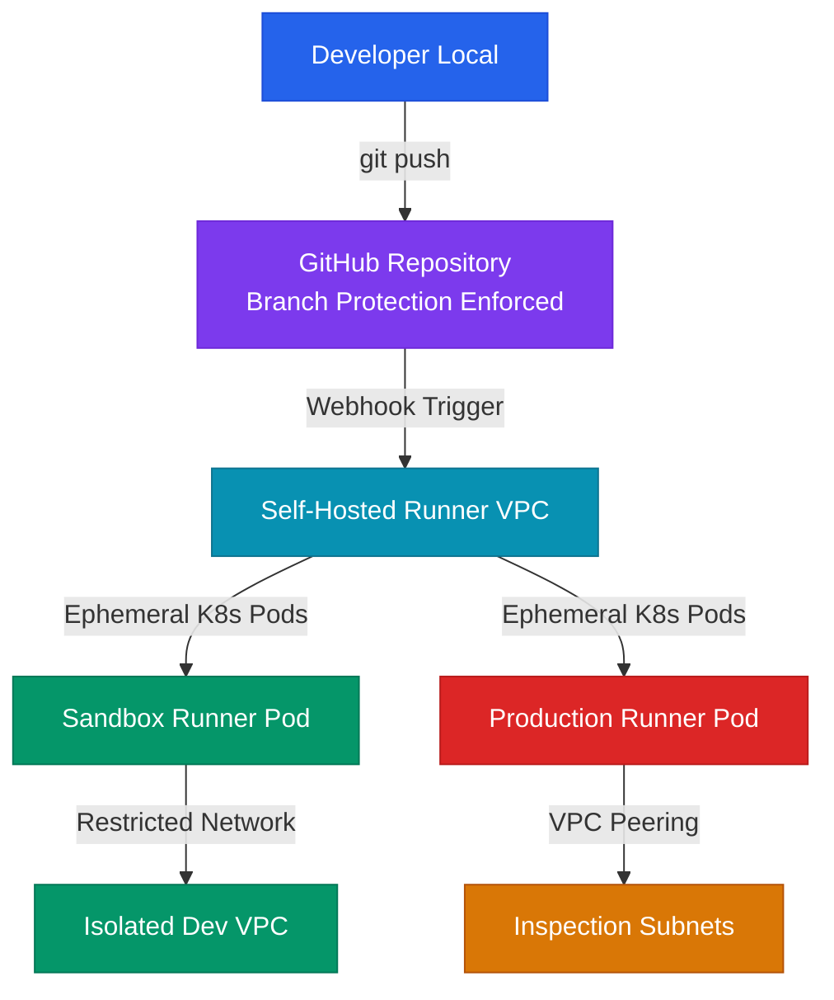

# Secure CI/CD Pipeline Design: Runner Hardening, Workload Identity, and Pipeline Integrity

## Executive Summary

Software delivery pipelines are highly attractive targets for modern adversaries. By compromising a build system, attackers can inject malicious code directly into production binaries, harvest cloud credentials, or hijack infrastructure. Traditional security strategies often focus exclusively on scanning code repositories for vulnerabilities, leaving the pipeline orchestration plane itself unsecured. Build runners frequently execute with administrative cloud privileges and access sensitive production environments, making them prime targets for lateral escalation.

At scale, the failure to secure pipeline runners and enforce strict branch protection policies creates catastrophic vulnerability chains. The most severe of these is Poisoned Pipeline Execution (PPE), where attackers modify CI configuration files in untrusted pull requests to execute arbitrary code on shared runner infrastructure. This whitepaper explains the design principles, access controls, and hardening patterns needed to secure build execution environments, implement keyless workload identity federation, and prevent pipeline hijacking.

---

## Threat Model and Attack Surface

The pipeline attack surface spans code contribution events, configuration files, runner execution hosts, and target environment deployment interfaces.

```
                  [ Malicious Pull Request Submitted ]
                                   │
                  ( Modifies .github/workflows/build.yml )
                                   │
                                   ▼
                   [ CI Runner Starts Execution ]
                                   │
                ( Runs Arbitrary Attacker Script )
                                   │
                                   ▼
                    [ Hijacks Runner Host Environment ]
                                   │
               ┌───────────────────┴───────────────────┐
               ▼ (Attack Path: Shared Secrets)         ▼ (Protected: OIDC Federation)
      [ Steals Hardcoded AWS Keys ]            [ Requests OIDC Token from STS ]
               │                                       │
               ▼                                       ▼
    [ Bypasses network gates ]                 [ Blocked: PR Ref mismatch ]
          ( Exfiltration )                             ( Secure )
```

### Threat Vectors and Kill-Chains

1. **Poisoned Pipeline Execution (PPE) via Pull Requests**:
   - *Adversary Goal*: Extract secrets or execute malicious code on enterprise runners.
   - *Attack Vector*: An open-source project or repository configuration allows pull requests from external forks to trigger build workflows automatically. An attacker submits a PR that modifies the build script or workflow configuration (`.github/workflows/ci.yml`), inserting commands to print environment variables or download malware. The runner executes the modified workflow in the context of the main repository, exposing secrets to the attacker's logs.
2. **Runner Host Compromise**:
   - *Adversary Goal*: Establish persistent access in the internal network or cloud environment hosting the build runner.
   - *Attack Vector*: An organization deploys self-hosted runners on persistent virtual machines inside their private AWS VPC. The runners are not isolated and share a broad IAM instance profile. An attacker exploits a vulnerability in a third-party dependency during a test execution, gains code execution on the runner VM, and queries the local IMDS to steal the VM's administrative IAM credentials.
3. **Secrets Extraction from Runner Memory**:
   - *Adversary Goal*: Steal deployment keys or API tokens.
   - *Attack Vector*: Build systems pass sensitive API tokens to shell scripts as plaintext environment variables. An attacker compromises an execution container and dumps the environment variables or memory of parent processes, harvesting active secrets.

---

## Deep Technical Body

### Poisoned Pipeline Execution (PPE) Mechanics and Mitigations

Poisoned Pipeline Execution occurs when the build runner compiles or tests code based on configurations defined in untrusted user branches.

#### The GitHub Actions `pull_request_target` Trap
GitHub Actions provides two primary triggers for pull requests:
* `pull_request`: Runs in the context of the merge commit (the code modification submitted in the PR). Workflows triggered by `pull_request` **do not have access to secrets** (they are stripped by GitHub) and have read-only token permissions, protecting the repository.
* `pull_request_target`: Runs in the context of the target base branch (the secure master branch), but has access to the PR code. Workflows triggered by `pull_request_target` **have full access to repository secrets** and write-access tokens.

If a developer writes a workflow triggered by `pull_request_target` that checks out the untrusted code from the incoming PR and runs an execution step (e.g. `npm install` or `make build`), the untrusted code executes inside a privileged context, exposing all repository secrets to the attacker.

#### Secure Workflow Patterns
1. **Never checkout untrusted PR code** in a `pull_request_target` workflow unless strict manual approvals are enforced.
2. Use the `pull_request` trigger for testing. If you must publish PR statuses or coverage reports, write a two-stage workflow:
   - Stage 1: The untrusted `pull_request` workflow runs tests and uploads test artifacts (without secrets).
   - Stage 2: A secure `workflow_run` workflow triggers after the first stage completes, reads the artifacts, and posts the results using secure tokens.

### Workload Identity Federation (GitHub OIDC) for Deployments

To eliminate the need for storing long-lived deployment secrets (such as AWS Access Keys) in GitHub, implement OpenID Connect (OIDC) federation.

#### How it works:
1. The GitHub Actions runner requests a short-lived OIDC token (JWT) from GitHub's token authority.
2. The runner calls `sts:AssumeRoleWithWebIdentity` on AWS, passing the JWT.
3. The AWS IAM service verifies the signature of the token against GitHub's public keys.
4. The trust policy validates that the repository and branch name in the JWT claims match the allowed values before returning temporary session credentials.

#### Secure GitHub Actions Workflow (OIDC Example)
```yaml
name: Production Secure Deploy
on:
  push:
    branches:
      - main

permissions:
  id-token: write # Required for requesting the OIDC JWT token
  contents: read  # Required for checkout

jobs:
  deploy:
    runs-on: ubuntu-latest
    steps:
      - name: Checkout Code
        uses: actions/checkout@v4

      - name: Configure AWS Credentials via OIDC
        uses: aws-actions/configure-aws-credentials@v4
        with:
          role-to-assume: arn:aws:iam::123456789012:role/GitHubActionsDeploymentRole
          aws-region: us-west-2

      - name: Deploy Application
        run: |
          aws s3 sync ./dist s3://my-production-deployment-bucket/
```

---

## Defensive Architecture

A secure pipeline design requires isolating runner hosts, enforcing branch protections, and applying strict validation rules to all code changes.

### Reference Pipeline Isolation Boundary Topology



* **Ephemeral Runners**: Build steps run inside temporary Kubernetes pods (e.g. using Actions Runner Controller). Pods are destroyed immediately after execution completes, preventing cross-build contamination and persistent malware installation.
* **Network Isolation**: Runners executing untrusted code (like unit tests or PR checks) run in isolated VPC subnets with no routing paths to internal production environments.

---

## Tooling and Implementation

Implement active scanning and policy controllers to govern pipeline configurations:

1. **GitHub Actions Runner Controller (ARC)**: Deploy self-hosted runners inside Kubernetes dynamically. ARC orchestrates ephemeral runner pods that scale up and down based on queue demands, maintaining a clean state for every build.
2. **Kube-score / Checkov**: Run static analysis on workflow configurations and runner deployment charts to identify security risks, such as running containers as root or missing memory limit definitions.
3. **StepSecurity / Slauth**: Integrate runtime security monitoring into your build workflows. StepSecurity logs and blocks unauthorized outbound network calls initiated during the build process, preventing dependencies from exfiltrating credentials.

---

## CI/CD Security Audit Checklist

| Item | Focus Area | Verification Step / Command | Target State |
| :--- | :--- | :--- | :--- |
| 1 | Branch Protection | Inspect branch protection settings for the `main` branch. | Requiring pull request reviews, status checks, and linear history is enforced. |
| 2 | Secret Management | Search repository settings for active, long-lived AWS keys or deployment secrets. | All deployment jobs use OIDC federation; no hardcoded keys exist. |
| 3 | Trigger Controls | Audit workflows using `pull_request_target` or `workflow_run`. | No untrusted code from PR branches is checked out or executed within these privileged scopes. |
| 4 | Runner Isolation | Check network configurations of self-hosted runner VMs. | Runners cannot access metadata services or adjacent production subnets. |
| 5 | Token Permissions | Verify default API permissions for GITHUB_TOKEN. | Default permissions are set to read-only; workflows define explicit, minimal permissions. |
| 6 | Execution Cleanup | Verify if build artifacts and temporary files are cleared from persistent volumes. | Ephemeral containers run in scratch memory, ensuring no data remains after jobs complete. |

---

## References

* *Security Hardening for GitHub Actions*: [GitHub Documentation](https://docs.github.com/en/actions/security-guides/security-hardening-for-github-actions)
* *GitHub Actions OpenID Connect (OIDC) Federation*: [GitHub Documentation](https://docs.github.com/en/actions/deployment/security-hardening-your-deployments/about-security-hardening-with-openid-connect)
* *OWASP Top 10 CI/CD Security Risks*: [OWASP Project](https://owasp.org/www-project-top-10-ci-cd-security-risks/)
