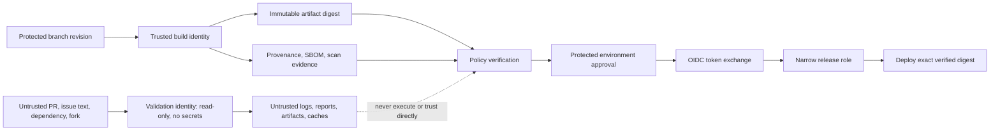

# Secure CI/CD Pipeline Architecture and Trust Boundaries

A pipeline is a privileged software supply-chain service. It evaluates attacker-
controlled text and code, downloads third-party components, executes scanners and
build tools, moves artifacts between trust zones, exchanges identity tokens, and can
change production. Security depends on keeping those capabilities separated and
verifying every promotion input.

The companion [`labs/secure-cicd`](../labs/secure-cicd/README.md) lab provides safe
and intentionally unsafe workflow fixtures plus a fail-closed scanner gate.

## Executive decision

Separate untrusted validation, trusted build, and privileged release into distinct
jobs/workflows and identities. Grant no deployment credential to pull-request code.
Build once in a protected context, identify the immutable artifact by digest, attach
provenance and security evidence, and promote that same digest after policy and human
approval. Prefer workload federation/OIDC to stored cloud credentials.

Never assume an event name makes content safe. Review the event, checkout ref, token
permissions, secrets, environment, runner, expressions, artifacts, caches,
dependencies, and called workflows together.

## Scope and non-goals

In scope:

- GitHub Actions and Azure DevOps trust-boundary patterns;
- pull-request validation, trusted build, release promotion, and cloud federation;
- scanner failure semantics, immutable dependencies, artifact integrity, approvals,
  observability, rollout, and incident response.

Not provided:

- a universal vulnerability threshold or compliance certification;
- proof that a marketplace action, scanner, compiler, dependency, or hosted runner is
  benign;
- organization-specific branch protection, Azure service connection, or cloud role;
- permission to deploy the repository's teaching fixtures.

## Threat model


```mermaid
flowchart LR
  U["Untrusted PR, issue text, dependency, fork"] --> V["Validation identity: read-only, no secrets"]
  V --> E["Untrusted logs, reports, artifacts, caches"]
  M["Protected branch revision"] --> B["Trusted build identity"]
  B --> A["Immutable artifact digest"]
  B --> P["Provenance, SBOM, scan evidence"]
  A --> G["Policy verification"]
  P --> G
  G --> H["Protected environment approval"]
  H --> O["OIDC token exchange"]
  O --> R["Narrow release role"]
  R --> D["Deploy exact verified digest"]
  E -. never execute or trust directly .-> G
```

### Material abuse cases

| Abuse case | Control strategy | Evidence |
| --- | --- | --- |
| Forked PR executes with write token or secrets | ordinary PR validation; explicit read permission; no deployment environment | workflow policy checks and fork test |
| `pull_request_target` checks out attacker head | never combine privileged base-context event with untrusted checkout/execution | unsafe fixture detection |
| PR title/body becomes shell syntax | pass expressions through environment variables or action inputs; quote as data | injection fixture and static rule |
| Mutable action tag is retargeted | full 40-character commit SHA plus dependency review/update process | repository action-pin check |
| Compromised action steals credential | minimize permissions; no persistent checkout credential; isolate release; constrain OIDC | workflow review and cloud audit |
| Scanner crashes but job appears green | validate report schema/status; missing/malformed input blocks | gate negative tests |
| Privileged workflow consumes poisoned artifact/cache | rebuild trusted output or verify digest/provenance; isolate cache namespaces | promotion policy and tamper tests |
| Artifact changes between approval and deploy | promote one digest; do not rebuild | registry/deployment digest correlation |
| OIDC trust accepts another branch/repository | exact issuer, audience, subject/environment; narrow cloud role | trust-policy unit/review tests |
| Self-hosted runner persists attacker state | ephemeral isolated runners or no untrusted code; egress and lifecycle controls | runner inventory and image/rebuild evidence |

## Architecture decision record

### Selected pipeline

1. **Untrusted validation:** source and metadata from pull requests/forks; read-only
   repository token; no organization/cloud secrets; no persistent runner trust.
2. **Trusted build:** protected branch/reviewed revision; deterministic locked inputs;
   produces artifact, digest, SBOM, provenance, and scan evidence.
3. **Verification:** checks artifact digest and expected provenance identity, scanner
   completeness, policy, waiver state, and evidence freshness.
4. **Release:** protected environment and narrow OIDC-federated role deploy the exact
   verified digest; no source rebuild.

### Rejected shortcuts

- A single job that builds PR code and deploys if branch conditions match. Conditions
  are not an identity boundary and are easy to change or misunderstand.
- Long-lived cloud secrets in repository/environment variables. Rotation does not
  remove exfiltration risk from a compromised job.
- Downloading PR artifacts in a privileged `workflow_run` and executing them. GitHub
  warns that privileged workflows consuming untrusted code, artifacts, or caches can
  be compromised.
- Treating a scan file's existence as success. A partial/empty/stale result must block.
- Rebuilding after approval. The approved evidence no longer binds the deployed bytes.

## GitHub Actions boundary design

### Events and checkout

For untrusted code, use `pull_request` with explicit minimal permissions. Fork behavior
depends on repository settings and event context, so verify actual token/secrets
behavior rather than repeating "PRs never get secrets" as a universal rule.

`pull_request_target` runs in the base repository context and can have access to
privileged resources. It is suitable only for carefully designed metadata operations
that do not execute or trust PR-controlled content. Checking out the PR head and
running it in that event destroys the boundary.

`workflow_run` can separate privilege, but artifacts, caches, output, branch names,
and other data from the upstream workflow remain untrusted. Authenticate the producer,
bind data to a commit/digest, parse it as data, and avoid executing it.

### Token and checkout permissions

Declare top-level `permissions: { contents: read }` or `{}` and grant only job-level
exceptions. Use `id-token: write` only in the job that exchanges the token; it does
not itself grant cloud access, but it enables minting an OIDC token that a cloud trust
policy may accept. Keep `persist-credentials: false` unless a reviewed step must use
the GitHub token.

Pin every third-party action to a full commit SHA. Retain a release comment for
reviewability and update through a controlled dependency process. A tag or branch is
mutable. Full SHA pinning limits retargeting risk but does not make the pinned code
safe; review the action source, transitive behavior, permissions, network use, and
publisher controls.

### Expression and command injection

Issue titles, PR bodies, branch names, commit messages, paths, matrix values, action
outputs, and repository content can be attacker-controlled. Do not splice expressions
directly into `run` source. Prefer a purpose-built action; otherwise place the value in
an environment variable and quote it according to the shell. Avoid `eval` and dynamic
command construction.

### Dependency and lifecycle behavior

Use a reviewed lockfile and deterministic installer. `npm ci --ignore-scripts` can
reduce lifecycle-script exposure for validation jobs, but some builds legitimately
need scripts; execute them only in an appropriate boundary. Apply equivalent locked
restore modes to other ecosystems. Package registries and build plugins remain supply-
chain dependencies.

### Runners

Hosted runners reduce persistence but do not eliminate action/dependency compromise.
Self-hosted runners require image provenance, ephemeral lifecycle, network egress,
host isolation, patching, telemetry, and prevention of untrusted jobs sharing state
with privileged jobs. Do not place a long-lived production identity on the runner.

## Azure DevOps boundary design

Separate PR validation from protected stages using environments, approvals/checks,
branch policies, templates, variable groups, service connections, and agent pools.
Treat pull-request variables, artifacts, caches, logging commands, and repository
templates as untrusted input.

- PR job: `checkout` without persistent credentials, no secret variable groups or
  service connection, and a disposable hosted/isolated agent.
- Trusted build: protected branch plus reviewed template; publish digest-addressed
  artifacts and evidence.
- Release: environment checks and a workload-identity-federated service connection
  scoped to the required Azure resource boundary.
- Template governance: keep security-critical templates in a protected repository/ref
  and review extension points; a template is code.

Azure DevOps task major versions are not immutable commit pins in the GitHub sense.
Govern built-in/marketplace task provenance, publisher, automatic updates, extension
permissions, and agent execution separately.

## Security gates and failure semantics

A gate is trustworthy only when it distinguishes:

- scanner completed and produced a report for this commit/artifact/configuration;
- valid report below policy;
- valid report above policy;
- scanner/tool failure, timeout, authentication failure, parse failure, or missing
  evidence;
- approved waiver with owner, scope, rationale, ticket, and expiry.

Unknown and incomplete states fail closed. The lab's gate returns `0` only for a
complete schema-valid report within policy, `3` for policy violations, and `2` for
invalid/incomplete scanner state. Production policy should use exploitability,
reachability, asset exposure, severity, fix availability, and risk acceptance—not a
single copied threshold.

Waivers are signed/authorized data. Bind them to the finding, artifact or source
range, environment, owner, and expiry. Expired or mismatched waivers block. Do not
encode a blanket `continue-on-error` as risk acceptance.

## Workload identity federation

For GitHub-to-cloud federation validate:

- expected OIDC issuer;
- audience intended by the cloud provider/trust policy;
- exact repository plus branch, tag, pull request, or protected environment subject;
- reusable-workflow identity if it participates in trust;
- job/environment protections and narrow cloud authorization.

Use separate roles/service principals for build evidence, staging, and production.
Cloud authorization remains decisive after federation; OIDC only authenticates the
workload claims accepted by the trust policy. Alert on unexpected subjects, audiences,
repositories, environments, source IP patterns, and role actions.

## Artifact promotion and supply-chain verification

Build once. Store in a registry or artifact service that supports immutable/digest
references and retention. Promotion verifies:

1. calculated artifact digest equals the subject digest;
2. statement type and predicate type are expected;
3. issuer and build identity/workflow are authorized;
4. source repository/ref/commit are authorized;
5. security reports and SBOM bind to the same digest/configuration;
6. waiver/approval is valid for the target environment;
7. deployment uses that digest, not a mutable tag.

See the [supply-chain lab](../labs/supply-chain/README.md) for offline negative tests.

## Failure modes

- **Platform outage:** do not bypass controls by manual credential reuse. Invoke a
  documented emergency release path with equivalent identity, evidence, approval,
  logging, and post-incident review.
- **Scanner outage:** block or use an explicit time-bounded risk acceptance. Never
  synthesize an empty success report.
- **OIDC/trust failure:** do not fall back automatically to stored secrets.
- **Artifact registry failure:** do not rebuild from source after approval; restore
  service or repeat the entire trusted build and review.
- **Runner compromise:** revoke sessions/roles, rotate any exposed non-federated
  credentials, invalidate artifacts/caches, rebuild on trusted infrastructure, and
  examine cloud/repository audit trails.
- **Bad policy rollout:** canary new rules in report-only mode, compare false-positive
  rates, then enforce with a versioned rollback—not `continue-on-error`.

## Deployment and rollback

Roll out boundaries before adding more scanners:

1. inventory events, secrets, permissions, runners, environments, actions/tasks,
   service connections, artifact paths, and bypass mechanisms;
2. split untrusted validation from release and set explicit token permissions;
3. eliminate persistent checkout/cloud credentials and narrow OIDC trust;
4. pin/review dependencies and isolate runners/caches;
5. bind artifact digest, provenance, SBOM, scans, and waivers;
6. introduce gates in observation mode, then enforce with measured ownership;
7. rehearse compromised-runner, scanner-outage, and emergency-release procedures.

Rollback a pipeline policy version or workflow revision through protected review.
Never deploy an earlier mutable tag; identify the last known-good workflow commit,
artifact digest, policy version, and evidence bundle.

## Validation evidence

Run:

```powershell
npm ci --ignore-scripts
node labs/secure-cicd/tests/run-tests.js
node scripts/check-action-pins.js
```

The tests cover a passing report, above-policy critical/secret findings, scanner
failure, malformed values, immutable pins, minimal permissions, and an intentionally
unsafe privileged-event fixture. Repository CI parses YAML, checks JavaScript syntax,
checks internal links, and validates generated/index metadata.

The tests do not execute hosted workflows or prove cloud trust policy correctness.
Add organization-specific policy tests and a non-production OIDC exchange before
enabling release.

## Observability and operations

Retain the workflow/pipeline definition commit, triggering event/actor/ref, token
permission set, runner image/identity, dependency/action digests, artifact digest,
provenance verification result, scanner configurations/results, waiver decision,
approver, cloud federation claims, cloud role, and deployment digest.

Alert on:

- privileged jobs triggered by unexpected events/refs/actors;
- new or broadened permissions, secrets, environments, actions, tasks, or runners;
- unpinned dependencies and unreviewed workflow/template changes;
- scanner failure/absence and rapidly growing waivers;
- OIDC subjects/audiences outside policy;
- deployment digest differing from approval/evidence;
- self-hosted runner reuse, unexpected egress, or persistence.

## Residual risk, cost, and usability

The design increases pipeline duration, evidence storage, dependency review, runner
cost, and operator friction. Strict gates need ownership and timely triage or teams
will seek bypasses. Federation reduces stored secrets but transfers importance to
workflow protections and trust-policy correctness.

Residual risk includes malicious reviewed source, compromised maintainers/actions/
runners/registries/cloud control planes, scanner blind spots, and authorized but
unsafe releases. Defense requires incident-ready audit evidence and recovery, not
only prevention.

## Limitations

Repository fixtures validate offline structure and gate behavior. GitHub/Azure DevOps
settings, cloud identities, organization policies, hosted runner images, and network
controls are outside this repository and require environment-specific verification.

## References

- [GitHub secure use reference](https://docs.github.com/en/actions/reference/security/secure-use)
- [GitHub events that trigger workflows](https://docs.github.com/en/actions/reference/workflows-and-actions/events-that-trigger-workflows)
- [GitHub script injection guidance](https://docs.github.com/en/actions/concepts/security/script-injections)
- [GitHub OIDC security hardening for AWS](https://docs.github.com/en/actions/how-tos/secure-your-work/security-harden-deployments/oidc-in-aws)
- [GitHub artifact attestations](https://docs.github.com/en/actions/concepts/security/artifact-attestations)
- [Azure workload identity federation for GitHub](https://learn.microsoft.com/en-us/azure/developer/github/connect-from-azure-openid-connect)
- [SLSA v1.2](https://slsa.dev/spec/v1.2/)
