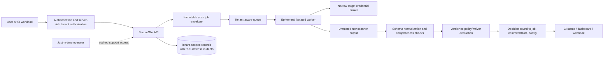

# SecureObs: Engineering a Multi-tenant Security Scanner and Automation Control Plane

> Evidence boundary: this is a sanitized engineering case study. It contains no
> client names, environments, scan results, credentials, or proprietary repository
> details. Controls reproduced by this repository are labeled **reproduced**. The
> SecureObs-specific architecture and defect narratives are sanitized design patterns
> and **require author confirmation** before being described as production history.

Security automation becomes a control plane when it accepts tenant-scoped targets,
launches scanners, receives untrusted output, stores findings, grants exceptions, and
changes delivery decisions. A scanner's own compromise or tenant-confusion bug can
expose source, cloud metadata, secrets, findings, waivers, and deployment authority.

## Executive decision

Design SecureObs around three non-negotiable properties:

1. **Authoritative tenant binding:** derive tenant/project authority from authenticated
   server-side relationships; enforce the binding in job orchestration, credentials,
   object paths, database rows, events, exports, and operator tools.
2. **Truthful scan state:** completed/valid/within-policy is distinct from queued,
   running, failed, timed out, canceled, malformed, stale, or partially uploaded.
   Unknown states never become green.
3. **Split authority:** ingestion/scanning cannot approve its own evidence; policy and
   human approval cannot alter scan bytes; deployment receives only a narrow decision
   bound to an immutable commit/artifact/configuration.

## Evidence classification

| Statement | Classification |
| --- | --- |
| Repository gate rejects failed/malformed scanner reports and above-policy findings | **Reproduced** in `labs/secure-cicd` |
| Repository RLS lab rejects cross-tenant reads/writes, missing/invalid context, connection reuse leakage, and bypass-role drift | **Reproduced** in `labs/postgresql-rls` |
| Repository supply-chain lab rejects digest, builder, source, issuer, and verification-state mismatch | **Reproduced** in `labs/supply-chain` |
| SecureObs used the exact services, tables, queues, scanners, or cloud roles shown here | **Illustrative; author confirmation required** |
| The sanitized defect classes below occurred in a particular production/client environment | **Not claimed**; they are review patterns unless the owner adds evidence |
| Security or business outcomes improved by a quantified amount | **Not claimed**; no supporting dataset is present |

This classification prevents a useful derived architecture from becoming fabricated
employment or client history.

## Scope and non-goals

In scope:

- SaaS control-plane/API, tenant/project membership, scan orchestration, workers,
  credentials, reports, policy, waivers, integrations, audit, and support operations;
- code/dependency/IaC/container/cloud posture scanners at a common boundary;
- CI status/deployment decisions and multitenant data handling.

Not provided:

- a claim that one scanner covers all vulnerability classes;
- direct execution of arbitrary customer code without isolation;
- permission to connect to a customer repository/cloud account;
- customer-specific compliance certification or production-history evidence;
- a universal finding threshold.

## Assets, actors, and trust boundaries



Assets include source snapshots, cloud/repository credentials, job definitions,
scanner images/plugins, raw/normalized findings, artifacts/SBOM/provenance, policy,
waivers, audit logs, webhook signing keys, customer endpoints, tenant membership,
billing, and support access.

Attackers include a legitimate tenant user substituting IDs, a malicious repository,
compromised CI identity, poisoned scanner/plugin/image, cloud target returning hostile
data, compromised worker, malicious operator, confused-deputy webhook, and a tenant
attempting denial of service or cost amplification.

## Threat model and abuse cases

| Abuse case | Control | Required negative test |
| --- | --- | --- |
| Client supplies another tenant/project ID | membership/action authorization; never trust selector alone | mutate route/header/body/event tenant identifiers |
| Worker receives broad shared cloud/repo key | per-job short-lived credential, exact target/scope, separate broker | use credential against another target/tenant/action |
| Scanner reads metadata/control plane | egress allowlist/proxy, metadata block, isolated account/project/namespace | SSRF/metadata/DNS-rebinding fixtures |
| Malicious repository escapes build | ephemeral sandbox/VM, no host socket, minimal kernel/capabilities, resource/network limits | fork bomb, symlink, archive bomb, device/host path attempts |
| Scanner exits zero but output is empty/partial | independent schema/completeness/freshness validation | empty/truncated/wrong-job report |
| Scanner crashes and pipeline turns green | explicit terminal-state machine; unknown blocks | timeout, cancel, auth failure, parse error, worker loss |
| Result replayed for new commit/config | bind job, target, commit/digest, scanner/policy/config versions and expiry | substitute old signed/valid result |
| Cross-tenant row/object/export leak | tenant keys, RLS, tenant-prefixed object authorization, export reauthorization | direct ID, search, pagination, export, presigned URL tests |
| Tenant controls callback URL | pre-registered destinations, HTTPS/allowlist, DNS/redirect protection, signed events | localhost/link-local/private IP/redirect rebinding tests |
| Operator bypasses tenant context | separate JIT support role, case/approval, impersonation banner, immutable audit | direct database/object-store access and cross-tenant support attempt |
| Waiver applies too broadly/forever | finding/scope/artifact/environment binding, owner, approval, expiry | changed fingerprint, environment, commit and expired waiver |
| Tenant exhausts worker/cost | quota, concurrency, target size/time, cancellation, fair scheduling | archive bomb, huge repo, endless process, repeated job storm |

## Sanitized defect class 1: tenant context derived from request input

### Unsafe pattern

An API accepts `X-Tenant-ID`, sets a database session value, and relies on RLS. The
header is attacker-controlled; RLS consistently enforces the wrong authority.

### Corrected design

1. Authenticate issuer/audience/session or workload identity.
2. Load current server-side tenant/project membership and action entitlement.
3. Resolve the requested target only within that authorized set.
4. Create a transaction and apply authoritative tenant ID with transaction-local
   context.
5. Execute all work before commit and close results.
6. Enforce tenant again in RLS and non-database stores.
7. Log decision inputs without secrets or raw tokens.

This pattern is **reproduced** at the database boundary in the
[RLS lab](../labs/postgresql-rls/README.md). The application authorization layer still
requires SecureObs-specific implementation and tests.

## Sanitized defect class 2: scanner success inferred from process/report presence

### Unsafe pattern

A wrapper runs a scanner with error suppression, uploads whatever file exists, and a
gate interprets zero findings or a present JSON file as pass. Authentication failure,
timeout, killed worker, unsupported schema, or empty output can become false assurance.

### Corrected state machine

```text
QUEUED -> CLAIMED -> RUNNING -> UPLOADING -> VALIDATING -> EVALUATING -> COMPLETED
              |          |          |            |            |
              +--------> FAILED / TIMED_OUT / CANCELED / INVALID
```

Only `COMPLETED` has all invariants:

- authorized job/tenant/target and single active lease;
- expected scanner image/digest and configuration version;
- successful process status and no timeout/cancellation;
- report schema valid, complete, within size/count bounds, and bound to job/commit or
  artifact digest;
- policy version and waiver set evaluated;
- audit/decision persisted atomically or with idempotent reconciliation.

Every other terminal/unknown state blocks a required gate. The fail-closed report
schema and negative cases are **reproduced** in the
[CI/CD lab](../labs/secure-cicd/README.md).

## Sanitized defect class 3: results and approvals not bound to immutable inputs

A valid result can be unsafe when replayed for a different commit, artifact, target,
scanner rules, policy, or environment. Store a decision subject such as:

```json
{
  "tenantId": "<authoritative-tenant-id>",
  "projectId": "<authorized-project-id>",
  "jobId": "<immutable-job-id>",
  "sourceCommit": "<full-commit-sha>",
  "artifactDigest": "sha256:<digest-if-applicable>",
  "scanner": {
    "name": "<scanner>",
    "imageDigest": "sha256:<scanner-image-digest>",
    "configDigest": "sha256:<rules-and-config-digest>"
  },
  "policyVersion": "<version-or-digest>",
  "decision": "pass|block|error",
  "expiresAt": "<absolute-time>"
}
```

This is illustrative JSON. Authenticate stored decisions/events, make handlers
idempotent, and enforce uniqueness/version transitions so duplicate or reordered
messages cannot regress status.

## Architecture decision record

### Selected pattern

- Control-plane API authorizes tenant/project/action and emits an immutable job.
- Queue messages carry opaque job ID and integrity metadata, not reusable customer
  credentials.
- Credential broker exchanges worker identity for a short-lived target-specific grant.
- Workers are ephemeral and isolated per trust/risk tier; raw scanner output is
  untrusted data.
- Normalizer validates schema/completeness and persists an immutable raw evidence
  reference plus normalized findings.
- Independent policy evaluator produces a decision bound to immutable inputs.
- CI/webhooks expose narrow signed status, not scanner/control-plane authority.

### Isolation tiers

| Tier | Example use | Boundary |
| --- | --- | --- |
| Metadata/API-only | passive cloud/config APIs | isolated worker identity and egress; no customer code execution |
| Untrusted source static analysis | repository/archive parsing | ephemeral hardened container/VM with no cloud control credentials |
| Build/dynamic analysis | executes customer build/tests | stronger microVM/dedicated pool/account, restricted network, no shared cache trust |
| Regulated/dedicated tenant | high-impact or hostile workload | dedicated project/account/cluster/keys and tailored operations |

Containers sharing a kernel are not the strongest hostile-code boundary. Select VM/
microVM/dedicated infrastructure when threat and impact require it.

## Tenant-isolated data model

Every tenant-owned record carries a non-null tenant key, including project, target,
job, attempt, raw evidence metadata, finding, waiver, integration, export, and audit
view. Foreign keys include/validate tenant relationship so an object from tenant A
cannot be attached to tenant B. Random IDs reduce guessing but do not replace
authorization.

PostgreSQL RLS is defense in depth with complete read/write expressions, transaction-
local context, forced RLS, and non-bypass roles. Object storage uses an authoritative
tenant/job key constructed server-side and a service role that checks database
authorization before issuing short-lived URLs. Search/index, queue, cache, analytics,
logs, and backups need equivalent tenant constraints and purge/retention handling.

## Worker and credential security

- verify scanner image/plugin digests and control the allowed catalog;
- read-only root filesystem where compatible, minimal capabilities, non-root,
  seccomp/AppArmor/SELinux/sandboxed runtime, resource/pid/time limits;
- no Docker socket, host path, node credential, control-plane token, or unrelated
  tenant cache;
- per-job workspace, secure deletion/lifecycle and no cross-job reuse without a
  content-addressed verified cache design;
- egress deny by default through an authenticated proxy/allowlist; block metadata,
  loopback, link-local, private ranges and DNS rebinding where not required;
- short-lived target credentials constrained by repository/account/project, actions,
  branch/environment, and job duration;
- logs redact credentials/tokens/source snippets and apply tenant-aware access.

Credential brokers must authorize job, tenant, target, worker attestation/identity,
scanner class, and requested scope. Never place a long-lived customer cloud key in a
general queue message or environment dump.

## Policy, findings, and waivers

Keep raw evidence immutable for the retention period and normalize into a versioned
finding schema. A finding fingerprint should be stable enough for lifecycle but not
so broad that a waiver crosses vulnerable components/paths/tenants. Record scanner,
rule, version, location/component, severity, confidence, exploitability/reachability,
first/last seen, status, and source/artifact binding.

A waiver includes tenant/project, finding/rule/component scope, environment, owner,
approver, rationale, compensating control, ticket, created/expiry dates, and policy
version. Expiry or subject mismatch reopens/blocks according to policy. Scanner/policy
administrators should not unilaterally approve their own control bypass.

## API, webhook, and CI integration

APIs authorize every object and list/search filter before pagination/aggregation.
Exports reauthorize at execution and download. Avoid exposing raw cloud/scanner errors
that leak target details.

Webhooks use registered HTTPS destinations, signed payloads, timestamp/replay defense,
event IDs, retry with bounded backoff, delivery audit, and SSRF protections. CI status
credentials can update only the intended repository/check context. They cannot launch
arbitrary tenant jobs, read raw results, approve waivers, or deploy.

Untrusted pull requests never receive SecureObs customer/cloud credentials. A trusted
build can submit a commit/artifact for scanning; release verifies a decision bound to
the same immutable subject. See the [CI/CD architecture](secure-cicd-pipeline-design.md).

## Failure modes

- Queue duplicate/reorder: idempotency key and monotonic version/state transition.
- Worker heartbeat loss: lease expires; mark attempt failed/unknown; never reuse
  partial output as pass; issue a new attempt with independent identity.
- Scanner/provider outage: block required control or invoke explicit expiring risk
  acceptance; communicate evidence gap.
- Object/database partial write: immutable upload then transactional metadata state;
  reconcile orphan objects and incomplete jobs.
- Tenant context absent/invalid: fail request/job; no default tenant; alert.
- Credential broker unavailable: do not fall back to a shared static credential.
- Policy rollout defect: report-only/canary/versioned rollback; preserve decisions and
  never globally suppress exit codes.
- Cross-tenant suspicion: disable affected integration/worker path, preserve evidence,
  revoke sessions/credentials/URLs, scope all stores/exports/logs/backups, notify under
  the response process, and add a permanent regression test.

## Deployment and rollback

1. Inventory tenants, projects, target credentials, stores, queues, roles, scanners,
   policies, waivers, exports, operators, and integration callbacks.
2. Introduce authoritative tenant/job envelope and observe missing/mismatch events.
3. Split runtime/migration/operator roles and add database/store isolation tests.
4. Make scan state explicit and block unknown outcomes in a non-production pilot.
5. Move credentials to job-scoped federation/broker and harden ephemeral workers.
6. Bind findings, decisions, waivers, and CI status to immutable subjects.
7. Canary policy per scanner/tenant tier and rehearse outage/cross-tenant response.

Rollback restores a known policy/worker/API revision but does not silently accept
evidence created under a broken control. Quarantine/re-scan affected jobs and expire
decisions where integrity or isolation is uncertain.

## Validation evidence

Reproduced locally:

```powershell
npm ci --ignore-scripts
node labs/secure-cicd/tests/run-tests.js
node labs/supply-chain/tests/run-tests.js
./labs/postgresql-rls/run-tests.ps1
```

Production/project-specific tests still required:

- tenant substitution across every API/list/search/export/webhook/operator path;
- queue duplication/reordering, worker loss, partial upload, report/schema mismatch,
  stale decision and waiver mismatch/expiry;
- credential exchange for wrong worker/job/tenant/target/scope;
- hostile repository/archive/build, SSRF/metadata, egress, resource exhaustion and
  sandbox escape attempts;
- scanner/plugin/image substitution and result provenance;
- deletion/retention/backup/restore for one tenant;
- cross-tenant incident and bulk credential-revocation exercise.

## Observability and operations

Correlate tenant/project, principal/workload, authoritative authorization decision,
job/attempt, target, scanner image/config, worker/lease, credential exchange (without
secret), source commit/artifact digest, report completeness, policy/waiver, status,
webhook/CI delivery, operator/support case, trace, and timing.

Alert on tenant mismatch/missing context, runtime bypass-role/schema drift, unusual
operator cross-tenant access, worker metadata/private-network attempts, repeated
scanner error converted near release, decision subject mismatch, broad/expiring
waivers, new scanner/plugin digest, credential scope anomalies, object/export URL
abuse, and resource/cost spikes.

Track security-control health separately from vulnerability count: completed/failed/
timed-out/invalid jobs, evidence latency, policy evaluation errors, isolation-test
pass rate, stale decisions, waiver age, credential lifetime, worker reuse, and tenant
deletion verification.

## Residual risk, cost, and usability

Per-job isolation, federation, immutable evidence, tenant-aware stores, and negative
testing increase compute, latency, storage, engineering and operational cost. Strict
unknown-state blocking can delay releases during scanner outages. Offer clear status,
fast retry, owned emergency risk acceptance, and service reliability targets rather
than weakening truth semantics.

Residual risk includes scanner blind spots/compromise, sandbox or control-plane
escape, malicious authorized users/operators, cloud/SaaS provider compromise, side
channels, inaccurate normalization, unmodeled data stores, stale membership, and
unsafe customer configuration. Security automation produces evidence and decisions;
it cannot guarantee that a workload is vulnerability-free.

## Limitations and author follow-up

This repository cannot verify private SecureObs source, deployments, incident records,
or employment/client history. Before publishing first-person historical claims, the
owner should add sanitized evidence (for example architecture decision records, test
artifacts, commit references, or explicitly attested recollection) and change only the
corresponding statement classification. Do not add customer-identifying detail.

## References

- [PostgreSQL row security policies](https://www.postgresql.org/docs/current/ddl-rowsecurity.html)
- [GitHub secure use reference](https://docs.github.com/en/actions/reference/security/secure-use)
- [SLSA v1.2 specification](https://slsa.dev/spec/v1.2/)
- [NIST Secure Software Development Framework](https://csrc.nist.gov/pubs/sp/800/218/final)
- [OWASP ASVS project](https://owasp.org/www-project-application-security-verification-standard/)
