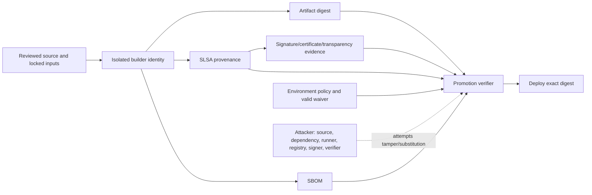

# Software Supply-chain Evidence: SBOMs, Provenance, Signing, and Verification

An SBOM lists components. Provenance describes how an artifact was built. A signature
or transparency entry authenticates a statement under a particular identity model.
None of those facts alone establish that software is safe or authorized for a target
environment. The security control is a verifier that binds all evidence to the exact
artifact digest and enforces an explicit identity/source/build/policy decision.

The [`labs/supply-chain`](../labs/supply-chain/README.md) lab reproduces digest,
builder, source, issuer, verification-state, tamper, and SBOM-format checks offline.

## Executive decision

Build once on a protected, isolated builder. Address the output by cryptographic
digest. Generate a current-format SBOM and SLSA provenance predicate, obtain an
attestation through an approved identity/signing service, store evidence with the
artifact, and verify digest plus expected issuer, subject/workflow, source ref,
builder, statement type, and environment policy before promotion.

Use SLSA v1.2 for new mappings, CycloneDX 1.7 or SPDX 3.0 for new examples depending
on ecosystem needs, and record older format versions where interoperability requires
them. Treat GitHub's SLSA-level statements as platform-specific claims with their
documented conditions; do not generalize them to unrelated build systems.

## Scope and non-goals

In scope:

- build provenance, SBOM lifecycle, keyless/key-based signing, verification policy,
  artifact promotion, negative tests, operations, and incident response;
- OCI/container and file artifacts at an architectural level;
- SLSA v1.2 concepts and current SBOM specification status.

Not established:

- absence of malicious source, vulnerable dependencies, compiler compromise, or
  exploitable configuration;
- truth of arbitrary claims merely because a signature validates;
- a complete organization PKI/HSM design;
- legal license conclusions from an automated SBOM/license scanner;
- one universal SLSA level for every workflow.

## Threat model



| Abuse case | Required verifier/control response |
| --- | --- |
| Artifact bytes changed after build | Calculated digest no longer matches provenance subject; block |
| Valid attestation from an untrusted repository/workflow | Identity/source/builder policy mismatch; block |
| Attacker swaps provenance predicate type | Exact statement/predicate allowlist; block |
| Signature service unavailable | Explicit failure/risk-acceptance path; never interpret missing evidence as pass |
| SBOM belongs to another image | Bind SBOM attestation to the same subject digest; block mismatch |
| Mutable tag is retargeted | Resolve and deploy digest; tags are discovery labels only |
| Build uses unrecorded input | Hermeticity/input completeness controls and provenance review; lower assurance if unknown |
| Keyless identity subject is broader than intended | Match expected issuer and narrow certificate/workflow identity |
| Signing key is stolen | Revoke/disable, inventory affected signatures, re-sign/rebuild, update policy and incident evidence |
| Vulnerable component absent from SBOM | Validate generation coverage and compare multiple inventory/runtime signals |

## Architecture decision record

### Selected evidence chain

1. Protected source revision and locked inputs.
2. Ephemeral or isolated build environment with a narrow workload identity.
3. Immutable artifact digest in a controlled registry.
4. CycloneDX or SPDX SBOM bound to that digest.
5. SLSA provenance describing source, build type, builder, and available inputs.
6. Approved signing/attestation identity and, where applicable, transparency evidence.
7. Independent promotion verifier with environment policy and waiver validation.
8. Deployment and runtime inventory record the exact digest.

### Keyless versus managed keys

Keyless signing (for example Sigstore's OIDC-based flow) reduces long-lived signing-key
custody and can make workload identity visible in certificates/transparency evidence.
It shifts trust to OIDC, certificate authority, transparency, workflow protection,
clock/network behavior, and identity matching.

Managed signing keys can support offline/private environments and existing PKI/HSM
controls, but require generation, access, rotation, backup, revocation, audit, and
disaster-recovery procedures. Do not store a private signing key as an ordinary CI
secret. Select per threat model and record the trust roots.

### Why an SBOM is not a gate by itself

An SBOM may be incomplete, stale, mislabeled, or detached from deployed bytes. It is
useful for component inventory, vulnerability response, policy, licensing review, and
customer evidence only when generation coverage and artifact binding are understood.
A zero-vulnerability scan reflects one database/tool/configuration/time, not proof of
safety.

## SLSA v1.2 interpretation

SLSA v1.2 defines tracks and build provenance expectations. A level communicates
properties of a particular build path and evidence, not a quality grade for source.
Record:

- SLSA specification version and track;
- provenance predicate version;
- builder identity and build type;
- source/commit/ref and external/internal parameters;
- isolation and tamper-resistance controls actually satisfied;
- verifier policy and gaps.

GitHub documents that its artifact attestations by themselves can provide SLSA Build
Level 2 provenance and that a qualifying reusable build workflow can support its
documented Level 3 pattern. Those are conditional GitHub-specific claims. Verify the
actual workflow and current documentation rather than labeling all Actions builds L3.

## SBOM format and lifecycle

CycloneDX 1.7 and SPDX 3.0 are current when reviewed. Choose based on consumer/tool
interoperability and required data model. Each SBOM should record format/spec version,
serial/document identity, generator and version, timestamp, primary component/artifact,
component identifiers/hashes where available, relationships/dependencies, and known
scope exclusions.

Operational lifecycle:

1. generate during the trusted build from resolved dependencies and produced output;
2. validate schema and organization-required fields;
3. bind/attest it to the artifact digest;
4. retain it with provenance, scans, and deployment record;
5. continuously re-evaluate deployed inventories as vulnerability intelligence changes;
6. supersede, never silently edit, historical evidence.

## Verification policy

Verification is authorization. A production policy normally requires:

- locally calculated artifact digest equals exactly one attested subject;
- accepted statement type, predicate type, and schema version;
- trusted issuer/trust root and successful cryptographic verification;
- exact or tightly matched workflow/service identity;
- allowed source repository, ref/tag policy, and commit relationship;
- allowed builder/build type and required build properties;
- SBOM format/version and artifact binding;
- required scanner reports tied to digest and tool/configuration version;
- valid time-bounded waiver/approval for the target environment;
- deploy by digest and record runtime digest.

Avoid identity regexes that unintentionally accept forks, renamed repositories,
unprotected branches, or arbitrary workflows. Test policy with authorized and
near-miss identities. Separate the builder/signing identity from the promotion/deploy
identity so one compromised job cannot create and approve its own evidence.

## Admission and runtime enforcement

Cluster admission can require digest references and verified attestations through a
policy controller. Fail-open versus fail-closed behavior during registry, identity,
transparency, or verifier outages must be a conscious environment decision. Production
typically requires a controlled emergency path rather than silent fail-open.

Admission evidence is not runtime continuity. Record the running image digest, watch
for mutable-tag drift, unauthorized debug containers, node-local image substitution,
and workloads created through exempt identities/namespaces. Protect policy controller,
webhook configuration, trust roots, and exemptions as privileged supply-chain assets.

## Failure modes

- **Attestation missing/invalid:** block promotion; rebuild through the trusted path.
- **Verification service unavailable:** pause, or use a documented time-bounded
  emergency procedure with cached trust material and equivalent audit—not a global
  policy disable.
- **Transparency service unavailable:** apply the documented offline/bundle policy;
  do not confuse inability to look up evidence with validation.
- **SBOM generation failure:** block required-evidence policy; never emit an empty SBOM
  as success.
- **Registry tag changed:** deploy/compare digest; investigate retargeting.
- **Signer/build identity compromise:** revoke trust, enumerate all issued evidence,
  quarantine affected digests, rebuild, and update verifiers.
- **Vulnerability discovered after release:** query deployed digest/SBOM inventory,
  validate reachability/exposure, remediate, and preserve original evidence.
- **Policy rollout rejects valid workloads:** canary/report first, version policy and
  exemptions, and roll back the policy version—not artifact verification globally.

## Deployment and rollback

Adopt incrementally:

1. inventory registries, builders, package managers, release identities, and deployed
   artifact references;
2. enforce immutable digests and protected build source;
3. generate/retain schema-valid SBOM and provenance in observation mode;
4. deploy an independent verifier with negative identity/digest tests;
5. canary enforcement in a non-production environment;
6. create narrow, owned, expiring exemptions;
7. enforce by environment and rehearse issuer/registry/verifier outage response.

Rollback deploys a previously verified digest with evidence still acceptable under
current policy. If current policy intentionally rejects the old artifact, rollback
requires explicit risk acceptance or a rebuilt/remediated artifact—not retagging.

## Validation evidence

Run:

```powershell
npm ci --ignore-scripts
node labs/supply-chain/tests/run-tests.js
```

The lab validates the exact fixture artifact hash, statement and predicate types,
expected builder, source URI, issuer, successful-verification boundary, tampered
artifact, bad digest, untrusted builder, unverified evidence, and CycloneDX 1.7 field.

The lab deliberately does not implement signature cryptography. It models the output
of a trusted external verifier and clearly labels that boundary. Production commands
for Cosign and GitHub attestation verification are included but not claimed as locally
executed because they require published artifacts and platform identity.

## Observability and operations

Retain/search:

- source commit/ref, build run, workflow/builder identity and definition revision;
- artifact digest and registry coordinates;
- provenance/SBOM/signature bundle and verification policy/version/result;
- dependency lockfiles, scanner/tool/database/configuration versions;
- approval/waiver owner, scope, expiry, and ticket;
- deployment environment, runtime digest, actor, and time;
- trust-root, issuer, identity-policy, action, builder, and exemption changes.

Alert on unsigned/unattested promotion attempts, identity/source mismatch, tag/digest
changes, expired waivers, verifier fail-open state, new trust roots/builders, unusual
signing volume, missing SBOM coverage, and runtime digest not present in approved
inventory.

## Residual risk, cost, and usability

Evidence generation increases build time, storage, registry operations, policy
maintenance, and incident-analysis workload. Strict identity/digest policy complicates
developer experimentation and emergency rollback. Provide fast feedback, local
verification, owned exemptions, and reliable infrastructure to reduce bypass pressure.

Residual risk includes malicious authorized source, compromised trusted builder or
issuer, verifier defects, incomplete provenance/SBOMs, dependency confusion, runtime
mutation, and collusion/overbroad identities. Strong evidence shortens detection and
response; it does not make those risks impossible.

## Limitations

The offline lab is an educational policy harness. It is not an in-toto envelope,
Sigstore certificate-chain/transparency verifier, GitHub attestation bundle parser, or
Kubernetes admission controller. Integrations must use supported libraries/tools and
test current platform-specific semantics.

## References

- [SLSA v1.2 specification](https://slsa.dev/spec/v1.2/)
- [CycloneDX specification overview](https://cyclonedx.org/specification/overview/)
- [SPDX specifications](https://spdx.dev/use/specifications/)
- [Sigstore Cosign verification](https://docs.sigstore.dev/cosign/verifying/verify/)
- [GitHub artifact attestations](https://docs.github.com/en/actions/concepts/security/artifact-attestations)
- [GitHub secure use reference](https://docs.github.com/en/actions/reference/security/secure-use)
