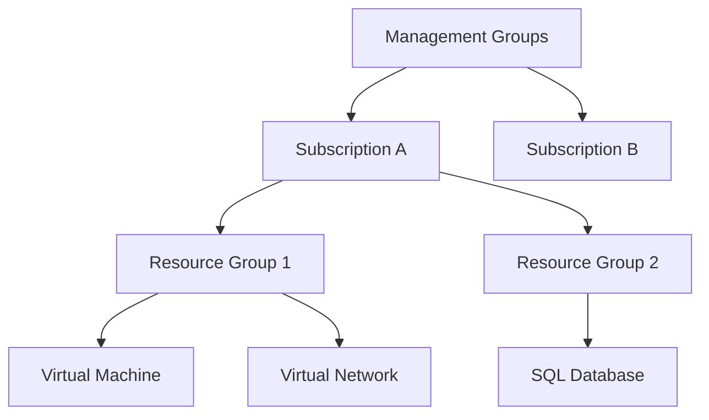

# Microsoft AZ-900: Azure Fundamentals Deep Dive

This comprehensive guide serves as an exhaustive, end-to-end study resource for the **Microsoft AZ-900: Azure Fundamentals** exam. It covers all core exam domains in deep technical detail, including real-world architectural design patterns, comparisons, and calculations.

---

## Domain 1: Cloud Concepts & Architecture

### 1.1 Core Cloud Computing Principles
Cloud computing is the delivery of computing services—including servers, storage, databases, networking, software, analytics, and intelligence—over the internet ("the cloud").

#### High Availability (HA)
High Availability ensures that systems are designed to operate continuously without failure for a designated period. HA is achieved through redundant hardware configurations, network paths, and power sources. In Azure, HA is backed by **Service Level Agreements (SLAs)**, which define Microsoft's uptime commitments (e.g., 99.9%, 99.99%).

*   **Composite SLA Calculation:** If your application relies on two independent services, each with its own SLA, the composite SLA is the product of their individual SLAs.
    $$\text{Composite SLA} = \text{SLA}_{\text{Service 1}} \times \text{SLA}_{\text{Service 2}}$$
    For example, if a Web App (99.95% SLA) connects to an Azure SQL Database (99.99% SLA):
    $$\text{Composite SLA} = 0.9995 \times 0.9999 = 99.94\%$$
    This demonstrates that composite SLAs are always lower than individual service SLAs, requiring multi-region failover configurations to increase overall uptime.

#### Scalability: Vertical vs. Horizontal
Scalability is the ability of a system to handle increased load by adding resources.
*   **Vertical Scalability (Scale Up/Down):** Adding more power (CPU, RAM, disk space) to an existing resource, such as resizing a Virtual Machine from a `Standard_D2s_v5` to a `Standard_D4s_v5`. This process typically requires a VM reboot (downtime).
*   **Horizontal Scalability (Scale Out/In):** Adding more resource instances to share the workload, such as deploying additional VMs behind a load balancer. This can be automated and does not cause downtime.

#### Elasticity
Elasticity is the ability of a system to dynamically allocate and de-allocate resources in real-time based on current demand. While *scalability* is the *capacity* to grow, *elasticity* is the *automation* of that growth (and shrinkage) to optimize operational costs (e.g., Virtual Machine Scale Sets scaling down from 10 instances to 2 instances at night).

#### Agility & Speed
Agility refers to the speed and flexibility with which IT resources can be provisioned, configured, and deployed. In a traditional datacenter, procuring a physical server takes weeks; in Azure, provisioning a virtual machine takes minutes or seconds via automated templates (Infrastructure as Code).

#### Fault Tolerance & Disaster Recovery (DR)
*   **Fault Tolerance (FT):** The ability of an architecture to survive a hardware component failure (e.g., power supply, disk drive, network switch) without any noticeable disruption to users. This is achieved by clustering and physical separation.
*   **Disaster Recovery (DR):** The process of restoring application functionality and data access after a major catastrophic event (e.g., earthquake, flood, power grid failure). DR planning utilizes **Recovery Point Objective (RPO)** (maximum acceptable data loss window) and **Recovery Time Objective (RTO)** (maximum acceptable system recovery time).

---

### 1.2 Financial Models: CapEx vs. OpEx
*   **Capital Expenditure (CapEx):** The upfront spending of capital on physical infrastructure, which is then amortized/depreciated over its useful lifecycle. Examples include buying physical servers, networking racks, backup power generators, and securing real estate for datacenters.
*   **Operational Expenditure (OpEx):** Spending money on services or products on a continuous, pay-as-you-go basis. There is no upfront investment; costs are billed monthly as operating expenses and can be deducted in the same tax year. Azure operates on this consumption-based model.

---

### 1.3 Shared Responsibility Model
The Shared Responsibility Model defines which security and operational tasks are handled by Microsoft (the cloud provider) and which are handled by you (the customer).

```
+-----------------------------------+----------+----------+----------+----------+
| Responsibility Area               | On-Prem  |   IaaS   |   PaaS   |   SaaS   |
+-----------------------------------+----------+----------+----------+----------+
| Information and Data              | Customer | Customer | Customer | Customer |
| Devices (Mobile and PCs)          | Customer | Customer | Customer | Customer |
| Accounts and Identities           | Customer | Customer | Customer | Customer |
| Identity & Access Infrastructure  | Customer | Customer | Shared   | Shared   |
| Application Code                  | Customer | Customer | Customer | MSFT     |
| Network Controls (Firewalls)      | Customer | Customer | Shared   | MSFT     |
| Operating System (OS)             | Customer | Customer | MSFT     | MSFT     |
| Physical Security (Hosts/DC)      | Customer | MSFT     | MSFT     | MSFT     |
+-----------------------------------+----------+----------+----------+----------+
```

---

## Domain 2: Core Azure Architecture

### 2.1 Regional Infrastructure
*   **Azure Regions:** A geographical area containing at least one, but typically multiple datacenters situated nearby and networked together with a low-latency, high-bandwidth connection. Examples: `East US`, `North Europe`, `East Asia`.
*   **Region Pairs:** Each Azure region is systematically paired with another region within the same geography (typically at least 300 miles apart). During a major regional outage, Azure prioritizes recovery of one region in each pair to ensure business continuity. Examples: `East US` is paired with `West US`.
*   **Availability Zones (AZs):** Physically separate datacenters within a single Azure region. Each zone has independent power, cooling, and networking. Availability Zones are designed to protect against the loss of an entire datacenter. A region must have at least **three** separate Availability Zones to support zone-redundant deployments.

---

### 2.2 Resource Hierarchy
Azure organizes resources in a strict four-level logical hierarchy:



1.  **Management Groups:** Containers that help manage access, policy, and compliance across multiple subscriptions.
2.  **Subscriptions:** A billing boundary and logical security access container. A subscription is tied to a billing account and determines how resource consumption is invoiced.
3.  **Resource Groups:** A logical container into which Azure resources are deployed and managed. All resources must belong to exactly one Resource Group, and resources within a group should share the same lifecycle.
4.  **Resources:** Individual instances of services, such as a virtual machine, database, disk storage, or virtual network interface.

---

## Domain 3: Core Azure Services

### 3.1 Compute Services

#### Virtual Machines (VMs)
IaaS compute resources. You get full control over the operating system (Windows or Linux), configurations, patches, and runtime environments. Ideal for legacy app migrations (lift-and-shift) or custom OS requirements.

#### Azure App Services
PaaS hosting platform for web applications, REST APIs, and mobile backends. Azure handles the OS, patching, and hardware scale. Supports multiple languages (.NET, Java, Node.js, Python, PHP, Ruby).

#### Azure Container Instances (ACI)
A serverless container hosting service. Allows launching Docker containers directly without the administrative overhead of setting up VMs or container orchestration systems. Ideal for short-lived, isolated tasks or batch processing.

#### Azure Kubernetes Service (AKS)
A fully managed Kubernetes container orchestration service. Azure manages the Kubernetes control plane for free; you only pay for the agent pool VM nodes running your container workloads.

#### Azure Functions
Serverless compute (Function-as-a-Service) where code runs on-demand in response to events (e.g., database updates, queue messages, HTTP requests). Scales automatically and you only pay for the execution time and number of requests.

---

### 3.2 Networking Services

#### Virtual Network (VNet)
The fundamental building block for private network communications in Azure. VNets allow VMs to communicate securely with each other, the internet, and on-premises networks.
*   **Subnets:** Allow segmenting a VNet into logical subnetworks for security and organization.
*   **VNet Peering:** Connects two VNets seamlessly, allowing resources in both VNets to communicate using private IP addresses.

#### Load Balancer vs. Application Gateway
*   **Azure Load Balancer:** Operates at **Layer 4** (Transport protocol: TCP/UDP). Distributes incoming traffic across backend VM pools. Highly performant, but does not inspect traffic content.
*   **Azure Application Gateway:** Operates at **Layer 7** (Application protocol: HTTP/HTTPS). Can perform URL-path routing, SSL termination, and integrates a **Web Application Firewall (WAF)** to protect against common web vulnerabilities.

#### Connecting On-Premises to Azure
*   **VPN Gateway:** Connects your local network to an Azure VNet using an encrypted tunnel over the public internet (Site-to-Site VPN).
*   **ExpressRoute:** Connects your local network directly to Azure over a dedicated, private fiber connection provided by a connectivity partner. Bypasses the public internet, offering higher speed, lower latency, and tighter security.

---

## Domain 4: Identity, Security, and Governance

### 4.1 Identity & Access Services

#### Microsoft Entra ID (formerly Azure Active Directory)
A cloud-based identity and access management service. It handles user authentication (sign-in) and authorization (accessing apps).
*   **Entra ID vs. Active Directory Domain Services (AD DS):** AD DS is a local, Windows-Server based directory service centered around Kerberos/NTLM authentication. Entra ID is a cloud-native tenant system using modern protocols (OIDC, SAML, OAuth 2.0).

#### Conditional Access
A policy-driven security engine that evaluates signals during authentication to make access decisions.
*   *Signals:* User identity, location, device health, and application requested.
*   *Decisions:* Allow access, block access, or require Multi-Factor Authentication (MFA).

---

### 4.2 Resource Management & Governance

#### Azure RBAC (Role-Based Access Control)
Manages *who* has access to *what* Azure resources, and what they can do with them. Roles are applied at scopes (Management Group, Subscription, Resource Group, or Resource).
*   *Owner:* Full access to all resources, including delegation.
*   *Contributor:* Can create and manage resources, but cannot grant access to others.
*   *Reader:* View resources, but cannot make modifications.

#### Azure Policy
Enforces compliance and resource standards. Unlike RBAC (which controls *who* can deploy), Azure Policy controls *what properties* the deployed resources must have.
*   *Example:* Audit or block the creation of VMs unless they are configured with encryption keys, or enforce that resources are only deployed in a specific geographic region.

#### Resource Locks
Prevents accidental resource deletion or modification. Resource locks override RBAC permissions.
*   `CanNotDelete`: Authorized users can read and modify a resource, but cannot delete it.
*   `ReadOnly`: Authorized users can only read a resource; they cannot update or delete it.
