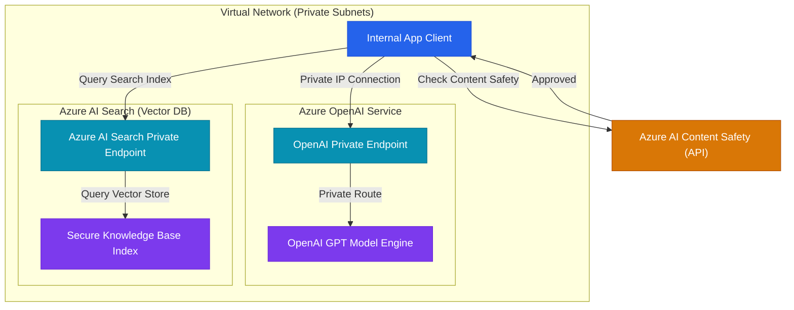

#  SC-500 Domain 4: Secure AI Workloads and Governance

This domain outlines secure deployment parameters for Generative AI endpoints, prompt safety mitigations, vector database index filters, and ML pipelines.

---

## 1. Securing Azure OpenAI Services

### 1.1 Endpoint Hardening
* **Disable Public Endpoints:** Access keys must not be exposed over the public internet. Disable public access on the Azure OpenAI service and create a **Private Endpoint** to assign a private IP address within a VNet subnet.
* **Disable API Key Auth:** Rely on Microsoft Entra ID authentication instead of shared keys. Assign the **Cognitive Services User** role to the client application's Managed Identity.

### 1.2 Customer-Managed Keys (CMK)
Encrypt fine-tuning datasets and custom AI model weights inside Cognitive Services using Key Vault CMK, ensuring full cryptographic control over the keys.

---

## 2. Mitigating Generative AI Attack Vectors

### 2.1 Prompt Injection & Jailbreaks
* **Threat:** Attackers structure prompt inputs to override model system guidelines, forcing chatbots to leak keys, generate hate speech, or ignore context boundaries.
* **Mitigation:**
    * Deploy **Azure AI Content Safety** filters to inspect prompts before they reach the model.
    * Set strict **System Messages** that are separate from user prompts, instructing the model to reject queries outside its scope.

### 2.2 RAG (Retrieval-Augmented Generation) Data Leakage
* **Threat:** A user queries a RAG system and the LLM retrieves files from a shared vector index that the user is not authorized to read, leaking sensitive files (e.g. employee performance reviews).
* **Mitigation:**
    * Use **Security Filters** at the Vector Database layer (Azure AI Search).
    * Pass the user's security groups inside the vector search query payload to pre-filter search results before document context is sent to the model:
        ```json
        "$filter": "allowedGroups/any(g: g eq 'Finance-Admins')"
        ```

### 2.3 Training Data Poisoning
* **Threat:** Malicious actors inject corrupted records into training dataset storage accounts, altering fine-tuned model behaviors.
* **Mitigation:**
    * Store ML training data inside storage accounts accessible strictly via Private Endpoints.
    * Use code signing and commit provenance tags on ML training scripts.

---

## 3. Secure AI Architecture Topology

This diagram details the zero-trust data flow required for a secure RAG application:


