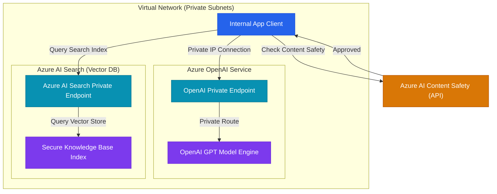

# Microsoft SC-500: End-to-End Security for Cloud & AI Workloads

This study guide provides a technical deep dive into the Microsoft **SC-500: Implementing End-to-End Security Controls for Cloud and AI Workloads** exam.

---

## 1. Manage Identity, Access, and Governance

### 1.1 Enterprise Access Controls & MFA Policies
Securing access starts with defining strict boundaries using **Conditional Access (CA)**, **Privileged Identity Management (PIM)**, and auditing sign-in behaviors.

#### Privileged Identity Management (PIM)
PIM provides time-bound, approval-based activation to mitigate risks associated with persistent (always-on) administrative access. 
*   **Just-in-Time (JIT) Activation:** Administrators remain standard users until they request role elevation.
*   **Approval Gateways:** You can configure requirements for activation, including MFA prompts, business justifications, ticket system IDs, and manager approvals.
*   **Audit Logging:** Elevation events are recorded, allowing security operations center (SOC) analysts to run audit reviews.

#### Conditional Access Policies
Conditional Access acts as the decision engine for zero-trust architectures:
*   *Signals:* User group membership, device compliance status (MDM/Intune registration), client application location (trusted/untrusted IP ranges), and real-time session risk (calculated by Entra ID Protection).
*   *Access Decisions:* Block Access, Enforce MFA, Force Password Reset, or Require Compliant Devices.

---

### 1.2 Auditing Identities with KQL (Kusto Query Language)
Security engineers query Microsoft Sentinel and Log Analytics workspaces using KQL to detect anomalous access attempts or identity risks.

#### KQL Query: Detecting Potential Brute Force Attacks (Multiple Failed Logins)
```kusto
SigninLogs
| where TimeGenerated > ago(24h)
| where ResultType == "50126" // Code for invalid username or password
| summarize FailedCount = count() by UserPrincipalName, IPAddress, Location
| where FailedCount > 5
| order by FailedCount desc
```

#### KQL Query: Privileged Elevation Tracking
```kusto
AuditLogs
| where TimeGenerated > ago(7d)
| where OperationName == "Add member to role"
| extend ElevatedUser = tostring(TargetResources[0].userPrincipalName)
| extend AssignedRole = tostring(TargetResources[0].modifiedProperties[1].newValue)
| extend Actor = Identity
| project TimeGenerated, OperationName, Actor, ElevatedUser, AssignedRole
```

---

## 2. Secure Storage, Databases, and Networking

### 2.1 Storage Account & SQL Security Controls
*   **Storage Access Control:** Disable shared key authentication globally on storage accounts to force applications to use **Microsoft Entra ID token authentication**. Set SAS token expiration parameters to small, specific windows.
*   **Always Encrypted:** Secures sensitive column data (e.g., social security numbers) on the client side before writing it to Azure SQL Database. The database engine never sees the decryption keys (which are hosted in Azure Key Vault), shielding database administrators (DBAs) from reading confidential rows.
*   **Dynamic Data Masking (DDM):** Limits sensitive data exposure. Example SQL command to apply DDM:
    ```sql
    ALTER TABLE Employees  
    ALTER COLUMN CreditCard ADD MASKED WITH (FUNCTION = 'partial(0,"XXXX-XXXX-XXXX-",4)');
    ```

---

### 2.2 Network Architecture
Hardening the network boundary requires eliminating public endpoints using **Private Link** and wrapping ingress points in stateless/stateful firewalls.

#### Private Endpoints vs. Service Endpoints
*   **Service Endpoints:** Keep resources (e.g., Azure Storage) on public IP spaces, but configure firewalls on those resources to accept traffic *only* from designated subnets.
*   **Private Endpoints:** Assign a private, internal IP address from your VNet directly to the target PaaS resource (e.g., SQL, Azure OpenAI). The public IP of the PaaS resource is disabled, shielding the asset from internet-facing scanners.

---

## 3. Secure Computing & Key Vault Posture

### 3.1 Host Security & Access Restraints
*   **Azure Bastion:** A managed PaaS bastion host that secures administration connections. Administrators connect via the Azure Portal over SSL (Port 443) to Bastion, which then proxy-routes the RDP/SSH traffic over internal VNet IPs. VM public IPs can be safely removed.
*   **Azure Key Vault Hardening:**
    *   **Soft Delete:** Enabled by default. Ensures that deleted vaults or keys can be recovered within a specified retention window (default 90 days).
    *   **Purge Protection:** Prevents immediate, permanent deletion of key vaults or secrets by any user, including Subscription Owners, until the retention period expires. Protects against ransomware attacks attempting to delete cryptographic backup keys.

---

## 4. Secure AI Workloads & Governance

The core focus of the SC-500 curriculum is the end-to-end security architecture of generative AI systems.

### 4.1 Enterprise Secure AI Architecture
The architecture diagram below outlines the secure connectivity required for a retrieval-augmented generation (RAG) platform using Private Link, Azure AI Search, and Content Safety filters:



---

### 4.2 Mitigating Generative AI Threat Vectors

#### 1. Prompt Injection & Jailbreaks
*   **Threat:** Attackers format prompt inputs to override system instructions (e.g., forcing a corporate chatbot to leak secret codes, write malware, or ignore guardrails).
*   **Mitigation:**
    *   Implement **Azure AI Content Safety** filters. This API intercepts inputs and inspects them using specialized jailbreak detection models.
    *   Enforce structured parameters: keep User Prompts clearly separated from System Prompts using system role definitions in chat completion APIs.

#### 2. RAG Data Leakage
*   **Threat:** A user asks a RAG-backed chatbot a query, and the LLM retrieves files from a shared index that the user is not authorized to read, leaking confidential data (e.g., salaries, merger plans).
*   **Mitigation:**
    *   Enable **Security Filters** at the Vector Database layer (Azure AI Search).
    *   Configure access control fields inside the document index matching Entra ID group membership.
    *   Add a pre-filter clause to the search query using the user's security token:
        ```json
        "$filter": "allowedGroups/any(g: g eq 'Finance-Admins')"
        ```

#### 3. Model & Pipeline Poisoning
*   **Threat:** Attackers compromise training repositories or storage endpoints, injecting tainted data that alters the behavior of fine-tuned models.
*   **Mitigation:**
    *   Enforce identity controls on **Azure Machine Learning Workspaces** by disabling API keys and relying on Entra ID RBAC.
    *   Store all training data in storage accounts that are accessible only via Private Endpoints.
    *   Apply code-signing and provenance checks to ML pipelines using GitHub Actions or Azure Pipelines to prevent unauthorized modifications to the model training script.
