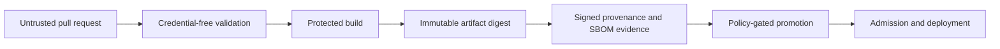

# DevSecOps pipeline hardening

**Content type: Conceptual Reference.** Last technically reviewed: 2026-07-23.

The current, evidence-backed material for this topic is split into focused
investigations and runnable labs:

- [Secure CI/CD trust boundaries](../../../devsecops/secure-cicd-pipeline-design.md)
- [Software supply-chain evidence](../../../devsecops/supply-chain-sbom-signing.md)
- [Infrastructure as Code policy engineering](../../../devsecops/iac-security-and-policy-as-code.md)
- [Secure CI/CD lab](../../../labs/secure-cicd/README.md)
- [Supply-chain lab](../../../labs/supply-chain/README.md)
- [Terraform and OPA lab](../../../labs/iac-policy/README.md)
- [Kubernetes and Kyverno lab](../../../labs/kubernetes-security/README.md)

This page retains the cross-domain architecture without duplicating executable
snippets that can drift away from their tests.

## Trust zones



- Pull-request code and metadata are untrusted input.
- A protected build uses reviewed workflow definitions and a narrowly scoped
  identity.
- Promotion consumes the same immutable digest that was evaluated.
- Signature and provenance verification binds expected issuer, workflow identity,
  source/build policy, and artifact digest.
- Deployment authorization remains separate from artifact integrity.

## Policy layers

| Layer | Question answered | Typical failure it cannot answer alone |
| --- | --- | --- |
| Source scanning | Does authored configuration match recognizable rules? | Computed/unknown values and runtime drift |
| Serialized-plan policy | What changes does the resolved plan describe? | Provider-side mutation and out-of-band changes |
| Cloud-provider policy | Will the platform accept or deny the operation? | Previously deployed drift and unsupported services |
| Admission policy | May this workload definition or artifact enter the cluster? | Runtime behavior after admission |
| Posture and drift monitoring | Does observed state differ from policy? | Safe intent and approved remediation |

The [OPA lab](../../../labs/iac-policy/README.md) includes positive and negative plan
fixtures for public exposure, encryption, IAM, logging, unknown values, tags, and
deleted controls.

## SLSA v1.2 interpretation

SLSA v1.2 has distinct tracks and levels. The Build track currently defines:

- Build L1: provenance exists;
- Build L2: signed provenance from a hosted build platform; and
- Build L3: a hardened build platform satisfying the detailed requirements.

Generating a provenance-shaped JSON document does not establish Build L2 or L3.
Claims must identify the SLSA version, track, target level, evidence, and unmet
requirements. The repository's offline supply-chain lab validates digest, builder,
build type, source, and an external-verifier result, but it does not implement
Sigstore cryptography or claim a SLSA level.

## Kyverno policy lifecycle

Kyverno 1.18 marks the legacy `kyverno.io/v1` `ClusterPolicy` type deprecated for
these examples. Current policies in this repository use the stable
`policies.kyverno.io/v1` types:

- `ValidatingPolicy` for CEL-based resource checks; and
- `ImageValidatingPolicy` for image signature and attestation verification.

The extracted
[`ImageValidatingPolicy`](../../../labs/kubernetes-security/policies/verify-release-images.yaml)
sets a fail-closed webhook policy, exact keyless issuer/workflow identity, repository
scope, digest verification, and SLSA provenance predicate type. Native Kyverno 1.18.2
tests validate policy parsing and Pod enforcement. Offline identity fixtures do not
replace an online signed/unsigned registry test.

## Failure behavior and rollout

For each gate, define:

- trusted input and producer identity;
- fail-open versus fail-closed behavior;
- timeout and dependency outage handling;
- exception owner, approval, and expiry;
- immutable evidence retained for review;
- alert and control-health telemetry; and
- rollback that does not silently disable unrelated controls.

Use:

```text
observe → audit → warn → enforce → measure bypasses
```

Monitor privileged-event execution, action-pin drift, artifact digest mismatches,
provenance verification failure, unsigned image attempts, admission errors,
exceptions, and deployments that do not match the reviewed digest.

## Residual risk

These controls do not eliminate malicious authorized source, compromised build
platforms, unsafe third-party tools, dependency substitution, signer policy mistakes,
admission exceptions, registry outages, or runtime exploitation. Separate identities,
network restrictions, review protections, runtime telemetry, and incident response
remain necessary.

## References

- [GitHub Actions secure use](https://docs.github.com/en/actions/reference/security/secure-use)
- [SLSA v1.2 specification](https://slsa.dev/spec/v1.2/)
- [Sigstore Cosign verification](https://docs.sigstore.dev/cosign/verifying/verify/)
- [Kyverno policy type overview](https://kyverno.io/docs/policy-types/overview/)
- [Kyverno ImageValidatingPolicy](https://kyverno.io/docs/policy-types/image-validating-policy/)
- [OPA policy testing](https://www.openpolicyagent.org/docs/policy-testing)
