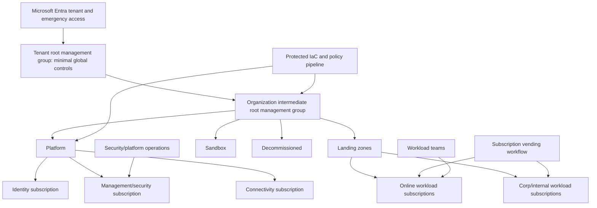

# Azure Landing Zone Security Engineering Guide

An Azure landing zone is an operating model and architecture for placing workloads
into governed subscriptions. It is not a single portal accelerator, repository, or
management-group diagram. A senior design connects identity, resource organization,
networking, security operations, governance, platform automation, subscription
vending, workload onboarding, and lifecycle responsibilities—and preserves a safe
path to change them.

The companion [Azure landing-zone lab](../../../labs/azure-landing-zone/README.md)
compiles a small tenant-scope management-group/policy Bicep design and documents a
federated what-if workflow. Existing deep dives remain available for
[architecture](architecture.md), [identity](iam.md), [networking](networking.md),
[policy governance](policy-governance.md), and
[implementation templates](implementation-templates.md).

## Executive decision

Reserve the tenant-root management group for the smallest set of controls that must
apply to every subscription. Put the organization's Platform, Landing Zones, Sandbox,
and Decommissioned hierarchy under an intermediate root management group, and express
durable policy/operating archetypes rather than the current org chart. Vend workload
subscriptions through a controlled product workflow that establishes ownership,
budget, identity, network, security, logging, policy, and decommissioning metadata.
Deploy the platform from protected IaC with federated identities and staged policy
enforcement.

Prefer a small durable hierarchy. Management groups affect inherited authorization
and policy at broad scope; every extra branch adds exception, move, deployment, and
operations cost.

## Scope and non-goals

In scope:

- Microsoft Entra tenant and Azure organization/resource hierarchy;
- identity/privilege, subscription vending, policy, network, management/security,
  platform automation, ownership, observability, and recovery;
- greenfield or incremental adoption across platform and workload teams.

Not provided:

- an organization-specific tenant, IP plan, regulatory mapping, budget, or operating
  team;
- authorization to create tenant-scope resources or move subscriptions;
- a complete Virtual WAN/hub-spoke, identity platform, SIEM, backup, or workload
  implementation;
- proof that the legacy snippets in companion pages compile against every current API
  version. Each example retains its declared implementation status.

## Assumptions and constraints

- One organization controls the Entra tenant and Azure billing/management hierarchy.
- Production workloads have named business, technical, security, data, and cost
  owners.
- Tenant-root and management-group changes are protected by privileged identity,
  change review, audit, and emergency access.
- Workload teams can consume a paved-road subscription product but retain responsibility
  for application/data controls inside their subscription.
- Regulatory/data-residency requirements are translated into explicit policy and
  deployment requirements, not inferred from a generic reference architecture.

If mergers, sovereign tenants, hostile tenant workloads, delegated providers, or
separate legal entities violate these assumptions, design separate tenant/account/
management boundaries deliberately.

## Assets, actors, and trust boundaries



High-value assets include tenant-root authority, Global Administrator/Privileged Role
Administrator paths, emergency accounts, management-group owners, policy exemptions,
deployment identities, connectivity controls, DNS, firewall/routing, platform keys,
central logs, Defender/Sentinel configurations, recovery vaults, and subscription-
vending metadata.

Threat actors include a compromised workload contributor, platform engineer, CI
workflow, service principal, managed identity, partner/guest, subscription owner,
network appliance, or control-plane dependency.

## Threat model and abuse cases

| Abuse case | Control strategy | Validation evidence |
| --- | --- | --- |
| Workload owner grants broad external access | inherited policy, narrow owner model, access review and activity-log detection | violating role-assignment fixtures and tenant audit |
| CI subject from another repo/branch gets tenant role | exact federated credential issuer/subject/audience plus protected environment | negative OIDC claim test and sign-in/activity logs |
| Broad policy `deny` interrupts platform | audit-first/canary rollout, exemptions with owner/expiry, what-if and rollback | compliance impact report and canary results |
| Subscription moved to escape controls | restrict management-group move authority; alert and reconcile hierarchy | move attempt test/audit rule |
| Workload routes around inspection/DNS | UDR/firewall/DNS/private endpoint policy and effective-route tests | synthetic connectivity and exfiltration tests |
| Platform identity changes its own guardrails | separate policy/identity deployment roles and approvals | authorization graph and pipeline tests |
| Central logging disabled or excluded | immutable/central destinations, diagnostic policy, independent health alert | log-delivery failure exercise |
| Emergency identity becomes normal admin | excluded from routine use, strong independent credential, alert and post-use review | sign-in exercise and evidence review |
| Vending creates orphaned subscription | required owner/cost/data/lifecycle metadata and periodic reconciliation | catalog-to-Azure inventory test |
| Tenant-root compromise | separate privileged workstations, PIM/JIT, least privilege, emergency recovery | tabletop and privileged-access review |

## Architecture decision record

### Selected organization model

Use the tenant root only for controls that genuinely apply everywhere and need the
widest scope. Create an organization intermediate root management group directly
beneath it so the organization can evolve its governed hierarchy without treating the
provider-owned tenant root as its ordinary landing-zone root. Beneath that intermediate
root:

- **Platform:** centrally operated identity, management/security, and connectivity
  subscriptions.
- **Landing zones:** workload subscriptions grouped only when they share policy and
  connectivity archetypes, commonly corp/internal and online/external patterns.
- **Sandbox:** experimentation with restricted connectivity/data/identity, quotas,
  expiry, and no route to production trust.
- **Decommissioned:** a controlled quarantine/lifecycle scope for retired
  subscriptions before final closure, subject to retention/legal requirements.

Avoid management groups per department, region, environment, or application unless
they represent durable policy divergence. Use subscriptions, resource groups, tags,
policy parameters, and application portfolios for other classification.

### Alternatives

| Alternative | Why not the default | When it fits |
| --- | --- | --- |
| One subscription per environment for all workloads | shared RBAC/quota/blast radius and lifecycle coupling | very small temporary platform with explicit migration plan |
| Management group per business unit/application | deep volatile hierarchy and inherited-policy complexity | legally/operationally autonomous portfolios with durable policy differences |
| Portal/manual subscription setup | inconsistent controls, weak evidence and orphan risk | emergency process only, followed by vending reconciliation |
| One highly privileged pipeline identity | easy operation but unacceptable cross-environment/tenant-root blast radius | not selected; split by scope/function |
| Immediate deny policy everywhere | fast nominal compliance but high outage/bypass pressure | only for well-tested non-negotiable controls with safe exceptions |

## Subscription vending product

Subscription vending is an API/workflow with a contract, not a ticket that ends at
subscription creation. Required input:

- business, technical, security, data, and cost owners;
- workload/environment/criticality/data classification and residency;
- management-group/archetype and connectivity/DNS/ingress/egress needs;
- identity groups, privileged roles, managed/workload identities, and deployment
  federation subject;
- budgets, quotas, backup/recovery objectives and retention;
- central logging/Defender/Sentinel routing, incident contacts, and on-call;
- policy exemptions with rationale/owner/expiry;
- lifecycle dates and decommissioning plan.

Workflow stages:

1. authenticate/authorize requester and validate metadata;
2. allocate subscription/billing and target management group;
3. apply baseline policy, budgets, diagnostic/security contacts, and role groups;
4. connect network/DNS/private resolution according to archetype;
5. create narrow federated deployment identity and environment protections;
6. run negative connectivity/identity/policy/log-delivery tests;
7. publish catalog/CMDB evidence and transfer documented responsibilities;
8. continuously reconcile drift and ownership.

Vending must be idempotent and restartable. Partial completion fails closed: do not
hand a subscription to a workload before required identity, policy, telemetry, and
ownership gates pass.

## Identity and privileged access

Use groups rather than direct user assignments, least privilege, PIM/JIT activation,
approval for high-impact roles, access reviews, and separate privileged identities/
workstations. Minimize permanent tenant and subscription owners. Protect role-
assignable groups and the identities that administer PIM, Conditional Access,
federated credentials, service principals, managed identities, and policy exemptions.

Maintain at least two independently secured emergency access accounts according to
Microsoft's current guidance and organizational threat model. Exclude them only from
controls that would defeat emergency purpose, protect credentials independently, do
not use them routinely, alert every sign-in/change, and test/review on schedule.

For automation, prefer managed identity within Azure and workload identity federation
from GitHub/Azure DevOps. A federated credential must match the exact trusted issuer
and narrow repository/environment/branch or service connection subject. Grant the
resulting identity only its deployment scope/actions; federation removes a stored
secret but does not make broad Azure roles safe.

See [identity and access management](iam.md) for deeper design patterns. Validate old
snippets against current APIs before use.

## Network and data paths

Select hub-spoke, Virtual WAN, or another topology based on scale, routing, region,
appliance, hybrid, and operating constraints. Centralization is not automatically
secure: document who controls routes/firewalls/DNS/private endpoints, failure domains,
regional egress, east-west inspection, and workload autonomy.

Baseline decisions:

- private/restricted management endpoints where feasible;
- explicit ingress and egress paths; no accidental direct public service endpoint;
- DDoS/WAF/firewall controls matched to exposure;
- DNS ownership, private zones/resolvers/forwarders and exfiltration/tunneling
  monitoring;
- service endpoints/private endpoints selected with documented data-exfiltration and
  name-resolution behavior;
- route propagation/effective routes tested before and after changes;
- platform/workload network roles separated.

See [networking](networking.md). Test actual packets, DNS, identity, failover, and
asymmetric routes; a diagram or policy assignment is not runtime evidence.

## Policy governance and control mapping

Map requirements to the Azure landing-zone design areas, Microsoft cloud security
benchmark v1, and organization/regulatory requirements. Microsoft cloud security
benchmark v2 is preview as of this review and must not silently replace v1 mappings.

Policy lifecycle:

1. define threat/requirement, scope, owner, effect, parameters, exclusions, and
   remediation behavior;
2. test compliant/violating/exempt/edge resources and API aliases;
3. deploy disabled/audit/auditIfNotExists before deny/modify/deployIfNotExists;
4. measure impact across representative subscriptions/regions/services;
5. approve named exemptions with rationale, compensating controls, and expiry;
6. promote by canary management group, then broader rings;
7. monitor compliance, deployment/remediation identity, failures, and policy drift;
8. version and retire with migration/rollback evidence.

`deployIfNotExists` and `modify` can mutate resources and require managed identity/
permissions; removing an assignment does not necessarily undo the mutation. `deny`
can block incident recovery or platform provisioning. Treat policy as privileged code.

See [policy governance](policy-governance.md).

## IaC and deployment identities

Protect Bicep/Terraform modules, parameters, deployment stacks/state, module/provider
dependencies, pipelines, and review rules. Separate tenant/management-group platform
identity from subscription workload identity. No untrusted pull request receives a
tenant credential. Compile/validate untrusted source without credentials, then run
what-if/plan for a reviewed commit in a protected context.

Bind approval evidence to template/module revision, parameters, target tenant/scope,
what-if/plan, policy results, tool versions, and deployment identity. What-if is useful
but predictive; validate runtime after deployment. Do not automatically deploy merely
because compilation or policy checks pass.

The [lab](../../../labs/azure-landing-zone/README.md) supplies a tested Bicep compile
target and illustrative GitHub OIDC what-if workflow. The broader
[implementation templates](implementation-templates.md) are a pattern catalog and
contain mixed illustrative examples; review API versions, modules, secrets, and
organization assumptions individually.

## Failure modes

- **Entra/PIM dependency outage:** use tested emergency identities and narrow recovery
  procedures; do not create permanent owner assignments as fallback.
- **Bad tenant-root policy:** stop promotion, use preauthorized policy rollback,
  preserve audit, and assess resources mutated by modify/deploy effects.
- **Connectivity change isolates control/monitoring:** out-of-band management,
  staged regional changes, known-good route/firewall revision, and synthetic tests.
- **Federated deployment trust too broad:** restrict credential/role, disable affected
  identity, investigate sign-in/activity/deployment logs, and rebuild affected
  artifacts/resources as required.
- **Subscription vending partial failure:** quarantine/not hand off; resume idempotently
  or decommission after inventorying created objects.
- **Central logging/security service outage:** detect independently, buffer/route where
  supported, preserve local sources, and never interpret missing alerts as no threat.
- **Management-group move:** evaluate inherited policy/RBAC before move, restrict
  authority, and reconcile immediately after.
- **Region/platform dependency loss:** workload RTO/RPO, paired/alternate region,
  DNS/network/control-plane recovery, and data consistency are workload-specific.

## Deployment and rollback strategy

Adopt in rings:

1. inventory tenant roles, subscriptions, management groups, policies, exemptions,
   networks, logs, service principals, and billing/ownership;
2. protect tenant-root/admin/emergency identity and central audit;
3. establish hierarchy and platform subscriptions without disruptive policy;
4. deploy policy in audit and validate representative workloads;
5. pilot subscription vending and onboarding in non-production;
6. canary connectivity/security services and policy enforcement;
7. migrate workload subscriptions with per-workload go/no-go and recovery;
8. enforce continuous ownership, drift, exemption, access, and lifecycle review.

Rollback is component-specific. Policy assignment rollback does not undo modifications;
network rollback restores a known-good route/firewall/DNS revision; identity rollback
must not reintroduce exposed credentials; subscription moves require inherited-control
analysis. Rehearse before broad enforcement.

## Validation evidence

Local reproducible checks:

```powershell
az bicep build --file labs/azure-landing-zone/main.bicep
npm run code:check
npm run actions:check
```

Environment-specific preproduction evidence:

- tenant-scope what-if reviewed by platform/security owner;
- negative OIDC issuer/subject/audience exchange and narrow role authorization;
- policy compliant/violating/exempt/missing-parameter fixtures;
- subscription-vending partial failure/idempotency and ownership reconciliation;
- cross-subscription network/DNS/egress and management endpoint tests;
- diagnostic log delivery, alert, retention, and access tests;
- emergency access, bad policy, compromised deployment identity, and regional outage
  exercises.

Repository validation compiles the lab when Azure CLI/Bicep is available and reports
an explicit limitation otherwise. It does not log into or deploy to an Azure tenant.

## Observability and operations

Centralize and protect Entra sign-in/audit, Azure Activity Log, resource diagnostics,
policy compliance/remediation, Defender for Cloud, network flows/firewall/WAF/DNS,
Key Vault, deployment, subscription/management-group changes, service-principal/
federated credential, PIM, Conditional Access, billing/cost, backup, and vending audit.

Alert on tenant/subscription owner changes, management-group moves, policy/exemption
changes, disabled diagnostics/security plans, public exposure, route/firewall/DNS
changes, emergency-account use, unusual workload federation, broad role assignment,
unowned subscriptions, failed vending stages, and log-delivery gaps.

Operational ownership must identify platform, identity, network, security operations,
FinOps, workload, data, and incident-response duties. Use error budgets and maintenance
windows for shared platform services; a central control outage can affect every
subscription.

## Residual risk, cost, and usability

Central policy and network services reduce inconsistency but increase shared blast
radius and platform-team responsibility. Subscription isolation adds cost/quotas/
inventory but improves ownership and lifecycle. Private connectivity, regional
redundancy, premium security/logging, privileged tooling, and data retention can be
expensive. Poor vending ergonomics drives shadow subscriptions and exemptions.

Residual risk includes tenant-root/admin compromise, overbroad automation, Azure
control-plane/service outage, policy alias/coverage gaps, workload-owner bypass,
telemetry loss, malicious insiders, supply-chain compromise, and misclassified data.
Landing zones constrain and expose risk; they do not transfer workload security to the
platform team.

## Limitations

This is a provider-current architectural guide as of 2026-07-21. Azure landing-zone
guidance and APIs are living; validate current documentation, region/provider
availability, tenant/billing model, and module releases. The repository has no access
to the author's Azure tenant, so tenant what-if/deployment assertions remain unmade.

## Operational checklist

- [ ] Hierarchy represents durable policy archetypes, not organizational fashion.
- [ ] Tenant-root controls and emergency access are minimal, monitored, and tested.
- [ ] Subscription vending establishes owner, budget, identity, network, policy,
      logging, recovery, and lifecycle controls before handoff.
- [ ] CI uses exact federated trust and narrow split identities; no client secret.
- [ ] Policy progresses audit/canary to enforcement with expiring exemptions.
- [ ] Network and DNS paths are tested, not assumed from diagrams.
- [ ] Deployment evidence binds reviewed source, parameters, target, plan/what-if,
      identity, approval, and runtime verification.
- [ ] Central logs/security services have independent health and incident procedures.
- [ ] Component-specific rollback and tenant/control-plane incidents are rehearsed.
- [ ] Costs, shared blast radius, ownership, and residual risk are accepted explicitly.

## References

- [Azure landing zones](https://learn.microsoft.com/en-us/azure/cloud-adoption-framework/ready/landing-zone/)
- [Landing-zone design areas](https://learn.microsoft.com/en-us/azure/cloud-adoption-framework/ready/landing-zone/design-areas)
- [Management-group design](https://learn.microsoft.com/en-us/azure/cloud-adoption-framework/ready/landing-zone/design-area/resource-org-management-groups)
- [Subscription vending](https://learn.microsoft.com/en-us/azure/cloud-adoption-framework/ready/landing-zone/design-area/subscription-vending)
- [Azure landing-zone implementation options](https://learn.microsoft.com/en-us/azure/cloud-adoption-framework/ready/landing-zone/implementation-options)
- [GitHub OIDC access to Azure](https://learn.microsoft.com/en-us/azure/developer/github/connect-from-azure-openid-connect)
- [Microsoft cloud security benchmark](https://learn.microsoft.com/en-us/security/benchmark/azure/)
- [Cloud Adoption Framework changes](https://learn.microsoft.com/en-us/azure/cloud-adoption-framework/whats-new)
