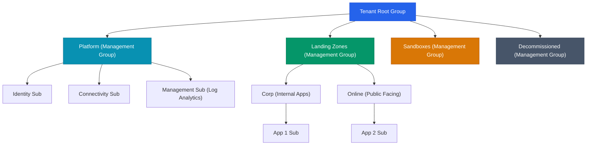

# Azure Landing Zone: Architecture Overview

An Azure Landing Zone is the output of a multi-subscription Azure environment that accounts for scale, security governance, networking, and identity. It serves as the foundation for deploying production workloads in the cloud.

---

## 1. Core Principles of a Landing Zone

*   **Subscription Democratization:** Subscriptions should be used as a unit of management and scale, not just a billing boundary.
*   **Policy-Driven Governance:** Utilize Azure Policy to enforce guardrails rather than relying solely on RBAC.
*   **Single Control and Management Plane:** Centralize logging, monitoring, and networking for full visibility.
*   **Application-Centric and Archetype-Neutral:** The landing zone should support any application archetype (IaaS, PaaS, or Kubernetes).

## 2. Management Group Hierarchy

The core of an Azure Landing Zone is a robust Management Group structure. This allows you to apply Azure Policies and RBAC at scale across multiple subscriptions.

### Platform Subscriptions
These are highly controlled subscriptions that provide shared services to the rest of the environment:
1.  **Identity Subscription:** Hosts Active Directory Domain Controllers, Azure AD Connect, or specialized identity appliances.
2.  **Connectivity Subscription:** Hosts the Azure Virtual WAN hub, ExpressRoute circuits, VPN gateways, and Azure Firewall.
3.  **Management Subscription:** Hosts the centralized Log Analytics Workspace, Azure Monitor, and Microsoft Defender for Cloud configurations.

### Landing Zone Subscriptions
These host your actual workloads. They are typically divided into:
1.  **Corp:** Workloads that do not have direct inbound internet access. They connect via the Hub (Connectivity Subscription).
2.  **Online:** Workloads that require direct inbound internet access (often behind an Azure Application Gateway or Front Door).
