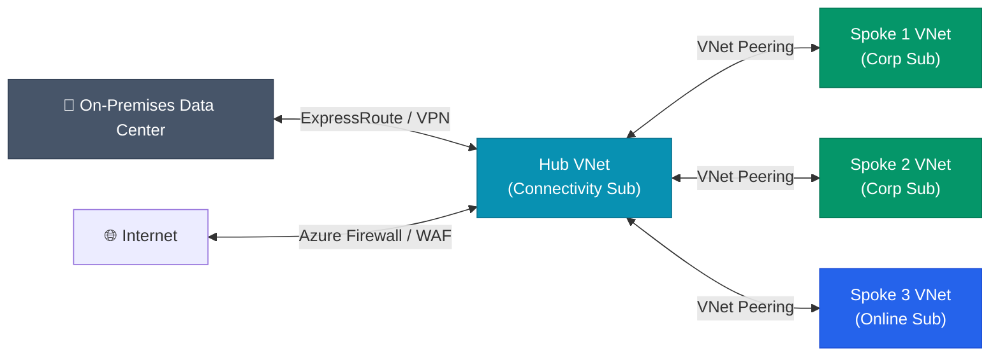

# Azure Landing Zone: Networking and Connectivity

A secure Azure Landing Zone relies on a Hub-and-Spoke topology, isolating workload environments while centralizing security inspections and external connectivity.

---

## 1. Hub-and-Spoke Topology

In a Hub-and-Spoke architecture, the **Hub** is a central virtual network (VNet) in the Connectivity Subscription that acts as a single point of connectivity to on-premises networks and the internet. The **Spokes** are VNets in the Landing Zone subscriptions where your applications reside.

*   **VNet Peering:** Spoke VNets are peered directly to the Hub VNet. Spokes do *not* peer directly with each other by default, preventing lateral movement.
*   **Centralized Security:** All traffic entering or leaving the Azure environment (and optionally traffic moving between Spokes) is routed through an Azure Firewall or Network Virtual Appliance (NVA) in the Hub.

## 2. Azure Virtual WAN (vWAN)

For large-scale, global deployments, Azure Virtual WAN is recommended over traditional VNet peering.
*   **Any-to-Any Connectivity:** vWAN automatically manages routing between multiple hubs across different Azure regions and simplifies VPN/ExpressRoute branch connectivity.
*   **Secured Virtual Hub:** Integrating Azure Firewall directly into the vWAN hub creates a "Secured Virtual Hub," allowing you to inspect traffic flowing branch-to-branch, branch-to-VNet, and VNet-to-VNet.

## 3. Network Security Groups (NSGs) and ASGs

While the Azure Firewall handles perimeter security, NSGs provide micro-segmentation inside the Spoke VNets.
*   **NSGs:** Attach to subnets (preferred) or individual Network Interfaces (NICs) to filter traffic based on IP, port, and protocol.
*   **Application Security Groups (ASGs):** Group VMs based on their function (e.g., `Web-Servers`, `DB-Servers`) rather than relying on explicit IP addresses. You can write NSG rules that say "Allow traffic from `Web-Servers` to `DB-Servers`".

## 4. Private Link and DNS

*   **Azure Private Link:** Access Azure PaaS services (like Azure SQL or Storage Accounts) over a private IP address within your VNet, ensuring traffic never traverses the public internet.
*   **Private DNS Zones:** To resolve Private Endpoint IP addresses, Azure Private DNS Zones are integrated into the Hub, and a central DNS resolver (like Azure DNS Private Resolver) handles queries from on-premises and spoke VNets.
