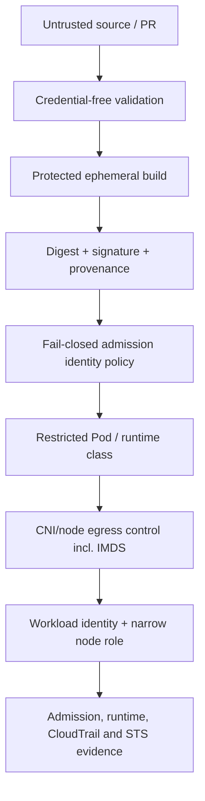

# Cloud and Kubernetes attack paths

An attack path is a conditional chain. Each edge requires a capability, trust
relationship, routing path, or control failure. A leaked credential does not by
itself prove registry write access; a compromised image does not deploy itself; a
container cannot escape an arbitrary `hostPath` mount by traversing `..`; and a node
credential does not automatically authorize cloud administration.

This investigation models one plausible AWS and Kubernetes chain, records the exact
preconditions, and identifies controls that break individual edges. It is a
primary-source synthesis with a partially tested policy lab, not a reproduction of a
real incident.

## Scope and non-goals

In scope:

- developer or build identity compromise;
- mutable image replacement and deployment trust;
- risky Pod and node access;
- EC2 Instance Metadata Service (IMDS) reachability;
- worker-role permissions and cross-account role trust; and
- admission, identity, network, and runtime control points.

Out of scope:

- exploitation of a specific container-runtime CVE;
- an assertion that a named organization experienced this chain;
- a live EKS or AWS account test; and
- universal ATT&CK mappings for every implementation.

## Trust boundaries and preconditions


```mermaid
flowchart LR
  A["Compromised developer/build principal"] -->|"1. Registry push is authorized"| B["Altered image or manifest"]
  B -->|"2. Deployment consumes attacker-controlled reference"| C["Attacker code in Pod"]
  C -->|"3. Explicit host/node capability exists"| D["Node credential or metadata path"]
  D -->|"4. Node cloud role authorizes useful APIs"| E["Cloud resource access"]
  E -->|"5. STS permissions and target trust both allow"| F["Higher-privilege role session"]
```

Every numbered edge is independently testable:

| Edge | Required preconditions | Evidence to collect |
| --- | --- | --- |
| 1. Principal → registry | Valid credential/session; repository action such as ECR layer upload and image put; no denying SCP/resource policy/session boundary | CloudTrail identity, session tags/name, repository policy, effective IAM reachability |
| 2. Registry → workload | Mutable tag or attacker-controlled digest/manifest; deploy automation selects it; admission does not reject identity/provenance | Deployment manifest, resolved digest, admission decision, promotion record |
| 3. Pod → node | Runtime escape vulnerability **or** explicitly dangerous Pod capability such as a broad/sensitive `hostPath`, host namespace, privileged mode, or unsafe device/socket mount | Admitted Pod, policy exception, node/runtime telemetry |
| 4. Node path → credentials | Credential file/socket is actually exposed, or Pod-to-IMDS routing works; token/hop-limit requirements are satisfied | Mounted host path, network trace, IMDS options, CNI/iptables behavior |
| 5. Credentials → privilege | Source identity permits `sts:AssumeRole`; destination trust accepts the principal and conditions; boundaries/SCPs/session policies do not deny; assumed role permissions reach the target | IAM trust and permission policies, Access Analyzer, CloudTrail STS and denied API events |

If any precondition is absent, that edge is not demonstrated.

## Correct hostPath semantics

A Pod that mounts host `/var/log` at container `/var/log` sees that mounted subtree.
The container path:

```text
/var/log/../../../etc/kubernetes/kubelet.conf
```

does **not** escape the mount to arbitrary host-root siblings. Path resolution occurs
inside the container mount namespace. A node-file attack instead requires a mount
whose configured host path contains the target, for example a broad host-root mount,
a sensitive `/etc/kubernetes` mount, a container-runtime socket, or another genuine
node escape.

`hostPath` risk is contextual: mounted host path, read/write mode, host permissions,
container user/capabilities, SELinux/AppArmor policy, runtime, and node configuration
all matter. A read-only log mount is not equivalent to a writable host-root mount.

## Node identity precision

Kubernetes Node authorization does not give a kubelet an unrestricted cluster-wide
secret read. It authorizes a node for resources related to Pods scheduled to that
node, subject to the configured authorizers and NodeRestriction admission behavior.
A stolen node credential remains serious, but the reachable API objects must be
measured rather than described as every cluster secret.

Cloud permissions are separate. An EKS worker role may pull images and operate node
components without being allowed to assume an administrator role. The escalation
edge exists only when both the source permissions and target trust policy accept the
operation.

## IMDS behavior is topology-dependent

Requiring IMDSv2 prevents IMDSv1 requests and requires a session token. The response
hop limit influences whether a response survives the network path, but `1` is not a
universal “blocks every Pod” switch. Container networking topology, host networking,
proxies, CNIs, and node configuration change the effective hops.

Use several layers:

- block Pod access to `169.254.169.254` in the enforced node/CNI path;
- require IMDSv2 and select a tested hop limit;
- keep node-role permissions narrow;
- use workload identity for Pod-specific cloud permissions;
- avoid host networking except reviewed system workloads; and
- alert on unexpected IMDS and STS activity.

Validate the result in each cluster; do not infer it from one metadata setting.

## Attack path and control breaks

### 1. Compromised build or developer identity

An attacker obtains a valid credential or workflow capability. The consequential
question is effective authorization: can that session push an image, replace a tag,
change a deployment manifest, dispatch a privileged workflow, or modify a reusable
workflow?

Break the edge with short-lived federation, protected environments, exact OIDC
subject/audience constraints, dedicated publisher roles, branch protections,
reviewed action pins, and denial telemetry. Rotation alone does not reduce an active
session's permissions.

### 2. Artifact or deployment substitution

The attacker publishes a digest or changes a mutable tag. The path continues only if
release automation promotes the attacker-controlled reference.

Break the edge by building in a protected context, recording provenance, promoting a
reviewed digest, and verifying signer/workflow identity and predicate policy at
admission. An SBOM or valid signature does not establish that an artifact is benign.

The [supply-chain lab](../labs/supply-chain/README.md) demonstrates digest/provenance
policy and tamper rejection. The
[Kyverno lab](../labs/kubernetes-security/README.md) validates current
`ImageValidatingPolicy` structure and negative identity fixtures. It does not perform
online Sigstore cryptography.

### 3. Pod-to-node capability

Attacker code runs in the workload boundary. The chain needs an actual node path:
privileged execution, host namespaces, a sensitive host mount/socket/device, a
runtime/kernel vulnerability, or an authorized debug path.

Break the edge with Pod Security Admission, a current admission policy, narrow
exceptions, `automountServiceAccountToken: false` where API identity is unnecessary,
non-root/read-only/seccomp/capability controls, runtime isolation, and node-pool or
cluster separation for hostile tenants.

Sandboxed runtimes can reduce the kernel attack surface. They do not themselves
reject a dangerous `hostPath`; admission and platform policy own that decision.

### 4. Node or metadata credential use

After obtaining an exposed node credential or a working IMDS route, the attacker is
limited by that principal's effective permissions and organization guardrails.
Alert on unusual IMDS token requests, node-role API use outside expected services,
new STS session destinations, and calls from unexpected network or workload context.

### 5. Cross-account or higher-privilege role assumption

AWS evaluates the caller's permission and the target role's trust policy, followed
by boundaries, session policies, organization controls, and the assumed role's own
authorization. A successful token or signature check is not the same as successful
role assumption, and a role session is not proof that a later API call is allowed.

The [IAM federation lab](../labs/iam-oidc/README.md) exercises trust claims,
permission-boundary protections, external ID, session tags, and restricted
`iam:PassRole` using structural policy tests.

## Defensive architecture


```mermaid
flowchart TD
  PR["Untrusted source / PR"] --> VALIDATE["Credential-free validation"]
  VALIDATE --> BUILD["Protected ephemeral build"]
  BUILD --> EVIDENCE["Digest + signature + provenance"]
  EVIDENCE --> ADMISSION["Fail-closed admission identity policy"]
  ADMISSION --> POD["Restricted Pod / runtime class"]
  POD --> NET["CNI/node egress control incl. IMDS"]
  NET --> IAM["Workload identity + narrow node role"]
  IAM --> MON["Admission, runtime, CloudTrail and STS evidence"]
```

No single box proves the chain is broken. Test each transition and retain the
resolved digest, policy version, decision, exception, principal, and cloud denial or
success event.

## Verification and negative tests

Run:

```text
node labs/kubernetes-security/tests/run-tests.js
kyverno test labs/kubernetes-security --remove-color
node labs/iam-oidc/tests/run-tests.js
node labs/supply-chain/tests/run-tests.js
```

Negative fixtures cover privileged Pods, host namespaces, sensitive `hostPath`,
added capabilities, missing resource constraints, token automount, unsigned/wrong
image identity, wrong OIDC claims, boundary removal, unauthorized `PassRole`, and
artifact/provenance substitution.

These tests do not launch EKS, contact IMDS, query AWS IAM, or exploit a runtime. A
production review additionally needs server-side dry runs, cluster/CNI tests, IAM
Access Analyzer and authorized simulation, registry verification, and runtime
telemetry.

## Operations and residual risk

Roll out blocking controls as:

```text
observe → audit → warn → enforce → measure bypasses
```

Track policy denials, exceptions and expiry, unsigned-image attempts, unexpected
registry writes, mutable-tag deployments, Pod-to-IMDS attempts, node-role API calls,
STS trust failures, and break-glass use. Test rollback without disabling unrelated
boundaries.

Residual risks include compromised authorized maintainers, build-platform compromise,
validly signed malicious source, admission/controller outage or exemption abuse,
runtime zero-days, CNI gaps, overprivileged node/workload roles, and missing or
delayed telemetry.

## References

- [MITRE ATT&CK Enterprise techniques](https://attack.mitre.org/techniques/enterprise/)
- [AWS ECR identity and repository policies](https://docs.aws.amazon.com/AmazonECR/latest/userguide/security_iam_service-with-iam.html)
- [AWS IMDS configuration](https://docs.aws.amazon.com/AWSEC2/latest/UserGuide/configuring-instance-metadata-service.html)
- [AWS role trust and principal permissions](https://docs.aws.amazon.com/IAM/latest/UserGuide/reference_policies_evaluation-logic_policy-eval-denyallow.html)
- [Kubernetes volumes and hostPath warning](https://kubernetes.io/docs/concepts/storage/volumes/#hostpath)
- [Kubernetes Node authorization](https://kubernetes.io/docs/reference/access-authn-authz/node/)
- [Kubernetes Pod Security Standards](https://kubernetes.io/docs/concepts/security/pod-security-standards/)
- [Kubernetes service-account tokens](https://kubernetes.io/docs/tasks/configure-pod-container/configure-service-account/)
